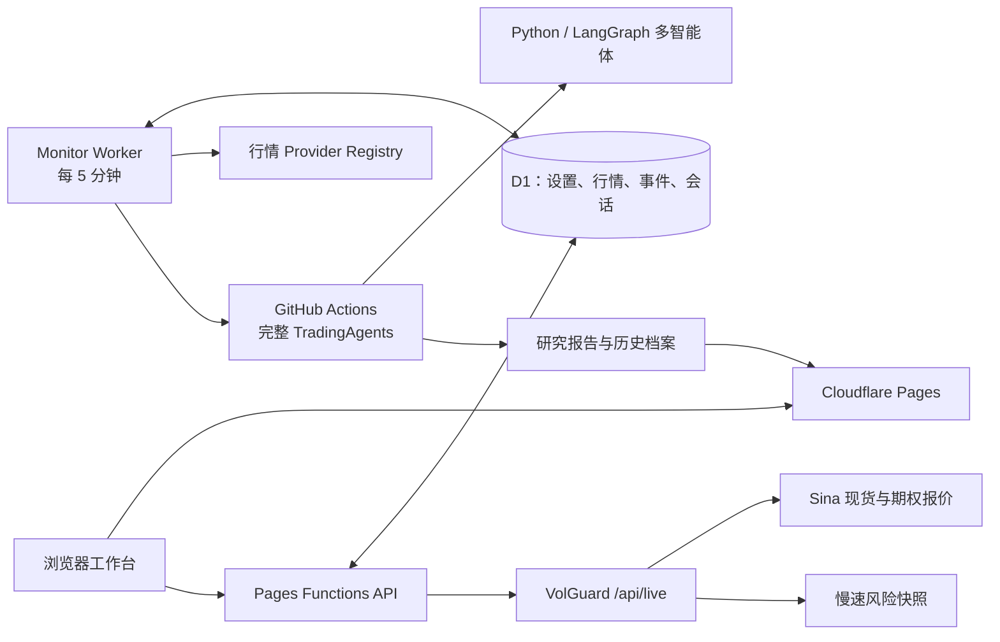
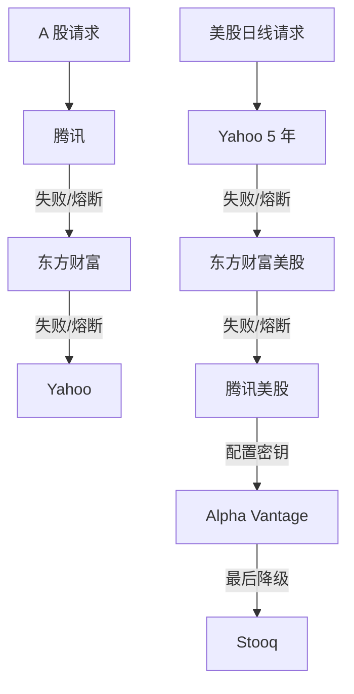
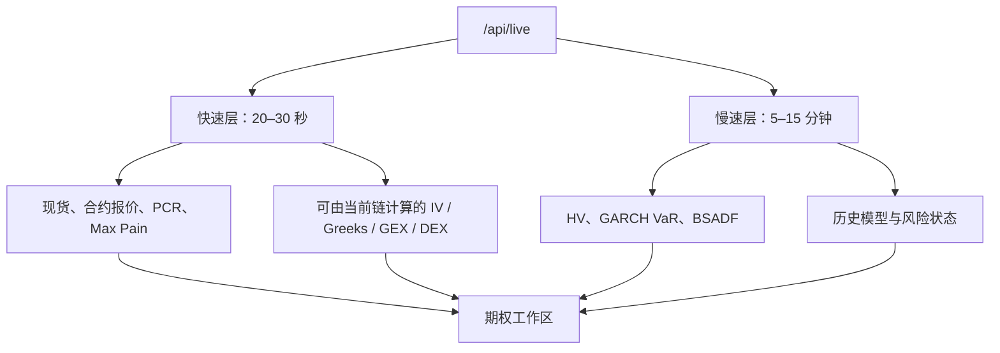

# Trading Workbench

面向 A 股 ETF 投资研究的多智能体工作台。它把主题监控、跨市场行情、新闻证据、TradingAgents 深度研究、研究档案、问答和上证 50 ETF 期权风控放在一个产品壳里，同时保留原 TradingAgents 的 Python 内核、CLI 和 LangGraph 协作流程。

- 生产工作台：[tradingagents-board.pages.dev](https://tradingagents-board.pages.dev/)
- 期权数据站：[sh50-volguard.pages.dev](https://sh50-volguard.pages.dev/)
- 主仓库：[gaaiyun/TradingWorkbench](https://github.com/gaaiyun/TradingWorkbench)
- 上游研究框架：[TauricResearch/TradingAgents](https://github.com/TauricResearch/TradingAgents)
- 当前产品版本：2026-07-24

> 本项目只做研究、解释和提醒，不连接券商，不自动交易。“实时”指有来源和时间戳的近实时数据，不代表交易所逐笔行情。

## 现在有什么

工作台有七个稳定的一级入口。ETF 监控不再覆盖原产品，而是其中一个工作区。

| 工作区 | 解决的问题 | 当前实现 |
|---|---|---|
| 市场监控 | 主题标的现在发生了什么 | 自选、5m/15m/1h/1d、K 线、成交量、MA20/60、MACD、RSI、事件和跨市场驱动 |
| Agent 研究 | TradingAgents 正在做什么 | 发起深度分析、阶段状态、最近运行、run card、报告入口 |
| 研究任务 | 今天会跑什么 | 网页编辑标的角色、任务时间、启停、下一次执行、立即运行 |
| 研究档案 | 以前得出过什么结论 | 报告索引、标的和日期、正文阅读、问答上下文 |
| 新闻/事件 | 结论依据是什么 | 来源、数据时间、标的、重要性、原文链接和证据流 |
| 期权风控 | 现货与期权风险如何变化 | 认购/认沽链、IV/HV、Greeks、GEX/DEX、PCR、Max Pain、VaR、BSADF、双刷新时钟 |
| 设置 | 监控目标如何调整 | `WorkbenchSettingsV2`、标的角色、分析深度、时区、任务频率和提醒阈值 |

页面采用统一的石墨灰研究终端样式：普通文字使用产品字体，只有价格和指标使用等宽数字；A 股红涨绿跌，美股绿涨红跌，系统健康色与行情色分离。

## 默认研究目标

> 持续监控 A 股通信与半导体 ETF，识别美股半导体隔夜行情、行业新闻和政策变化对 A 股 ETF 的传导影响。

| 角色 | 标的 | 分析方式 |
|---|---|---|
| 核心 | `515880.SS` 通信 ETF、`512480.SS` 半导体 ETF | 每日完整 TradingAgents |
| 比较 | `159995.SZ` 芯片 ETF | 轻量信号 |
| 美股驱动 | `SOXX`、`SMH`、`NVDA`、`TSM`、`AVGO`、`AMD`、`ASML`、`ORCL` | 日线、隔夜驱动和事件 |
| 系统基准 | 沪深 300、纳指 100、美元人民币 | 不占用户自选位置 |

`ORCL` 用来观察云基础设施、数据库和 AI 资本开支对半导体需求的外部影响。网页可以增删标的并修改角色，D1 保存后即时生效；仓库内 JSON 只是空库种子和灾备。

## 系统结构



运行时分为三层：

1. Cloudflare Worker 做轻量采集、来源降级、15 分钟规则信号和幂等调度。
2. GitHub Actions 运行完整 TradingAgents、ETF 深度研究和报告生成。
3. Pages Functions + D1 提供设置、查询、问答、会话恢复和证据接口。

这样不会把 pandas、模型推理或多 Agent 辩论塞进五分钟边缘任务，也不会因为一个免费数据源失效让整页变空。

## 行情与来源

所有动态接口统一返回：

```json
{
  "status": "ok",
  "asOf": "2026-07-23T07:00:00.000Z",
  "data": {},
  "sources": []
}
```

`status` 只允许 `ok`、`degraded`、`stale`、`unavailable`。数据记录保留 `source`、`asOf`、`fetchedAt`、`freshness`、`adjustment` 和质量状态。



- 连续失败三次的来源暂停 15 分钟，恢复成功后清零。
- 5 分钟行情保留 90 天，日线保留 5 年。
- 美股图表支持 6 个月、1 年、3 年、5 年，目标上限 1260 根交易日。
- 来源只能提供短历史时，页面显示实际起止日期、根数和降级原因。
- 过期数据不会被标成正常，也不会用示例价格填补生产空白。
- ETF 溢折价、iNAV、跟踪误差等字段只有在来源可靠且带时间戳时才展示。

## 调度与幂等

默认时区为 `Asia/Shanghai`。

```mermaid
gantt
    title 默认交易日任务
    dateFormat HH:mm
    axisFormat %H:%M
    section 美股
    收盘驱动快照 :milestone, us, 05:35, 0m
    section A股盘前
    轻量盘前简报 :milestone, pre, 08:25, 0m
    section A股盘中
    上午采集与信号 :active, am, 09:30, 120m
    下午采集与信号 :active, pm, 13:00, 120m
    section 收盘
    核心 ETF 深度研究 :milestone, close, 15:20, 0m
```



Worker 每五分钟读取 D1 设置，按“任务 + 理论计划时间槽”生成幂等键。时间槽采用原子领取、租约、最多三次重试和 attempt fencing；重复 Cron、夏令时重叠或晚到的旧任务都不能重复写入或重复触发模型。

盘中每五分钟采集，每十五分钟计算价格异动和成交量 z-score。只有高等级事件进入 PushPlus；完整多智能体分析默认每天一次，避免把所有驱动标的都扩成高成本辩论。

## TradingAgents 研究链

原 TradingAgents 内核没有被替换。


Python 包、CLI、LangGraph、检查点恢复、历史决策和多模型 Provider 仍可单独使用。工作台只是为它增加网页任务编排、监控上下文、阶段状态和报告入口。

Agent 对 ETF 不应套用普通公司的财务模板。主题报告应优先检查跟踪指数、持仓与权重、规模、流动性、费用、跟踪偏离、份额变化和公司行动，并按以下结构输出：

1. 发生了什么。
2. 证据及时间。
3. 对 A 股 ETF 的可能传导。
4. 置信度和假设。
5. 反证或替代解释。
6. 下一观察点。

## 期权风控

VolGuard 保持独立运行和独立故障域，但在工作台中是一等入口，而不是一个失效外链。



页面分别显示“行情时间”和“模型时间”。休市、快照、过期和不可用是四种不同状态；缺失指标显示 `—`，不显示成 `0`。VolGuard 的 Python 主程序仍保留四窗格、BSADF、GARCH VaR、HV/IV、GEX/DEX、Max Pain、Greeks 和期权雷达。

## 研究问答

问答使用 SSE，但不是一次性聊天：

- 每次请求带稳定 `requestId` 和 `sessionId`。
- D1 原子领取请求；重复请求回放已保存答案，不重复计费。
- 浏览器断线后，服务端继续完成上游响应并写入 D1。
- 当前行情、指标、新闻、事件、主题报告和历史报告进入上下文。
- 问题里出现 profile 内的代码或标的名称时，该标的覆盖当前图表选择；例如在
  `515880.SS` 图表上询问 `512480`，服务端仍读取 `512480.SS` 的证据。
- 证据编号保留来源和时间；上下文保存 SHA-256 哈希。
- 没有足够证据时必须回答“无法归因”，不能编造涨跌原因。
- 访问码只放请求头，不进入前端代码、D1 或日志。

## 本地运行

### Python / CLI

```powershell
python -m venv .venv
.\.venv\Scripts\Activate.ps1
python -m pip install -e ".[dev]"
tradingagents
```

### 工作台

```powershell
npm run test:functions
npm run test:frontend
npx wrangler pages dev public
```

本地 D1：

```powershell
npx wrangler d1 migrations apply tradingagents-workbench --local
```

不要把真实密钥写进仓库。可配置项见 [.env.example](.env.example) 和 [部署与运维](docs/operations-and-deployment.md)。

## 验证

提交前至少运行：

```powershell
npm run test:functions
npm run test:frontend
npm run check:workbench
python -m pytest -q --ignore=tests/e2e_workbench.py
$env:PLAYWRIGHT_BROWSERS_PATH = "G:\ClaudeData\ms-playwright"
python tests/e2e_workbench.py
```

Python 核心测试应使用已经安装完整项目依赖的虚拟环境。浏览器测试和完整 Python 测试在资源有限的 Windows 机器上应串行执行。

当前验收覆盖：

- 网页设置保存后立即生效，下一运行时间正确。
- 七个一级入口可以真实进入，不只检查按钮文字。
- Agent 任务触发、阶段状态、报告归档和 run card。
- K 线增量更新、行情请求竞态、美股五年区间和中美颜色规则。
- 新闻筛选、期权双时钟、自动刷新、无数据和降级状态。
- SSE、请求幂等、断线恢复、持久会话、错误访问码和证据引用。
- TradingAgents 核心、CLI、报告和 workflow 仍存在。

## 部署

生产由两个仓库协作：

- 本仓库保存工作台、Pages Functions、D1 migration、Monitor Worker 和 TradingAgents。
- VolGuard 仓库保存期权引擎，并用 Pages 权限定时部署两个网页项目；监控 Worker
  当前由本机 Wrangler OAuth 发布。补齐 Workers Scripts Edit 和 D1 Edit 后，手动
  workflow 才会按显式开关部署 Worker 或应用 migration。

部署顺序：

1. 运行全部测试。
2. 应用 D1 migration。
3. 部署 `tradingagents-monitor` Worker 和五分钟 Cron。
4. 部署 `tradingagents-board` Pages。
5. 部署或刷新 `sh50-volguard`。
6. 检查 `/api/health`、`/api/monitor-status`、`/api/market`、`/api/volguard`。
7. 用真实访问码做问答冒烟，问题为“今天 512480 为什么涨跌”。

详细命令、密钥名、回退和故障排查见 [docs/operations-and-deployment.md](docs/operations-and-deployment.md)。

## 文档

- [架构、接口与数据流](docs/architecture-and-data-flows.md)
- [参考项目、数据源与取舍](docs/etf-monitoring-reference-and-decisions.md)
- [部署、密钥、验收与回退](docs/operations-and-deployment.md)
- [产品回归、迁移与防复发约束](docs/regression-and-migration.md)
- [统一工作台设计记录](docs/superpowers/plans/2026-07-24-workbench-unification-design.md)

## 参考与许可证

本 fork 源自 [TauricResearch/TradingAgents](https://github.com/TauricResearch/TradingAgents)，保留其研究框架与开源许可证。产品设计还参考了 Vibe-Trading、OpenBB、Qlib、FinGPT、AI Hedge Fund、Ashare、adata、AKShare、QuantStats、awesome-systematic-trading、TradingView Lightweight Charts、iVIX 和 options_monitor。采用了什么、拒绝了什么以及原因，统一记录在[参考项目与架构决策](docs/etf-monitoring-reference-and-decisions.md)。

本项目的分析可能因数据延迟、免费来源变更、模型随机性和配置差异而变化，不构成投资建议。
