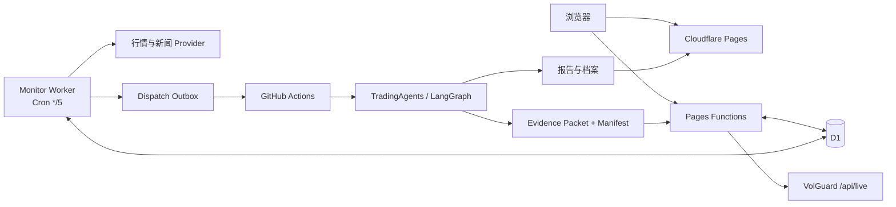
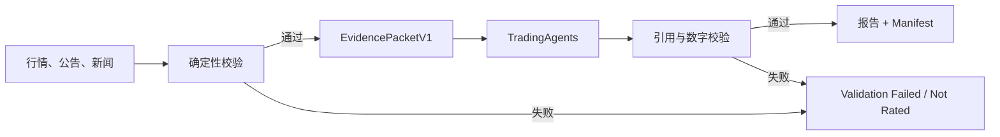

# Trading Workbench

Trading Workbench 是面向 A 股 ETF 研究的多智能体工作台。它把主题监控、跨市场行情、官方证据、TradingAgents 深度研究、研究档案、问答和上证 50 ETF 期权风控放在一个产品壳中，同时保留原 TradingAgents 的 Python 包、CLI 和 LangGraph 流程。

- 生产工作台：[tradingagents-board.pages.dev](https://tradingagents-board.pages.dev/)
- 期权数据站：[sh50-volguard.pages.dev](https://sh50-volguard.pages.dev/)
- 主仓库：[gaaiyun/TradingWorkbench](https://github.com/gaaiyun/TradingWorkbench)
- 上游框架：[TauricResearch/TradingAgents](https://github.com/TauricResearch/TradingAgents)
- 当前代码版本：2026-07-26

> 本项目只做研究、解释和提醒，不连接券商，也不自动交易。“实时”表示数据带来源和时间戳，不代表交易所逐笔行情。

## 产品入口

工作台保留七个一级入口：

| 工作区 | 用途 | 当前实现 |
|---|---|---|
| 市场监控 | 查看主题标的和跨市场驱动 | 多监控组、自选、5m/15m/1h/1d、K 线、成交量、MA、MACD、RSI、事件 |
| Agent 研究 | 临时研究未纳入监控的标的 | 标准/深度模式、独立请求身份、完整 TradingAgents |
| 研究任务 | 查看和触发当前监控组任务 | 计划时间、启停、下一次执行、运行阶段和失败原因 |
| 研究档案 | 阅读历史结论 | 13 个角色分栏、审计状态、报告身份和问答上下文 |
| 新闻/事件 | 查看证据和提醒状态 | 原文链接、发布时间、证据层级、来源轨迹、Web/PushPlus 状态 |
| 期权风控 | 查看现货和期权风险 | IV/HV、Greeks、GEX/DEX、PCR、Max Pain、VaR、BSADF、双时钟 |
| 设置 | 管理监控组 | 创建、复制、编辑、启停、删除、时区、计划、预算和提醒阈值 |

页面使用石墨灰研究终端样式。A 股红涨绿跌，美股和港股绿涨红跌；健康状态颜色不复用行情颜色。

## 多监控组

`WorkbenchSettingsV2` 保存在 D1。仓库中的 `public/data/workbench-settings.json` 只用于空库初始化和只读灾备。

- 最多 8 个 profile。
- 每个 profile 最多 14 个用户标的，另有最多 12 个系统基准。
- profile ID 创建后不可修改；至少保留一个 profile。
- 复制出的 profile 默认停用，确认内容后再启用。
- 页面把当前 profile ID 存入本地存储。切换后会取消旧请求并重置行情、新闻、任务、档案、报告和问答上下文。
- 临时研究和 VolGuard 不属于 profile，切换监控组不会改变它们。
- profile 写操作使用 D1 revision 做 CAS。缺少 revision 返回 428，revision 冲突返回 409。

默认 profile 为 `cn-semi-comms`：

| 角色 | 标的 | 分析方式 |
|---|---|---|
| 核心 | `515880.SS`、`512480.SS` | 每日完整 TradingAgents |
| 比较 | `159995.SZ` | 轻量信号 |
| 驱动 | `SOXX`、`SMH`、`NVDA`、`TSM`、`AVGO`、`AMD`、`ASML`、`ORCL`、`GOOGL`、`3887.HK` | 日线、隔夜驱动和事件 |
| 系统基准 | 沪深 300、纳指 100、美元人民币 | 不占用户标的位置 |

`GOOG` 归一为 `GOOGL`；`03887`、`3887` 和 `03887.HK` 归一为 `3887.HK`。`3887.HK` 对应 HashKey Holdings，身份由港交所发行人资料和公司投资者关系页交叉确认。`SMH` 只有在完整基金名称或明确代码语境中才关联，避免普通缩写误命中。

## 运行结构


```mermaid
flowchart LR
    B["浏览器"] --> P["Cloudflare Pages"]
    B --> F["Pages Functions"]
    F <--> D[("D1")]
    W["Monitor Worker<br/>Cron */5"] <--> D
    W --> R["行情与新闻 Provider"]
    W --> O["Dispatch Outbox"]
    O --> G["GitHub Actions"]
    G --> T["TradingAgents / LangGraph"]
    T --> E["Evidence Packet + Manifest"]
    T --> A["报告与档案"]
    E --> F
    A --> P
    F --> V["VolGuard /api/live"]
```

三个运行层分工如下：

- Pages Functions + D1 负责页面、设置、查询、问答、会话、证据和报告读取。
- Monitor Worker 负责轻量采集、确定性调度、规则信号、提醒 shadow 账本和 GitHub dispatch。
- GitHub Actions + Python 负责依赖安装、LLM、多 Agent 研究、报告生成和审计。

Worker 不运行 pandas、LangGraph、GARCH、BSADF 或长历史回测。VolGuard 保持独立仓库和故障域。

## 行情和复权

| 资产与周期 | 来源顺序 | 口径 |
|---|---|---|
| A 股 5m | 腾讯 → 东方财富 → Yahoo | 近实时，不宣称逐笔 |
| A 股 1d | 东方财富 → 腾讯 → Yahoo | 前两个来源要求 `qfq` |
| 美股 1d | Yahoo → 东方财富 → 腾讯 → Alpha Vantage → Stooq | 目标约五年 |
| 港股 1d | Yahoo → 最近已验证快照 | 短上市历史如实显示 |

所有动态记录带 `source`、`asOf`、`fetchedAt`、`freshness`、`quality` 和 `adjustment`。连续失败三次的来源暂停十五分钟。

复权口径不能互换：

- A 股 D1 主路径使用 `qfq`，即前复权。
- Yahoo `auto_adjust=True` 记录为 `split-and-dividend-adjusted`。
- 报告的 Market history 同时披露来源、复权口径、起止日期和样本数。
- 代码不会把 Yahoo 序列标成 qfq，也不会把不同 adjustment 的历史拼成一条序列。
- 页面、Evidence Packet、指标和 Agent 使用同一截止时间与同一历史口径。

`512480.SS` 在 2026-07-03 附近发生份额拆分。回归测试要求前复权序列保持连续，不能把拆分写成约 50% 单日暴跌。

## 新闻和证据

08:25 盘前任务按 profile 采集主题新闻和官方材料：

- Oracle、Alphabet：SEC EDGAR Submissions 中的 `8-K/8-K/A`。
- A 股通信与半导体：工信部“文件发布”API，固定 `cateid=58`、通信/芯片查询、上海日历 30 天窗口。
- HashKey：公司投资者关系公告。
- 宏观：Federal Reserve 官方 RSS 中与 FOMC、货币政策和经济活动有关的条目。
- 发现层：Google News RSS；Cloudflare 出口不可用时，A 股使用东方财富，美股和港股使用 Yahoo Finance RSS。

官方来源标记为 `evidence`，聚合和搜索结果标记为 `discovery`。发现层成功不会跳过官方查询；官方源失败时，本次采集保持 `degraded` 并保存失败码。HTTP 200 但响应结构错误也按失败处理。

D1 只保存标题、短摘要、原始发布者、原文链接、发布时间、采集时间、层级、标的和重复簇，不保存付费全文。

## 调度、预算和幂等

默认时区为 `Asia/Shanghai`：


```mermaid
gantt
    title 默认交易日任务
    dateFormat HH:mm
    axisFormat %H:%M
    section 美股
    收盘驱动快照 :milestone, us, 05:35, 0m
    section A股盘前
    新闻采集与盘前上下文 :milestone, pre, 08:25, 0m
    section A股盘中
    采集与规则信号 :active, cn, 09:30, 330m
    section 收盘
    日线回填与深度研究 :milestone, close, 15:20, 0m
```

Worker 为每个理论任务生成稳定 `slotId`，并在首次入库时冻结 profile revision、配置快照、payload hash 和本地日期。profile 被删除、停用或修改后，Worker 取消尚未执行的旧 slot，不用新配置重放旧任务。

调度器还提供：

- 原子租约、attempt fencing、最多三次重试。
- `profile + localDate` 的完整分析预算；`fullAnalysesPerDay=0` 时不 dispatch。
- profile 公平轮转、单 tick 工作量上限和外部请求预算。
- `profile + symbol + timeframe + schema + targetHash` 的 bootstrap 收据。
- GitHub dispatch outbox、receipt 和 reconcile，避免网络不确定或写回失败造成重复研究。

## 运行身份

每次研究使用以下一种身份：

| scope / kind | 必需字段 | 用途 |
|---|---|---|
| `legacy / legacy` | 无 | 兼容旧运行 |
| `profile / manual` | `profileId` | 网页手工运行当前监控组 |
| `profile / monitor` | `profileId + slotId + scheduledFor` | Worker 定时运行 |
| `adhoc / adhoc` | UUID `requestId` | 临时研究 |

`profileId` 与临时 `requestId` 互斥。监控运行的三个字段必须同时存在。workflow 标题、history、Manifest、Evidence 和报告 API 都保存或校验身份；同 ticker、同日期的不同运行不会靠目录序号猜归属。

临时研究标准模式最多 6 个标的，深度模式最多 3 个。它不写设置，也不改变定时任务。

## Evidence 和报告门禁

`EvidencePacketV1` 保存标的身份、市场、币种、资产类型、截止时间、OHLCV、复权口径、公司行动、指标、点时新闻、来源轨迹、Evidence ID 和内容哈希。


```mermaid
flowchart LR
    S["行情、公告、新闻"] --> V["确定性校验"]
    V -->|"通过"| E["EvidencePacketV1"]
    V -->|"失败"| N["Validation Failed / Not Rated"]
    E --> T["TradingAgents"]
    T --> C["引用与数字校验"]
    C -->|"通过"| R["报告 + Manifest"]
    C -->|"失败"| N
```

报告落盘前检查未知 Evidence ID、无引用数字、无方法目标价和缺少用户约束时的具体仓位比例。失败草稿保留供审计，但不能进入首页最新观点、问答或推送。

Evidence GET 必须选择一个范围：

- `?profile=<profileId>`
- `?requestId=<uuid>`
- `?scope=global`
- 无范围参数只读取 legacy 数据

提交 bundle、Packet 和 Manifest 的 identity 必须一致。`/api/v1/evidence` 是权威入口，旧 `/api/evidence` 只做兼容。

## 研究问答

问答使用持久化 SSE：

- 请求带稳定 `requestId` 和 `sessionId`，D1 原子领取并支持重放。
- 浏览器断线后，服务端继续完成响应并保存结果。
- 每个 session 绑定创建时的 profile；跨 profile 复用返回 409。
- 当前行情、指标、新闻、事件、Evidence Packet 和通过门禁的报告进入上下文。
- 报告上下文只允许当前 `profileId`、临时 `reportRequestId` 或显式 `reportScope=global` 三种范围之一。
- 证据不足时回答“无法可靠归因”。
- 访问码只进请求头，不写前端、D1 或日志。

## 提醒状态

migration `0015_notification_deliveries.sql` 建立 `eventId + channel` 唯一的投递账本。事件还记录 provider、provider 时间、质量和规则版本。

当前生产能力边界：

- Web 渠道的 `sent` 表示事件已写入 D1，可在网页看到。
- PushPlus 固定为 `shadow`，只记录策略判定和 `SHADOW_MODE`，尚未开启 live 发送。
- 阈值、静默时段、critical 例外和缺 token 的状态机已实现并有测试，但切换 live 前仍需 canary 和生产对账。

页面会显示 `SHADOW`、延期、失败、结果不确定或已发送等状态。当前看到 `PushPlus · SHADOW` 不代表手机已收到消息。

## 本地运行和验证

```powershell
python -m venv .venv
.\.venv\Scripts\Activate.ps1
python -m pip install -e ".[dev]"

npm run test:functions
npm run test:frontend
npm run check:workbench
python -m pytest -q

$env:PLAYWRIGHT_BROWSERS_PATH = "G:\ClaudeData\ms-playwright"
python tests/e2e_workbench.py
```

本地 D1：

```powershell
npx --yes wrangler@4.113.0 d1 migrations apply tradingagents-workbench --local --config wrangler.monitor.toml
```

本地只读 MCP：

```powershell
npm run mcp:readonly
```

MCP 只提供设置、监控、行情、新闻和研究历史查询，不接收访问码或写入 token。

## 部署

部署顺序为 D1 migration → Monitor Worker → Workbench Pages → VolGuard → 生产验收。

`deploy-monitor` 缺少 Cloudflare 凭据或 `MONITOR_WORKER_URL` 时直接失败。部署后 workflow 请求 Worker `/health`，并要求 `deployment.commitSha` 等于本次 GitHub SHA。绿色 workflow 仍需核对 migration、deploy 和 SHA 验证步骤都执行成功。

本轮发布依赖 migrations `0013_monitor_reliability.sql`、`0014_chat_evidence_scope.sql` 和 `0015_notification_deliveries.sql`。

当前功能分支代码尚未经过生产发布和 2026-07-27 08:25 外审，不能把本地 HEAD 当成生产状态。完整命令、周一验证协议和回退流程见 [部署与运维](docs/operations-and-deployment.md)。

## 架构取舍

项目保留 TradingAgents 的角色协作与报告链，使用 Lightweight Charts 渲染行情，并参考 OpenBB 的统一数据契约、Qlib 的离线评估边界和 FinGPT 的金融语料思路。当前没有引入它们的整套运行时：

- Cloudflare 免费 Worker 的 CPU 和子请求限制不适合 Python、LLM 辩论或重型回测。
- 免费行情和新闻源授权、稳定性不同，系统保存来源与降级轨迹，不把聚合结果包装成官方数据。
- VolGuard 继续独立部署，避免期权模型故障拖垮研究工作台。

详细取舍见 [参考项目与架构决策](docs/etf-monitoring-reference-and-decisions.md)。

## 文档

- [架构、接口与数据流](docs/architecture-and-data-flows.md)
- [部署、验收与回退](docs/operations-and-deployment.md)
- [产品回归与迁移](docs/regression-and-migration.md)
- [报告质量审计](docs/REPORT_QUALITY_AUDIT.md)
- [下一 Agent 交接](docs/NEXT_AGENT_HANDOFF.md)
- [只读 MCP](docs/mcp-readonly.md)
