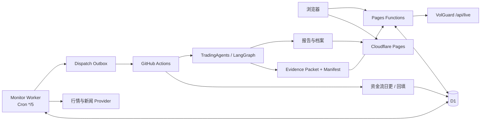
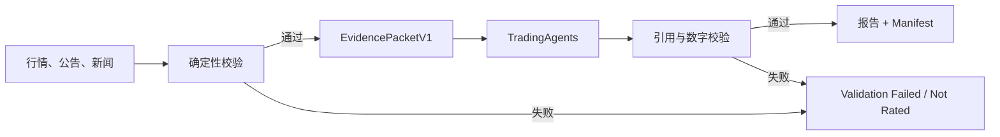

# Trading Workbench

Trading Workbench 是面向 A 股 ETF 研究的多智能体工作台。它把主题监控、跨市场行情、官方证据、TradingAgents 深度研究、研究档案、问答和上证 50 ETF 期权风控放在一个产品壳中，同时保留原 TradingAgents 的 Python 包、CLI 和 LangGraph 流程。

- 生产工作台：[tradingagents-board.pages.dev](https://tradingagents-board.pages.dev/)
- 期权数据站：[sh50-volguard.pages.dev](https://sh50-volguard.pages.dev/)
- 主仓库：[gaaiyun/TradingWorkbench](https://github.com/gaaiyun/TradingWorkbench)
- 上游框架：[TauricResearch/TradingAgents](https://github.com/TauricResearch/TradingAgents)
- 当前代码版本：2026-07-28

> 本项目只做研究、解释和提醒，不连接券商，也不自动交易。“实时”表示数据带来源和时间戳，不代表交易所逐笔行情。

## 产品入口

工作台保留七个一级入口：

| 工作区 | 用途 | 当前实现 |
|---|---|---|
| 市场监控 | 查看主题标的和跨市场驱动 | 多监控组、自选、5m/15m/1h/1d、K 线、成交量、MA、MACD、RSI、事件、ETF 日频资金面与历史分位 |
| Agent 研究 | 临时研究未纳入监控的标的 | 标准/深度模式、独立请求身份、完整 TradingAgents |
| 研究任务 | 查看和触发当前监控组任务 | 计划时间、启停、下一次执行、运行阶段和失败原因 |
| 研究档案 | 阅读历史结论 | 13 个角色分栏、审计状态、报告身份和问答上下文 |
| 新闻/事件 | 查看证据和提醒状态 | 原文链接、发布时间、证据层级、来源轨迹、Web/PushPlus 状态 |
| 期权风控 | 查看现货和期权风险 | IV/HV、Greeks、GEX/DEX、PCR、Max Pain、VaR、BSADF、卖方策略观察、双时钟 |
| 设置 | 管理监控组 | 创建、复制、编辑、启停、删除、时区、计划、预算和提醒阈值 |

页面使用石墨灰研究终端样式。A 股红涨绿跌，美股和港股绿涨红跌；健康状态颜色不复用行情颜色。

## 多监控组

`WorkbenchSettingsV2` 保存在 D1。仓库中的 `public/data/workbench-settings.json` 只用于空库初始化和只读灾备。

- 最多 8 个 profile。
- 每个 profile 最多 14 个用户标的，另有最多 12 个系统基准。
- profile ID 创建后不可修改；至少保留一个 profile。
- 复制出的 profile 默认停用，确认内容后再启用。
- 页面把当前 profile ID 存入本地存储。切换后会取消旧请求并重置行情、新闻、任务、档案、报告和问答上下文。
- 临时研究和 VolGuard 不属于 profile，切换监控组不会改变它们。
- profile 写操作使用 D1 revision 做 CAS。缺少 revision 返回 428，revision 冲突返回 409。

默认 profile 为 `cn-semi-comms`：

| 角色 | 标的 | 分析方式 |
|---|---|---|
| 核心 | `515880.SS`、`512480.SS` | 每日完整 TradingAgents |
| 比较 | `159995.SZ` | 轻量信号 |
| 驱动 | `SOXX`、`SMH`、`NVDA`、`TSM`、`AVGO`、`AMD`、`ASML`、`ORCL`、`GOOGL`、`3887.HK` | 日线、隔夜驱动和事件 |
| 系统基准 | 沪深 300、纳指 100、美元人民币 | 不占用户标的位置 |

`GOOG` 归一为 `GOOGL`；`03887`、`3887` 和 `03887.HK` 归一为 `3887.HK`。`3887.HK` 对应 HashKey Holdings，身份由港交所发行人资料和公司投资者关系页交叉确认。`SMH` 只有在完整基金名称或明确代码语境中才关联，避免普通缩写误命中。

## 运行结构


```mermaid
flowchart LR
    B["浏览器"] --> P["Cloudflare Pages"]
    B --> F["Pages Functions"]
    F <--> D[("D1")]
    W["Monitor Worker<br/>Cron */5"] <--> D
    W --> R["行情与新闻 Provider"]
    W --> O["Dispatch Outbox"]
    O --> G["GitHub Actions"]
    G --> FLOW["资金流日更 / 回填"]
    FLOW --> D
    G --> T["TradingAgents / LangGraph"]
    T --> E["Evidence Packet + Manifest"]
    T --> A["报告与档案"]
    E --> F
    A --> P
    F --> V["VolGuard /api/live"]
```

三个运行层分工如下：

- Pages Functions + D1 负责页面、设置、查询、问答、会话、证据和报告读取。
- Monitor Worker 负责轻量采集、确定性调度、规则信号、提醒 shadow 账本和 GitHub dispatch。
- GitHub Actions + Python 负责依赖安装、LLM、多 Agent 研究、报告生成和审计。

Worker 不运行 pandas、LangGraph、GARCH、BSADF 或长历史回测。VolGuard 保持独立仓库和故障域。

期权页的“卖方策略观察”是确定性风险提示，不是自动下单。它按每个到期日把一日 VaR（缺失时才用 HV30 正态近似）缩放到工作日 √DTE，并生成一张到期日表：虚值距离低于 90% 尾部线直接标为“认怂”，达到 99% 尾部线才列为卖方观察候选；同时展示 Put/Call 行权价边界并检查 IV-HV、价差和持仓量。IV 低于 HV 时明确提示“不宜裸卖”。如果上游没有逐合约 IV/Greeks，则仍显示 90%/99% 行权价距离和覆盖率，但不猜 Delta 档位、不生成裸卖指令。行情报价每 30 秒刷新，VaR/BSADF/HV 等慢指标按 5 分钟时钟刷新；页面始终分别显示行情时间与指标时间。

## 行情和复权

| 资产与周期 | 来源顺序 | 口径 |
|---|---|---|
| A 股 5m | 腾讯 → 东方财富 → Yahoo | 近实时，不宣称逐笔 |
| A 股 1d | 东方财富 → 腾讯 → Yahoo | 前两个来源要求 `qfq` |
| 美股 5m | Yahoo → 东方财富 → Alpha Vantage（有 key 时） | 仅 `SOXX / NVDA`；纽约常规时段每 15 分钟采集，原始粒度 5 分钟 |
| 美股 1d | Yahoo → 东方财富 → 腾讯 → Alpha Vantage → Stooq | 目标约五年 |
| 港股 1d | Yahoo → 最近已验证快照 | 短上市历史如实显示 |

所有动态记录带 `source`、`asOf`、`fetchedAt`、`freshness`、`quality` 和 `adjustment`。连续失败三次的来源暂停十五分钟。

前端请求使用 `cache: no-store`；资讯和行情在页面可见时每 60 秒轮询，期权快层每 30 秒轮询。`scripts/asset-version.mjs` 用 CSS+JS 内容哈希生成缓存版本，CI 的 `npm run check:asset-version` 会阻止静态资源改动后忘记更新 HTML。

复权口径不能互换：

- A 股 D1 主路径使用 `qfq`，即前复权。
- Yahoo `auto_adjust=True` 记录为 `split-and-dividend-adjusted`。
- 报告的 Market history 同时披露来源、复权口径、起止日期和样本数。
- 代码不会把 Yahoo 序列标成 qfq，也不会把不同 adjustment 的历史拼成一条序列。
- 页面、Evidence Packet、指标和 Agent 使用同一截止时间与同一历史口径。

`512480.SS` 在 2026-07-03 附近发生份额拆分。回归测试要求前复权序列保持连续，不能把拆分写成约 50% 单日暴跌。

## ETF 日频资金面

市场监控在主图下方显示融资余额、融资净买入和 ETF 份额，不新增一级入口，也不改变三窗格行情图、期权或 Evidence/报告契约。三张卡保留当前值摘要，卡片分位分别标明“水平 / 单日 / 单日变化”；下面直接对照“ETF 自身融资净买入”和“最新披露前十大持仓股票融资净买入合计”：两边都先计算近 5 个可用交易日累计，图上只展示最近 60 个分位点，但分位基准仍是 2024-01-01 起的全部有效历史。确定性结论先按累计值正负判断流入/流出，再按各自分位区分显著、偏弱或方向分化；两端资金日期不同则明确标为“暂不可比”。隔夜驱动、ETF 涨跌和资金数据分别显示实际日期，避免把盘中报价、完整日线和滞后两融误当成同一时点。分位排除当前值，使用 mid-rank；历史样本少于 60 个交易日时只显示“累积中”，不伪造分位。

隔夜映射不再把单个 `SOXX` 硬套给所有标的：`515880.SS` 使用 `NVDA + AVGO` 的 AI 通信驱动篮子，`512480.SS / 159995.SZ` 使用 `SOXX + SMH` 的美股半导体基准篮子；页面逐项显示代码、日线日期和涨跌，不把等权篮子伪装成指数。左侧自选和标的标题的“日涨跌”与当前 K 线周期解耦：A 股使用最新 5 分钟精确价除以前一交易日收盘价，日线只提供昨收；若 5 分钟数据比日线更旧则拒绝使用，避免 15 分钟柱间涨跌或腾讯日线小数压缩污染日涨跌。

“主题结论”继续只接受通过 Evidence 门禁的报告。当前标的没有 verified 报告、但资金两端日期一致且分位可用时，区域改为“主题观察”，显示 `资金偏强 / 资金偏弱 / 方向分化` 与近 5 日两端数值；文案明确它是可复核的确定性规则观察，不替代 verified 报告，不绕过问答和报告门禁。

资金流以独立的 `trade_date=YYYY-MM-DD` 保存上海业务交易日；`ts` 只保留为兼容排序字段，采用“上海交易日 00:00”的 UTC 瞬时表示，例如 2026-07-27 对应 `2026-07-26T16:00:00Z`。API 和前端优先读取 `trade_date`，禁止直接截 UTC 字符串前 10 位。migration `0018` 用 `datetime(ts, '+8 hours')` 回填历史业务日；减 8 小时会把方向改错。采集器拒绝上游周末记录，Pages 发布后还会自动检查周末为 0、周五存在以及资金日期属于同标的日线日期集合。

- 融资数据来自东方财富两融日频报表，保存为交易所披露的 CNY 数值；当前三个 ETF 已回填约六年历史。
- 成分股侧先读取天天基金最新披露前十大持仓，再对持仓股票逐只读取同一两融报表并按交易日简单合计；不按 ETF 权重加权。页面必须显示披露日和实际覆盖数。该篮子是 `current_top_10_approximation`，不是实时、完整或历史时点还原的指数成分。
- `515880.SS`、`512480.SS` 的历史份额由上交所日频基金规模除以东方财富同日未复权收盘价推导，明确标记 `derived`，不冒充登记份额。
- `159995.SZ` 没有找到同等级免费日频历史源，从上线日起保存 `f84` 快照并标记 `snapshot_unstamped`；页面明确显示“ETF 份额（仅快照）/ 历史份额不可用 / 无可比历史”，不与两只沪市 derived 序列伪装成同口径。
- 融资账户和份额变化都是资金代理，不能归因到汇金、证金、险资、“国家队”、“主力”或任何具体机构；大于 35% 的相邻份额跳变按拆分或口径变化排除，不进入流入/流出分位。
- 资金图上的 `market_events` 与官方 evidence 新闻只作同期时间锚，不代表事件导致资金变化；一句话观察不调用 LLM，不生成投资建议。
- `.github/workflows/fund-flow.yml` 在工作日北京时间 20:17 运行 daily 增量；历史回填只允许手工 `workflow_dispatch`。三个篮子必须各解析出 10 个不同代码，重叠股票全局去重、同股同日只计一次并串行请求；单日覆盖低于 80% 不写合计，partial 不覆盖已有完整合计；任一标的或来源失败不会抹掉其它已成功的 ETF 两融、份额或篮子结果。
- 2026-07-29 的 backfill run `30378437748` 已把三只 ETF 的两融日频分别补到 `1638 / 1580 / 1522` 条；按上海交易日复核周末均为 0，且 market bars 覆盖区间内的 flow 日期全部能在同标的日线集合中找到。上交所规模源仍可能因 GitHub 出口 403 单独降级。

外部审核曾用 `ts.slice(0, 10)` 得出“周五为 0、周日有数据”和“历史只有 286/401 天”。两项均已由远程 D1 只读查询证伪：前者把 UTC 日期错当上海业务日，后者把 `/api/flows?limit=2000` 对多种 `flow_type` 的总行数上限错当数据库深度。验收必须按单一 `flow_type` 查询或直接查 D1，并以 `trade_date` 为准。

数据落入独立 `fund_flows` 表，经 `/api/flows` 读取；`/api/monitor-status?capacity=1` 会显示该表的有界行数。当前资金面不进入 EvidencePacket、报告哈希或 verified 门禁。

## 新闻和证据

资讯分成两条互补时钟：Cloudflare Monitor 按 profile 全天运行，默认每 15 分钟采集政策、发行人、宏观和发现层资讯；交易日 08:25 盘前还会确保生成同一套幂等新闻槽。上交所会拒绝 Cloudflare 出口，因此基金公告由轻量 GitHub Actions 每两小时采集一次并参数化写入同一 D1：

- Oracle、Alphabet：SEC EDGAR Submissions 中的 `8-K/8-K/A`。
- A 股政策：中国政府网政策文件库，按“通信 / 集成电路”检索；部门文件、国务院公文和公报为 `evidence`，政策解读只作 `discovery`。
- A 股 ETF 公告：`.github/workflows/official-news.yml` 从 GitHub runner 按证券代码读取上交所季度报告、招募说明书、份额拆分等原始 PDF；当前覆盖 `515880` 和 `512480`。
- HashKey：公司投资者关系公告。
- 宏观：Federal Reserve 官方 RSS 中与 FOMC、货币政策和经济活动有关的条目。
- 发现层：Google News RSS；Cloudflare 出口不可用时，A 股使用东方财富，美股和港股使用 Yahoo Finance RSS。

官方来源标记为 `evidence`，聚合和搜索结果标记为 `discovery`。Monitor 内的发现层成功不会跳过官方查询；官方源失败时，本次采集保持 `degraded` 并保存失败码。上交所任务与 Worker 故障域隔离；网络错误、HTTP 429/5xx 和临时无效响应最多重试两次，仍失败或遇到其它 4xx、凭据、大小、D1 错误时 Actions run 响亮失败，不能用旧数据伪装成功。

Python TradingAgents 的 SEC 客户端使用运行时 `TRADINGAGENTS_SEC_CONTACT_EMAIL`（GitHub Actions secret）构造 fair-access User-Agent；未配置时保留失败轨迹并降级，不把 Yahoo 发现层冒充 SEC evidence。

D1 只保存标题、短摘要、原始发布者、原文链接、发布时间、采集时间、层级、标的和重复簇，不保存付费全文。

## 调度、预算和幂等

默认时区为 `Asia/Shanghai`：


```mermaid
gantt
    title 默认交易日任务
    dateFormat HH:mm
    axisFormat %H:%M
    section 美股
    收盘驱动快照 :milestone, us, 05:35, 0m
    section 全天资讯
    独立新闻采集 :active, news, 00:00, 24h
    section A股盘前
    盘前上下文与幂等刷新 :milestone, pre, 08:25, 0m
    section A股盘中
    采集与规则信号 :active, cn, 09:30, 330m
    section 收盘
    日线回填与深度研究 :milestone, close, 15:20, 0m
```

Worker 为每个理论任务生成稳定 `slotId`，并在首次入库时冻结 profile revision、配置快照、payload hash 和本地日期。profile 被删除、停用或修改后，Worker 取消尚未执行的旧 slot，不用新配置重放旧任务。

调度器还提供：

- 原子租约、attempt fencing、最多三次重试。
- 关键日任务补偿：若某次 Cron 在入库前失败，后续 tick 会在 36 小时内重新发现 `cnDailySnapshot`、`closeFullAnalysis`、`usCloseSnapshot`；稳定 slotId 保证只入库一次。盘中、信号和新闻高频任务不追溯，避免恢复风暴。
- 同一监控组的待执行任务先按业务日、再按类型和计划时间排序：同一业务日的行情采集及其全部分片先于 `closeFullAnalysis`，但次日新行情不能反向饿死前一日分析。这避免报告读取只更新了一部分标的的混合截面。
- `profile + localDate` 的完整分析预算；`fullAnalysesPerDay=0` 时不 dispatch。
- profile 公平轮转、单 tick 工作量上限和外部请求预算。
- 新闻任务排在同一时间槽的行情与规则信号之后，只使用剩余预算；所有启用 profile 的资讯总频率最多相当于每小时 8 次，避免多监控组造成无界积压。
- `profile + symbol + timeframe + schema + targetHash` 的 bootstrap 收据。
- GitHub dispatch outbox、receipt 和 reconcile，避免网络不确定或写回失败造成重复研究。

## 运行身份

每次研究使用以下一种身份：

| scope / kind | 必需字段 | 用途 |
|---|---|---|
| `legacy / legacy` | 无 | 兼容旧运行 |
| `profile / manual` | `profileId` | 网页手工运行当前监控组 |
| `profile / monitor` | `profileId + slotId + scheduledFor` | Worker 定时运行 |
| `adhoc / adhoc` | UUID `requestId` | 临时研究 |

`profileId` 与临时 `requestId` 互斥。监控运行的三个字段必须同时存在。workflow 标题、history、Manifest、Evidence 和报告 API 都保存或校验身份；同 ticker、同日期的不同运行不会靠目录序号猜归属。

临时研究标准模式最多 6 个标的，深度模式最多 3 个。它不写设置，也不改变定时任务。

## Evidence 和报告门禁

`EvidencePacketV1` 保存标的身份、市场、币种、资产类型、截止时间、OHLCV、复权口径、公司行动、指标、点时新闻、来源轨迹、Evidence ID 和内容哈希。

当 EvidencePacket 存在时，市场、新闻和基本面分析师都关闭平行精确数据工具，
只能使用 packet ledger；ETF 基本面缺少持仓、费率、NAV 或跟踪误差时必须写
“不可用”，不能用上市公司财报或模型常识补数。若最终 claim validation 失败，
网站只展示 fail-closed 的 `complete_report.md`；带幻觉或无引用数字的角色分卷仍保留在
GitHub 供审计，但不再作为网页报告标签页或 profile 报告 API 输出。


```mermaid
flowchart LR
    S["行情、公告、新闻"] --> V["确定性校验"]
    V -->|"通过"| E["EvidencePacketV1"]
    V -->|"失败"| N["Validation Failed / Not Rated"]
    E --> T["TradingAgents"]
    T --> C["引用与数字校验"]
    C -->|"通过"| R["报告 + Manifest"]
    C -->|"失败"| N
```

报告落盘前检查未知 Evidence ID、无引用数字、无方法目标价和缺少用户约束时的具体仓位比例。失败草稿保留供审计，但不能进入首页最新观点、问答或推送。

Evidence GET 必须选择一个范围：

- `?profile=<profileId>`
- `?requestId=<uuid>`
- `?scope=global`
- 无范围参数只读取 legacy 数据

提交 bundle、Packet 和 Manifest 的 identity 必须一致。`/api/v1/evidence` 是权威入口，旧 `/api/evidence` 只做兼容。

## 研究问答

问答使用持久化 SSE：

- 请求带稳定 `requestId` 和 `sessionId`，D1 原子领取并支持重放。
- 浏览器断线后，服务端继续完成响应并保存结果。
- 每个 session 绑定创建时的 profile；跨 profile 复用返回 409。
- 当前行情、指标、新闻、事件、Evidence Packet 和通过门禁的报告进入上下文。
- 报告上下文只允许当前 `profileId`、临时 `reportRequestId` 或显式 `reportScope=global` 三种范围之一。
- 证据不足时回答“无法可靠归因”。
- 访问码只进请求头，不写前端、D1 或日志。

## 提醒状态

migration `0015_notification_deliveries.sql` 建立 `eventId + channel` 唯一的投递账本。事件还记录 provider、provider 时间、质量和规则版本。

当前生产能力边界：

- Web 渠道的 `sent` 表示事件已写入 D1，可在网页看到。
- PushPlus 固定为 `shadow`，只记录策略判定和 `SHADOW_MODE`，尚未开启 live 发送。
- 阈值、静默时段、critical 例外和缺 token 的状态机已实现并有测试，但切换 live 前仍需 canary 和生产对账。

页面会显示 `SHADOW`、延期、失败、结果不确定或已发送等状态。当前看到 `PushPlus · SHADOW` 不代表手机已收到消息。

## 本地运行和验证

```powershell
python -m venv .venv
.\.venv\Scripts\Activate.ps1
python -m pip install -e ".[dev]"

npm run test:functions
npm run test:frontend
npm run check:workbench
python -m pytest -q

$env:PLAYWRIGHT_BROWSERS_PATH = "G:\ClaudeData\ms-playwright"
python tests/e2e_workbench.py
```

本地 D1：

```powershell
npx --yes wrangler@4.113.0 d1 migrations apply tradingagents-workbench --local --config wrangler.monitor.toml
```

本地只读 MCP：

```powershell
npm run mcp:readonly
```

MCP 只提供设置、监控、行情、新闻和研究历史查询，不接收访问码或写入 token。

## 部署

部署顺序为 D1 migration → Monitor Worker → Workbench Pages → VolGuard → 生产验收。

`deploy-monitor` 缺少 Cloudflare 凭据或 `MONITOR_WORKER_URL` 时直接失败。部署后 workflow 请求 Worker `/health`，并要求 `deployment.commitSha` 等于本次 GitHub SHA。`deploy-workbench` 还生成随静态站发布的 deployment manifest；Pages health 只有在 manifest SHA 与运行时 SHA 一致时才显示真实 `deployedAt`。绿色 workflow 仍需核对 migration、deploy 和 SHA 验证步骤都执行成功。

本轮发布依赖 migrations `0013_monitor_reliability.sql`、`0014_chat_evidence_scope.sql`、`0015_notification_deliveries.sql`、纯新增的 `0016_fund_flows.sql`、`0017_deployment_metadata.sql` 与 `0018_fund_flow_trade_date.sql`。0017 让 Pages 在静态 manifest 被后续同 SHA 部署遮盖时，仍能从 D1 回读可信 `deployedAt`；0018 明示并索引资金业务交易日。

2026-07-26 已完成 D1 `0013`–`0015`、Monitor Worker 和 Workbench Pages 的生产发布与冒烟。Pages `/api/health` 和 Worker `/health` 都返回运行时 commit SHA；发布 workflow 必须在生产域名回读到目标 SHA 才算成功。2026-07-27 的外审已确认 SEC provider 能取得 GOOGL 官方 8-K；ORCL 最近 8-K 超出 30 天窗口，零条 evidence 是正确结果。旧工信部反爬端点已从代码中移除，改为中国政府网政策库。上交所因 Cloudflare 出口 403 改由两小时 GitHub Actions 采集；首轮生产任务写入 `515880.SS` 4 条、`512480.SS` 3 条原始公告 evidence，包含二季报和份额拆分。部分来源失败时批次会写入可用结果并标记 `NEWS_COLLECTION_PARTIAL`，而不是让整页空白。完整记录、验证协议和回退流程见 [部署与运维](docs/operations-and-deployment.md)。

2026-07-29 资金观察纠错的功能基线为 `b6d8a88`：CI run `30379749679`、Pages run `30379749744`、Monitor run `30379750103` 全绿；现场回读 `origin/main`、Pages `/api/health` 与 Worker `/health` 三方 SHA 完全一致。Pages `deployedAt=2026-07-28T16:45:54Z`，Worker `deployedAt=2026-07-28T16:46:37Z`。`/api/flows` 中三只 ETF 自身融资净买入分别有 `1638 / 1580 / 1522` 条，最新上海交易日均为 2026-07-27、周末计数均为 0、状态均为 `ok`；同标的 643 个日线覆盖区间内不存在资金交易日缺口。生产浏览器实测 7 个可见一级入口、3 张资金卡、2 条对照线，390px 与 1440px 均无横向溢出、0 pageerror、0 console error，切换标的后确定性叙事同步更新。当前 Worker 新闻健康为 degraded：Google News RSS 返回 503、HashKey IR 返回 404，其余五个来源正常；这不影响资金流接口。上交所 `official-news` 定时任务仍有 `SSE_RESPONSE_INVALID_515880` 等间歇失败，任务会响亮失败并保留既有官方证据，不会用发现层结果冒充交易所 evidence。后续纯文档提交也会触发新部署，当前精确 SHA 仍须从 GitHub 与两个 health 端点实时回读。

同日用户截图红框问题的最终功能基线为 `328cda9`：CI `30383472709`、Pages `30383472699`、Monitor `30383498898` 全绿；生产回读 Pages 与 Worker 完整 SHA 均为 `328cda999dd9d0599bd367445d6976d482f38a8e`。Pages `deployedAt=2026-07-28T17:34:32Z`，Worker `deployedAt=2026-07-28T17:35:39Z`。生产 1440px/390px 实测 `512480.SS` 左侧、标题、资金叙事三处日涨跌均为 `-7.38%`；叙事显示 `SOXX + SMH` 美股半导体基准，主题区显示 `资金偏弱` 与近 5 日 ETF 端 P21、前十大持仓端 P17；两种宽度均无横向溢出、pageerror 或 console warning/error。

同日外部日期复审纠偏与美股分时的功能基线为 `64934de`：CI `30387614133`、Pages `30387770552`、Monitor `30387613679` 全绿；CI 内浏览器、Python 3.10–3.13、Functions、Ruff 与 clean install 全部成功。生产资金验收从 2024-01-01 起逐标的返回 620 个交易日，周五各 121、周末各 0、日线集合缺失各 0；完整 D1 两融仍为 `1638 / 1580 / 1522`。SOXX/NVDA 各保存 370 根 5m 行情，API 最近 300 根全部位于纽约常规时段、时间戳整 5 分钟、周末 0；首次 bootstrap 产生的两条未完成临时柱已精确删除且不可由新适配器重写。Pages 首次业务验收曾因生产别名传播延迟过早读到旧 schema，workflow 已改为有界重试，后续 run 成功。

## 架构取舍

项目保留 TradingAgents 的角色协作与报告链，使用 Lightweight Charts 渲染行情，并参考 OpenBB 的统一数据契约、Qlib 的离线评估边界和 FinGPT 的金融语料思路。当前没有引入它们的整套运行时：

- Cloudflare 免费 Worker 的 CPU 和子请求限制不适合 Python、LLM 辩论或重型回测。
- 免费行情和新闻源授权、稳定性不同，系统保存来源与降级轨迹，不把聚合结果包装成官方数据。
- VolGuard 继续独立部署，避免期权模型故障拖垮研究工作台。

详细取舍见 [参考项目与架构决策](docs/etf-monitoring-reference-and-decisions.md)。

## 文档

- [架构、接口与数据流](docs/architecture-and-data-flows.md)
- [部署、验收与回退](docs/operations-and-deployment.md)
- [云端 Agent 每日全局审查提示词](docs/CLOUD_AGENT_DAILY_AUDIT_PROMPT.md)
- [产品回归与迁移](docs/regression-and-migration.md)
- [报告质量审计](docs/REPORT_QUALITY_AUDIT.md)
- [下一 Agent 交接](docs/NEXT_AGENT_HANDOFF.md)
- [只读 MCP](docs/mcp-readonly.md)

## 生产输出边界

- 美股日线覆盖全部配置标的；生产分时目前只覆盖 `SOXX / NVDA`。二者可在页面选择 `5m / 15m / 1h / 1d`，其余美股和港股仍只开放 `1d`，不会用空数据伪装分时能力。
- SOXX/NVDA 分时来源链是 Yahoo → 东方财富 → 配置 key 时的 Alpha Vantage；这是一条有固定优先级和独立熔断的降级链，不是单一固定来源。
- 任务列表没有单任务结果接口时显示“未验证”，不再显示成“等待中”。
- evidence 与 discovery 新闻分别查询后合并展示，官方证据不会再被前 200 条发现层资讯挤出。
- Evidence claim validation 失败时，用户可见的汇总报告只显示 `Not Rated` 和失败原因，不再保留方向、仓位或交易指令；原始角色分卷仅作审计。
- `512480.SS / 515880.SS` 的 2026-07-28 报告把份额拆分误判为价格崩跌，已列入 invalidated 清单，不能进入最新观点或问答。

每日云端审查应同时验证运行、数据、图形、分析正文和报告门禁，不能只检查 health。可直接使用上面的[每日审查提示词](docs/CLOUD_AGENT_DAILY_AUDIT_PROMPT.md)。
