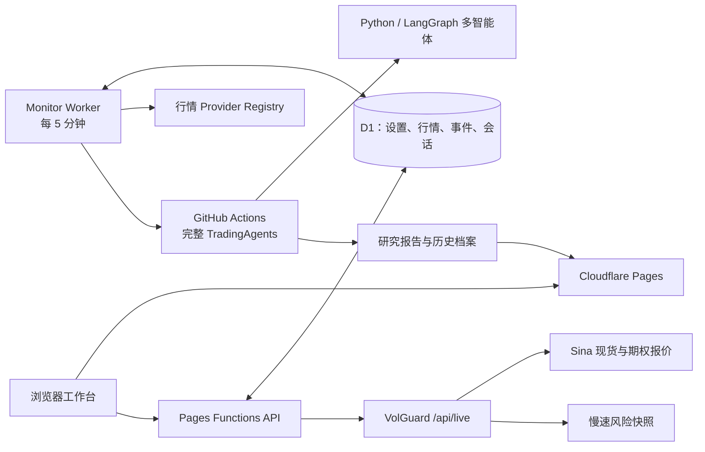
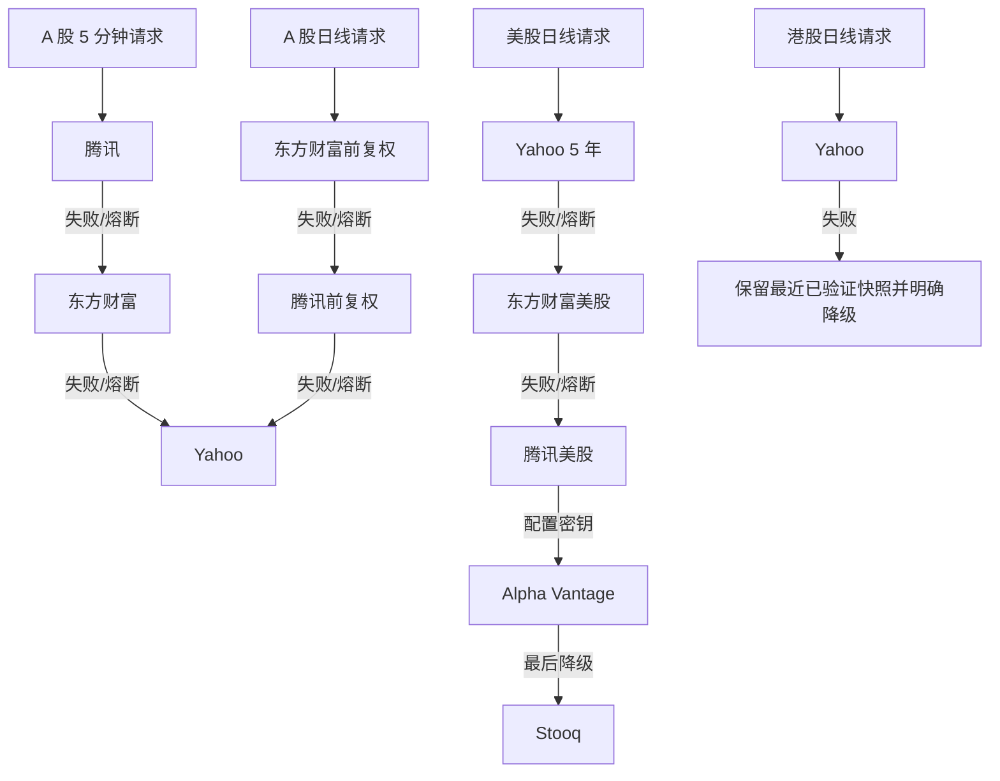
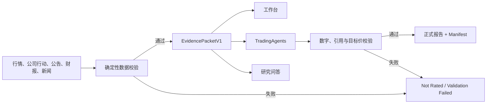
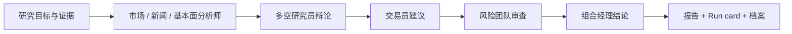
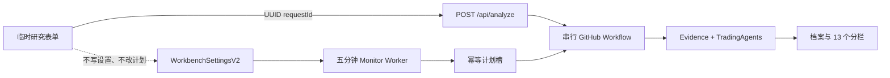
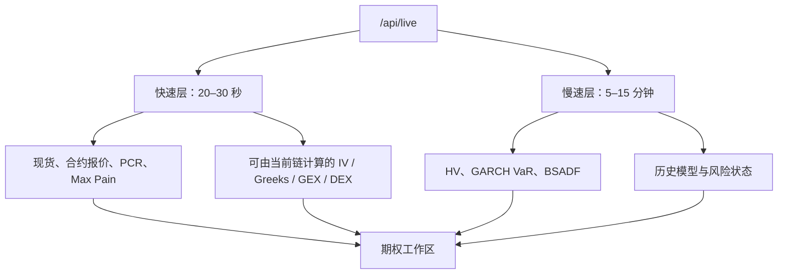

# Trading Workbench

面向 A 股 ETF 投资研究的多智能体工作台。它把主题监控、跨市场行情、新闻证据、TradingAgents 深度研究、研究档案、问答和上证 50 ETF 期权风控放在一个产品壳里，同时保留原 TradingAgents 的 Python 内核、CLI 和 LangGraph 协作流程。

- 生产工作台：[tradingagents-board.pages.dev](https://tradingagents-board.pages.dev/)
- 期权数据站：[sh50-volguard.pages.dev](https://sh50-volguard.pages.dev/)
- 主仓库：[gaaiyun/TradingWorkbench](https://github.com/gaaiyun/TradingWorkbench)
- 上游研究框架：[TauricResearch/TradingAgents](https://github.com/TauricResearch/TradingAgents)
- 当前产品版本：2026-07-26

> 本项目只做研究、解释和提醒，不连接券商，不自动交易。“实时”指有来源和时间戳的近实时数据，不代表交易所逐笔行情。

## 现在有什么

工作台有七个稳定的一级入口。ETF 监控不再覆盖原产品，而是其中一个工作区。

| 工作区 | 解决的问题 | 当前实现 |
|---|---|---|
| 市场监控 | 主题标的现在发生了什么 | 自选、5m/15m/1h/1d、K 线、成交量、MA20/60、MACD、RSI、事件和跨市场驱动 |
| Agent 研究 | 临时想到一只股票时如何研究 | 独立临时表单、标准/深度模式、精确请求状态、完整 TradingAgents 链路 |
| 研究任务 | 今天会跑什么 | 网页编辑标的角色、任务时间、启停、下一次执行、立即运行 |
| 研究档案 | 以前得出过什么结论 | 13 个角色分栏、审计状态、标的和日期、问答上下文 |
| 新闻/事件 | 结论依据是什么 | 来源、数据时间、标的、重要性、原文链接和证据流 |
| 期权风控 | 现货与期权风险如何变化 | 认购/认沽链、IV/HV、Greeks、GEX/DEX、PCR、Max Pain、VaR、BSADF、双刷新时钟 |
| 设置 | 监控目标如何调整 | `WorkbenchSettingsV2`、标的角色、分析深度、时区、任务频率和提醒阈值 |

页面采用统一的石墨灰研究终端样式：普通文字使用产品字体，只有价格和指标使用等宽数字；A 股红涨绿跌，美股和港股绿涨红跌，系统健康色与行情色分离。

## 默认研究目标

> 持续监控 A 股通信与半导体 ETF，识别美股半导体隔夜行情、行业新闻和政策变化对 A 股 ETF 的传导影响。

| 角色 | 标的 | 分析方式 |
|---|---|---|
| 核心 | `515880.SS` 通信 ETF、`512480.SS` 半导体 ETF | 每日完整 TradingAgents |
| 比较 | `159995.SZ` 芯片 ETF | 轻量信号 |
| 全球科技驱动 | `SOXX`、`SMH`、`NVDA`、`TSM`、`AVGO`、`AMD`、`ASML`、`ORCL`、`GOOGL`、`3887.HK` | 日线、隔夜驱动和事件 |
| 系统基准 | 沪深 300、纳指 100、美元人民币 | 不占用户自选位置 |

`ORCL` 和 `GOOGL` 用来观察云基础设施、广告、数据库与 AI 资本开支；`3887.HK`
是 HashKey Holdings，用来观察港股持牌数字资产基础设施及其监管风险。该身份已经由
[港交所发行人披露](https://www1.hkexnews.hk/search/titlesearch.xhtml?category=0&lang=EN&market=SEHK&stockId=1000284737)
和 [HashKey 投资者关系页](https://group.hashkey.com/en/investor-relations)交叉确认。
`GOOG` 会归一为 Alphabet 同公司别名，
`03887`、`3887` 和 `03887.HK` 会归一为 `3887.HK`。网页可以增删标的并修改角色，
D1 保存后即时生效；仓库内 JSON 只是空库种子和灾备。

## 系统结构


```mermaid
flowchart LR
    U["浏览器工作台"] --> P["Cloudflare Pages"]
    U --> F["Pages Functions API"]
    F <--> D[("D1：设置、行情、事件、会话")]
    W["Monitor Worker<br/>每 5 分钟"] <--> D
    W --> R["行情 Provider Registry"]
    W --> G["GitHub Actions<br/>完整 TradingAgents"]
    G --> A["Python / LangGraph 多智能体"]
    G --> O["研究报告与历史档案"]
    O --> P
    F --> V["VolGuard /api/live"]
    V --> Q["Sina 现货与期权报价"]
    V --> S["慢速风险快照"]
```

运行时分为三层：

1. Cloudflare Worker 做轻量采集、来源降级、15 分钟规则信号和幂等调度。
2. GitHub Actions 运行完整 TradingAgents、ETF 深度研究和报告生成。
3. Pages Functions + D1 提供设置、查询、问答、会话恢复和证据接口。

这样不会把 pandas、模型推理或多 Agent 辩论塞进五分钟边缘任务，也不会因为一个免费数据源失效让整页变空。

## 行情与来源

所有动态接口统一返回：

```json
{
  "status": "ok",
  "asOf": "2026-07-23T07:00:00.000Z",
  "data": {},
  "sources": []
}
```

`status` 只允许 `ok`、`degraded`、`stale`、`unavailable`。数据记录保留 `source`、`asOf`、`fetchedAt`、`freshness`、`adjustment` 和质量状态。


```mermaid
flowchart TD
    C5["A 股 5 分钟请求"] --> CT["腾讯"]
    CT -->|失败/熔断| CE["东方财富"]
    CE -->|失败/熔断| CY["Yahoo"]

    C1["A 股日线请求"] --> CD["东方财富前复权"]
    CD -->|失败/熔断| CQ["腾讯前复权"]
    CQ -->|失败/熔断| CY

    U["美股日线请求"] --> UY["Yahoo 5 年"]
    UY -->|失败/熔断| UE["东方财富美股"]
    UE -->|失败/熔断| UT["腾讯美股"]
    UT -->|配置密钥| UA["Alpha Vantage"]
    UA -->|最后降级| US["Stooq"]

    H["港股日线请求"] --> HY["Yahoo"]
    HY -->|失败| HC["保留最近已验证快照并明确降级"]
```

- 连续失败三次的来源暂停 15 分钟，恢复成功后清零。
- 5 分钟行情保留 90 天，日线保留 5 年。
- A 股日线每个交易日 15:20 回填，目标 1500 根；`512480.SS` 等发生份额拆分的 ETF 使用前复权序列，避免把拆分误判成单日暴跌。
- A 股 ETF 与美股日线图均支持 6 个月、1 年、3 年、5 年区间，目标上限 1260 根交易日；实际覆盖受上市日期和生产来源限制。
- 来源只能提供短历史时，页面显示实际起止日期、根数和降级原因。
- 过期数据不会被标成正常，也不会用示例价格填补生产空白。
- ETF 溢折价、iNAV、跟踪误差等字段只有在来源可靠且带时间戳时才展示。

## 调度与幂等

默认时区为 `Asia/Shanghai`。


```mermaid
gantt
    title 默认交易日任务
    dateFormat HH:mm
    axisFormat %H:%M
    section 美股
    收盘驱动快照 :milestone, us, 05:35, 0m
    section A股盘前
    新闻采集与轻量盘前简报 :milestone, pre, 08:25, 0m
    section A股盘中
    上午采集与信号 :active, am, 09:30, 120m
    下午采集与信号 :active, pm, 13:00, 120m
    section 收盘
    A 股日线回填与深度研究 :milestone, close, 15:20, 0m
```

Worker 每五分钟读取 D1 设置，按“任务 + 理论计划时间槽”生成幂等键。时间槽采用原子领取、租约、最多三次重试和 attempt fencing；重复 Cron、夏令时重叠或晚到的旧任务都不能重复写入或重复触发模型。

盘中每五分钟采集，每十五分钟计算价格异动和成交量 z-score。只有高等级事件进入 PushPlus；完整多智能体分析默认每天一次，避免把所有驱动标的都扩成高成本辩论。

新闻发现任务在 08:25 执行，按通信、A 股半导体、美股半导体、Oracle、Alphabet、
HashKey 和工信部政策主题采集。Oracle 与 Alphabet 优先读取 SEC EDGAR 8-K，
HashKey 优先读取公司投资者关系公告；A 股通信与芯片主题始终查询工信部官方
“文件发布”政策库，同时使用 Google News RSS 做发现。Google 从 Cloudflare 出口
不可用时，A 股发现层降级到东方财富资讯搜索；美股半导体、Oracle、Alphabet 与
HashKey 主题降级到对应的 Yahoo Finance RSS。东方财富仅属于发现层，
工信部政策原文才属于证据层。工信部查询固定 `cateid=58`、通信/芯片主题、上海日历
30 天窗口和最多 8 条结果，并在本地再次拒绝未来、窗口外、领导活动及非政策栏目。
SEC 请求使用符合 fair-access 要求的组织名与联系邮箱；官方源失败时，即使发现层有结果，
整次采集仍明确标为 `degraded`。D1 只保存
标题、短摘要、原始发布者、发布时间、采集时间、来源等级和原文链接；聚合结果标记为
`discovery`，SEC 8-K、工信部和 HashKey 公司公告标记为 `evidence`。`SMH` 只有匹配
`VanEck Semiconductor ETF` 等完整
实体名称时才关联到标的。

## 报告质量与证据门禁

旧报告保留原文，但不会继续无条件参与最新观点、问答和推送。系统为报告分别记录分析
状态与审计状态：

- 分析状态：`rated`、`not_rated`、`insufficient_evidence`、
  `data_validation_failed`。
- 审计状态：`verified`、`legacy_unverified`、`invalidated`。


```mermaid
flowchart LR
    S["行情、公司行动、公告、财报、新闻"] --> V["确定性数据校验"]
    V -->|"通过"| E["EvidencePacketV1"]
    V -->|"失败"| N["Not Rated / Validation Failed"]
    E --> UI["工作台"]
    E --> A["TradingAgents"]
    E --> Q["研究问答"]
    A --> C["数字、引用与目标价校验"]
    C -->|"通过"| R["正式报告 + Manifest"]
    C -->|"失败"| N
```

`EvidencePacketV1` 统一保存标的身份、市场、币种、资产类型、数据截止时间、复权
OHLCV、公司行动、指标样本数、新闻原文链接、来源降级过程、内容哈希和 Evidence ID。
数据连续性检查失败时不会调用模型生成 Buy/Sell；目标价只有在方法、输入、区间和情景
概率齐全时才展示。历史分析按 `asOf` 截断新闻与事实，避免把后来发布的信息带回过去。
Agent 只接收证据包中最后八根行情、指标、公司行动、新闻和来源组成的紧凑账本。报告
落盘前还会再次检查引用：未知 Evidence ID、无引用数字、无方法目标价或在缺少用户
持仓约束时给出具体仓位比例，都会把结果降为 `insufficient_evidence / Not Rated`，
不能标记为 `verified`。
每份新报告先显示一段由程序直接生成的 Evidence Snapshot，包括最近行情、指标、公司
行动、时点新闻、来源和完整性警告；它与 Agent 草稿分开，便于先核对事实再阅读推断。
证据包本身仍保留完整历史：已监控标的优先读取工作台已落库的日线；临时标的按需请求
约五年并限制为 1260 根。Yahoo `auto_adjust` 明确记录为
`split-and-dividend-adjusted`，不再冒充 A 股 `qfq`；两种复权口径会在 Packet 中披露。
技术快照包含 MA20/60/200、MACD、RSI14、ATR14 和 20 日实现波动率，避免临时研究只能
看到六个月、无法计算 MA200。
行情进入模型前还要通过有限数和 OHLC 区间校验。Yahoo 若在目标日返回只有成交量、
OHLC 为 `NaN` 的未完成日线，该行会被丢弃并阻断当日评级；合法休市没有目标日记录时
不会误判。证据 JSON、报告写盘和发布均禁止 `NaN`/`Infinity`。新报告 Manifest 保存
证据文件 SHA-256，档案审计按实际文件重算，不一致即失效。
GitHub 深度任务生成证据包后，用独立写入密钥提交到 `/api/v1/evidence`；Pages Function
校验 Schema、哈希、标的、时间和 Manifest 后才参数化写入 D1。网页、问答和后续 Agent
读取同一份只读快照；旧 `/api/evidence` 保留为兼容入口。写入失败只标记发布降级，
不会把未保存的包伪装成可追溯证据。

档案阅读器保留 13 个角色分栏，并支持 GFM 表格、引用、自动链接、分隔线、有序/无序
列表和代码块。表格在窄屏横向滚动，外链使用安全协议白名单，原始 HTML 始终转义。

档案页默认隐藏 `invalidated` 报告，可在“历史审计”中查看原文和失效原因。当前全量审计
结果见 [报告质量审计](docs/REPORT_QUALITY_AUDIT.md)，网页读取的同源索引位于
[`public/data/report-audit.json`](public/data/report-audit.json)。
同一交易日重跑不会覆盖旧目录，而是写入 `-v2`、`-v3` 版本并在审计索引中建立替代关系。
首页“最新观点”只读取 `verified` 报告；`legacy_unverified` 和 Not Rated 草稿仍可在
研究档案中查看，但不会伪装成当前投资结论。
审计索引还把未产出报告的运行拆成 `evidence_validation`、`analysis_execution` 和
`invalid_input`，避免把数据门禁、模型/流程故障和错误代码输入混成一种“分析失败”。

## TradingAgents 研究链

原 TradingAgents 内核没有被替换。


```mermaid
flowchart LR
    I["研究目标与证据"] --> AN["市场 / 新闻 / 基本面分析师"]
    AN --> DB["多空研究员辩论"]
    DB --> TR["交易员建议"]
    TR --> RM["风险团队审查"]
    RM --> PM["组合经理结论"]
    PM --> RC["报告 + Run card + 档案"]
```

Python 包、CLI、LangGraph、检查点恢复、历史决策和多模型 Provider 仍可单独使用。工作台只是为它增加网页任务编排、监控上下文、阶段状态和报告入口。

### 临时研究与持续监控的边界


```mermaid
flowchart LR
    U["临时研究表单"] -->|"UUID requestId"| API["POST /api/analyze"]
    API --> G["串行 GitHub Workflow"]
    G --> P["Evidence + TradingAgents"]
    P --> H["档案与 13 个分栏"]

    S["WorkbenchSettingsV2"] --> W["五分钟 Monitor Worker"]
    W --> K["幂等计划槽"]
    K --> G

    U -. "不写设置、不改计划" .-> S
```

临时研究默认使用市场、新闻和基本面分析师。标准模式最多 6 个标的，深度模式最多 3 个；
上限只约束临时请求，监控组合仍保留原有最多 10 个标的和 240 分钟运行契约。网页只跟踪
本次 `requestId`，GitHub 尚未创建运行记录时显示“已受理，等待进入队列”，不会把其他
定时任务误认为当前请求。Sentiment 目前不开放：Reddit 可用但 StockTwits 在实际出口
返回 403，来源健康尚未进入 Manifest，不能把占位文本当成可信情绪分卷。

报告分栏固定为：技术/市场、基本面、市场情绪、新闻、多方、空方、研究经理、交易方案、
激进风险、中性风险、保守风险、组合决策、完整报告。不存在的分卷直接隐藏，默认打开
组合决策；路径必须与完整报告位于同一版本目录。问答先验证完整报告 Manifest，再读取
选中分卷；分卷缺失只回退同一份完整报告，不会回退到其他标的。

Agent 对 ETF 不应套用普通公司的财务模板。主题报告应优先检查跟踪指数、持仓与权重、规模、流动性、费用、跟踪偏离、份额变化和公司行动，并按以下结构输出：

1. 发生了什么。
2. 证据及时间。
3. 对 A 股 ETF 的可能传导。
4. 置信度和假设。
5. 反证或替代解释。
6. 下一观察点。

## 期权风控

VolGuard 保持独立运行和独立故障域，但在工作台中是一等入口，而不是一个失效外链。


```mermaid
flowchart TD
    L["/api/live"] --> F["快速层：20–30 秒"]
    L --> S["慢速层：5–15 分钟"]
    F --> F1["现货、合约报价、PCR、Max Pain"]
    F --> F2["可由当前链计算的 IV / Greeks / GEX / DEX"]
    S --> S1["HV、GARCH VaR、BSADF"]
    S --> S2["历史模型与风险状态"]
    F1 --> UI["期权工作区"]
    F2 --> UI
    S1 --> UI
    S2 --> UI
```

页面分别显示“行情时间”和“模型时间”。休市、快照、过期和不可用是四种不同状态；缺失指标显示 `—`，不显示成 `0`。VolGuard 的 Python 主程序仍保留四窗格、BSADF、GARCH VaR、HV/IV、GEX/DEX、Max Pain、Greeks 和期权雷达。

## 研究问答

问答使用 SSE，但不是一次性聊天：

- 每次请求带稳定 `requestId` 和 `sessionId`。
- D1 原子领取请求；重复请求回放已保存答案，不重复计费。
- 浏览器断线后，服务端继续完成上游响应并写入 D1。
- 当前行情、指标、新闻、事件、主题报告和历史报告进入上下文。
- 问题里出现 profile 内的代码或标的名称时，该标的覆盖当前图表选择；例如在
  `515880.SS` 图表上询问 `512480`，服务端仍读取 `512480.SS` 的证据。
- 证据编号保留来源和时间；上下文保存 SHA-256 哈希。
- 没有足够证据时必须回答“无法归因”，不能编造涨跌原因。
- 访问码只放请求头，不进入前端代码、D1 或日志。

## Agent 只读工具

本地 stdio MCP 提供五个只读工具：监控目标、监控快照、行情、新闻和研究运行。所有
上游请求固定为 GET，不能修改网页设置、写入 D1、触发 GitHub Actions 或执行交易。

```powershell
npm run mcp:readonly
```

默认连接生产工作台；本地调试可用 `TRADING_WORKBENCH_URL` 改写基地址。客户端配置、
输入上限和安全边界见 [只读 MCP](docs/mcp-readonly.md)。

## 本地运行

### Python / CLI

```powershell
python -m venv .venv
.\.venv\Scripts\Activate.ps1
python -m pip install -e ".[dev]"
tradingagents
```

### 工作台

```powershell
npm run test:functions
npm run test:frontend
npx wrangler pages dev public
```

本地 D1：

```powershell
npx --yes wrangler@4.113.0 d1 migrations apply tradingagents-workbench --local --config wrangler.monitor.toml
```

不要把真实密钥写进仓库。可配置项见 [.env.example](.env.example) 和 [部署与运维](docs/operations-and-deployment.md)。

## 验证

提交前至少运行：

```powershell
npm run test:functions
npm run test:frontend
npm run check:workbench
python -m pytest -q --ignore=tests/e2e_workbench.py
$env:PLAYWRIGHT_BROWSERS_PATH = "G:\ClaudeData\ms-playwright"
python tests/e2e_workbench.py
```

Python 核心测试应使用已经安装完整项目依赖的虚拟环境。浏览器测试和完整 Python 测试在资源有限的 Windows 机器上应串行执行。

当前验收覆盖：

- 网页设置保存后立即生效，下一运行时间正确。
- 七个一级入口可以真实进入，不只检查按钮文字。
- Agent 任务触发、阶段状态、报告归档和 run card。
- K 线增量更新、行情请求竞态、美股五年区间和中美颜色规则。
- 新闻筛选、期权双时钟、自动刷新、无数据和降级状态。
- SSE、请求幂等、断线恢复、持久会话、错误访问码和证据引用。
- 报告审计隔离、拆分连续性、历史时点过滤、Evidence ID 和无证据不评级。
- `GOOGL`/`GOOG` 实体归一、`03887`/`3887.HK` 港股归一和短历史保护。
- 五个 MCP 查询工具保持 GET-only，未知写工具会被拒绝。
- TradingAgents 核心、CLI、报告和 workflow 仍存在。

## 部署

生产由两个仓库协作：

- 本仓库保存工作台、Pages Functions、D1 migration、Monitor Worker 和 TradingAgents。
- VolGuard 仓库保存期权引擎，并用 Pages 权限定时部署两个网页项目；监控 Worker
  当前由本机 Wrangler OAuth 发布。补齐 Workers Scripts Edit 和 D1 Edit 后，手动
  workflow 才会按显式开关部署 Worker 或应用 migration。

部署顺序：

1. 运行全部测试。
2. 应用 D1 migration。
3. 部署 `tradingagents-monitor` Worker 和五分钟 Cron。
4. 部署 `tradingagents-board` Pages。
5. 部署或刷新 `sh50-volguard`。
6. 检查 `/api/health`、`/api/monitor-status`、`/api/market`、`/api/volguard`。
7. 用真实访问码做问答冒烟，问题为“今天 512480 为什么涨跌”。

详细命令、密钥名、回退和故障排查见 [docs/operations-and-deployment.md](docs/operations-and-deployment.md)。

## 文档

- [架构、接口与数据流](docs/architecture-and-data-flows.md)
- [报告质量审计与历史报告状态](docs/REPORT_QUALITY_AUDIT.md)
- [参考项目、数据源与取舍](docs/etf-monitoring-reference-and-decisions.md)
- [部署、密钥、验收与回退](docs/operations-and-deployment.md)
- [本地只读 MCP 工具](docs/mcp-readonly.md)
- [产品回归、迁移与防复发约束](docs/regression-and-migration.md)
- [下一 Agent 交接](docs/NEXT_AGENT_HANDOFF.md)
- [统一工作台设计记录](docs/superpowers/plans/2026-07-24-workbench-unification-design.md)

## 参考与许可证

本 fork 源自 [TauricResearch/TradingAgents](https://github.com/TauricResearch/TradingAgents)，保留其研究框架与开源许可证。产品设计还参考了 Vibe-Trading、OpenBB、Qlib、FinGPT、AI Hedge Fund、Ashare、adata、AKShare、QuantStats、awesome-systematic-trading、TradingView Lightweight Charts、iVIX 和 options_monitor。采用了什么、拒绝了什么以及原因，统一记录在[参考项目与架构决策](docs/etf-monitoring-reference-and-decisions.md)。

本项目的分析可能因数据延迟、免费来源变更、模型随机性和配置差异而变化，不构成投资建议。
