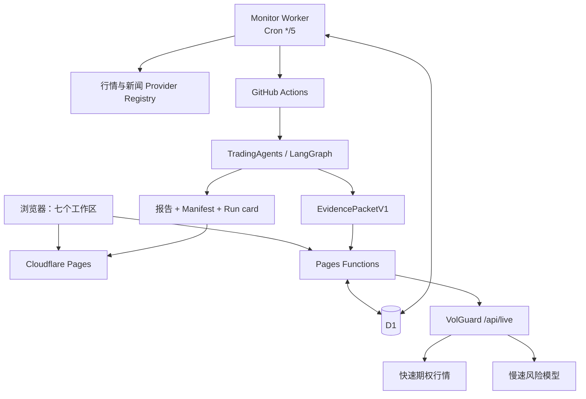

# Trading Workbench 下一 Agent 交接

更新日期：2026-07-26

用途：在当前 Codex 任务中断、重启或换 Agent 后，直接恢复工程状态，不重复推翻已经完成的产品结构。

## 1. 先看这里

项目已经从“单一 TradingAgents 演示”演进为一个研究工作台，ETF 监控只是其中一个工作区，不能再替换整个产品壳。下一位 Agent 的首要约束是：

1. 保留七个一级入口：市场监控、Agent 研究、研究任务、研究档案、新闻/事件、期权风控、设置。
2. 保留原 TradingAgents Python、CLI、LangGraph 多智能体、GitHub Actions 和报告归档。
3. 保留 VolGuard 完整期权能力及其独立故障域；工作台内的期权页不是静态外链。
4. 数据失败时显示降级、过期或不可用，不得启用 fixture 或模拟行情冒充生产数据。
5. 历史报告只有通过证据、引用和 Manifest 门禁后才能进入最新观点、问答或推送。
6. 不创建带 `codex/` 字样的分支；commit 不添加 AI 或 Co-Authored-By 署名。
7. 不把任何访问码、API key、Cloudflare token、GitHub token 或浏览器凭据写进仓库、D1、报告、日志或本文。

## 2. 本地与 GitHub

| 项目 | 当前值 |
|---|---|
| 工作树 | `G:\worktrees\TradingWorkbench\report-evidence-pipeline` |
| 当前本地工作树分支 | `fix/report-evidence-pipeline`（完成验收后快进到 `main`，不长期保留） |
| 权威分支 | `main` |
| 远程 | `https://github.com/gaaiyun/TradingWorkbench.git` |
| Python 虚拟环境 | `G:\venvs\tradingworkbench-report-evidence` |
| Pages 生产站 | `https://tradingagents-board.pages.dev/` |
| Monitor Worker | `https://tradingagents-monitor.gaaiyun-risk-selfcheck.workers.dev/` |
| VolGuard | `https://sh50-volguard.pages.dev/` |
| D1 | `tradingagents-workbench` |
| Pages 项目 | `tradingagents-board` |
| Worker 名称 | `tradingagents-monitor` |

### 2026-07-26 本轮交付内容

- 官方证据源：SEC User-Agent 支持 `SEC_CONTACT_EMAIL`，403 保留失败轨迹；工信部改为
  官方文件发布 API，不再读取“部领导活动”RSS。A 股发现层成功后仍会查询工信部，
  两层结果可同时入库；官方失败不能被发现层掩盖。
- 临时研究：网页可独立输入新标的，不写 `WorkbenchSettingsV2`；standard 最多 6 个，
  deep 最多 3 个。监控组合仍保留最多 10 个标的和原有调度契约。
- 临时行情：按需读取约五年、最多 1260 根；补 MA200，并明确区分 Yahoo
  `split-and-dividend-adjusted` 与 A 股 D1 `qfq`。
- 状态关联：临时请求使用 UUID `requestId`，页面只匹配自身 GitHub run；未入队时不借用
  其他定时任务状态。
- 档案：当前索引包含 23 次运行、53 条结果，其中 47 份成功报告均已按真实文件回填
  `files`；13 个固定分栏缺失即隐藏，默认组合决策，支持键盘与重试。
- 问答：完整报告 Manifest 仍是门禁；选中分栏由服务端枚举映射，同栏缺失只回退同一份
  完整报告。
- Sentiment 暂不开放：Reddit 可达，StockTwits 实际返回 403，尚无可信来源健康 Manifest。
- 已同步实现提交：`0dace87`、`90b2d9d`、`1e487a7`、`93123cd`、`ea9727c`、
  `0263f89`、`9cbaf14`、`ed6acb7`。`ed6acb7` 修复真实 MSFT 任务暴露的非有限行情、
  严格 JSON、目标日缺口、Evidence API 语义校验和报告文件哈希门禁。
- 报告 Markdown 已拆成独立安全渲染模块，支持 GFM 表格、引用、裸链接、分隔线、
  有序列表和代码块；13 个角色分栏及监控配置不变。

### 2026-07-26 本轮新鲜验证

- Functions：228 passed / 1 skipped；跳过项只在显式启用时调用真实免费 Provider。
- 前端与导航：55 passed。
- Python：637 passed / 2 skipped；跳过原因分别是本机未安装 `langchain_aws`、未配置
  DeepSeek 测试密钥。
- Ruff：`All checks passed`。
- 前端语法：`public/assets/workbench.js` 与 `public/assets/workbench-markdown.mjs`
  均通过 `node --check`。
- 浏览器 E2E：62/62 个显式断言通过，包含档案页真实挂载后的表格、链接、引用和
  分隔线检查，退出码 0。
- 报告审计：47 份成功报告；0 verified、43 legacy_unverified、4 invalidated；另有 6 条
  无报告记录，其中证据校验 3、模型/流程 2、错误输入 1。
- GitHub `main` 已同步到 `ed6acb7`。真实 MSFT 重验
  `https://github.com/gaaiyun/TradingWorkbench/actions/runs/30168909752` 已正确阻断
  缺失目标日完整行情；该次失败未持久化，后续已修改 workflow 为“先持久化失败记录，
  再将任务标红”，必须用下一次真实运行确认。

### 会话与审计材料位置

- Codex 会话目录：`G:\codex-home\sessions\2026\07\25\`；可搜索短语
  `临时标的数据通道` 找到本轮并行审计记录。
- Codex 会话索引：`G:\codex-home\session_index.jsonl`。
- Claude 可读历史：`G:\ClaudeCode\readable\`；原始归档：
  `G:\ClaudeCode\archive\`。
- 用户粘贴的完整对话附件：
  `G:\codex-home\attachments\abf231d7-7ccb-4ece-bfa9-da37dad5ba99\pasted-text.txt`。

### 2026-07-25 最终生产验收基线

- Pages 生产域名：`https://tradingagents-board.pages.dev/`；2026-07-26 已验证预览为
  `https://e55f95bc.tradingagents-board.pages.dev`。
- Worker 版本：`24776c52-43e4-4c79-86c4-2bf48d93eaf3`。
- `/api/health`：`status=ok`，访问门禁、问答、分析调度和 D1 共享会话均已配置。
- `/api/v1/evidence`：未授权请求返回 JSON 401，不再错误回退到 HTML。
- 报告审计：46 份成功报告；0 verified、43 legacy_unverified、3 invalidated；另有 6 条失败记录。
- 日线覆盖：ORCL 与 GOOGL 各 1,255 根、3887.HK 145 根；港股样本短是上市历史边界，不补造数据。
- A 股新闻：515880.SS 9 条、512480.SS 16 条、159995.SZ 16 条，全部带原文链接。Google News 在 Cloudflare 出口失败时，东方财富发现层已在生产回退成功。
- VolGuard：`/api/live` 返回 92 份期权合约；快行情、标的时间和慢指标时间分别记录。
- 问答：生产问题“今天 512480 为什么涨跌”返回 21 条证据、时间与来源，并因点时数据校验失败明确答复“无法可靠归因”；同一请求重放命中 D1；SSE 有 `meta/delta/done`；失效报告正文未进入上下文。
- 本地验证：Functions 206 passed / 1 skipped，前端 42 passed，Python 612 passed / 2 skipped，ruff 和浏览器 E2E 均通过。

GitHub `deploy-workbench` 在仓库未配置 Cloudflare 凭据时会“测试成功、部署步骤 skipped”。本轮因此使用本机 Wrangler OAuth 完成 Pages 和 Worker 发布。后续不能只看 workflow 总结为绿色就宣称生产已更新，必须检查部署步骤并访问生产路由。

接手时先执行：

```powershell
Set-Location "G:\worktrees\TradingWorkbench\report-evidence-pipeline"
git fetch origin --prune
git status --short
git log --oneline --decorate --graph --max-count=20 --all
```

不要在工作树不干净时直接 rebase、切分支或删除文件。先阅读差异并确认它属于本任务还是用户的其他改动。

## 3. 本次 Codex 对话

这次长任务的原始会话文件是：

```text
G:\codex-home\sessions\2026\07\22\rollout-2026-07-22T17-59-01-019f8943-9db3-7c52-88de-0cb3773977ba.jsonl
```

确认方法：

```powershell
rg -F "TradingWorkbench 全量报告审计与证据链修复计划" `
  "G:\codex-home\sessions\2026\07\22\rollout-2026-07-22T17-59-01-019f8943-9db3-7c52-88de-0cb3773977ba.jsonl"
```

该 JSONL 只用于本机只读恢复上下文。它可能包含长对话、工具输出和敏感运维上下文：

- 不要提交、上传、复制或全文打印；
- 不要把其中的访问码、token、key 或 Cookie 写入本文或 GitHub；
- 只用 `rg` 搜索需要的用户要求和已完成状态；
- Claude Code 的历史若需要交叉核对，实体数据在 `G:\ClaudeCode`，恢复说明在 `G:\ClaudeCode\项目恢复提示词.md`。

## 4. 产品结构



三个运行层必须保持清晰：

- Pages + Functions + D1：页面、动态查询、设置、问答、会话、证据读取、报告和 VolGuard 代理。
- Monitor Worker：每五分钟调度、行情和新闻采集、十五分钟信号、幂等时间槽、GitHub dispatch。
- GitHub Actions + Python：完整多 Agent 研究、点时证据、报告、审计和历史持久化。

VolGuard 在另一个仓库运行。工作台通过 `/api/volguard` 读取实时接口，失败才降级到快照。不要把两个 Python/Cloudflare 项目强行合成一个运行时。

## 5. 默认研究目标

配置种子位于 `public/data/workbench-settings.json`，D1 才是在线设置真值。默认 profile 是 `cn-semi-comms`：

- 核心完整分析：`515880.SS`、`512480.SS`。
- 同类比较：`159995.SZ`。
- 美股半导体驱动：`SOXX`、`SMH`、`NVDA`、`TSM`、`AVGO`、`AMD`、`ASML`。
- 全球科技与数字资产驱动：`ORCL`、`GOOGL`、`3887.HK`。
- 系统基准：沪深 300、纳指 100、美元人民币，不占普通自选位置。

实体规范：

- `GOOG` 归一为 `GOOGL`；
- `03887`、`3887`、`03887.HK` 归一为 `3887.HK`；
- `SMH` 不能用普通英文缩写裸匹配，必须匹配完整基金实体或明确代码语境。

默认时区是 `Asia/Shanghai`：

- 05:35 美股收盘驱动快照；
- 08:25 新闻发现与盘前上下文；
- 09:30–11:30、13:00–15:00 每五分钟采集、每十五分钟信号；
- 15:20 A 股日线回填和收盘深度分析。

## 6. 行情数据流

| 资产/周期 | 优先级 | 关键约束 |
|---|---|---|
| A 股 5m | 腾讯 → 东方财富 → Yahoo | 近实时，不宣称逐笔 |
| A 股 1d | 东方财富 qfq → 腾讯 qfq → Yahoo | 前复权优先；拆分不能变成暴跌 |
| 美股 1d | Yahoo → 东方财富 → 腾讯 → Alpha Vantage → Stooq | 目标五年、约 1,250 根 |
| 港股 1d | Yahoo → 最近已验证快照 | 短上市历史要明确 |

所有记录带 `source`、`asOf`、`fetchedAt`、`freshness`、`adjustment` 和质量状态。连续失败三次的来源暂停十五分钟。D1 保存 5m 约 90 天、日线约五年；15m/1h 等周期由服务端聚合。

重点回归：

- `512480.SS` 在 2026-07-03 附近的份额拆分必须保持 qfq 连续；
- 美股日线页面支持 6m/1y/3y/5y，不再固定 240 或 320 根；
- `3887.HK` 上市历史不足时不计算 MA200 或虚构五年趋势；
- 页面与深度 Agent 必须使用相同复权口径和截止时间。

## 7. 新闻证据流

当前实现的证据和发现层：

| 类型 | 来源 | 用法 |
|---|---|---|
| 官方证据 | SEC EDGAR 8-K（ORCL、GOOGL） | 首选，`sourceTier=evidence` |
| 官方证据 | HashKey Investor Relations | 3887.HK 首选，`sourceTier=evidence` |
| 官方证据 | 工信部文件发布 API | A 股通信、半导体和政策证据；上海 30 天窗口 |
| 发现层 | Google News RSS | 主题发现，不作为最终事实来源 |
| 发现降级 | 东方财富资讯搜索 | Cloudflare 出口访问 Google 失败时补齐 A 股主题；仍为 `discovery` |
| 发现降级 | Yahoo Finance RSS | Google/官方页失败后的发现层 |

SEC CIK：

- Oracle：`0001341439`
- Alphabet：`0001652044`

SEC 只接受 `8-K`/`8-K/A`，链接必须是 `https://www.sec.gov/Archives/edgar/data/...`。每条新闻保存标题、短摘要、原始发布者、原文链接、发布时间、采集时间、来源层级、标的、主题和重复簇，不保存付费全文。

A 股通信与芯片主题始终查询工信部证据层；Google/东方财富只构成一条“首个有效来源”
的发现链。发现层成功不能让工信部候选提前结束，工信部失败也必须保留轨迹并使本次采集
标记为 `degraded`。官方端点即使返回 HTTP 200，若缺少 MIIT JSON envelope、SEC Atom
`feed` 或 HashKey 文章 feed，也按 `NEWS_MALFORMED_RESPONSE` 降级，不能当作合法零条。

未来官方源仍有缺口：上交所/深交所基金公告、巨潮、基金管理人、中证指数、更多公司 IR 和 HKEXnews 尚未全部成为直接采集器。增加时必须保留 Provider Registry、失败轨迹、去重和原始链接，不能把聚合标题升级为官方证据。

## 8. Evidence 与报告门禁

`EvidencePacketV1` 至少包含：

- 标的、市场、币种、资产类型；
- `asOf`、`generatedAt`、内容哈希；
- 复权 OHLCV、公司行动、连续性检查；
- 指标、实际样本数、指标版本；
- 点时新闻和原始链接；
- 来源降级轨迹；
- Evidence ID、可支持结论、反证和未解决问题。

主接口是 `/api/v1/evidence`，旧 `/api/evidence` 保留为兼容入口。新接口要求标准 `Authorization: Bearer ...`；POST 上限 1 MiB。D1 在线保留 180 天，报告目录中的 `evidence_packet.json` 和 `report_manifest.json` 是长期审计副本。

分析状态：

- `rated`
- `not_rated`
- `insufficient_evidence`
- `data_validation_failed`

审计状态：

- `verified`
- `legacy_unverified`
- `invalidated`

未产出报告的失败分类：

- `evidence_validation`
- `analysis_execution`
- `invalid_input`

正式结论必须同时满足：

1. Evidence Packet 状态可评级且哈希有效；
2. 报告路径、标的、日期与 Manifest 一致；
3. `claimValidation.status=passed`；
4. 每个数字结论引用已知 Evidence ID；
5. 目标价具有方法、输入、区间和情景；
6. 没有用户持仓/风险预算时不输出具体清仓或仓位比例；
7. `analysisStatus=rated` 且 `auditStatus=verified`。

不满足时保留草稿，但标记 Not Rated 或相应失败，不得进入首页最新观点、问答、推送和组合结论。

人工确认的公司行动污染报告是：

- `reports/515880.SS/2026-07-24/complete_report.md`
- `reports/512480.SS/2026-07-23/complete_report.md`
- `reports/512480.SS/2026-07-24/complete_report.md`

审计器还会动态失效 Manifest/证据包不一致的报告。当前
`reports/MSFT/2026-07-24/complete_report.md` 因非标准 `NaN` 包标为
`INVALID_EVIDENCE_PACKET`；不能将这类损坏包降回 `legacy_unverified`。

同日 `-v2`、`-v3` 不得被连带失效。机器审计索引是 `public/data/report-audit.json`，生成命令是：

```powershell
node scripts/report-audit.mjs
```

发布前以机器索引的 `generatedAt` 和 `summary` 为准，不手写猜测数量。

2026-07-25 最终重验快照：

- Actions：
  `https://github.com/gaaiyun/TradingWorkbench/actions/runs/30154765352`
- 数据提交：`0815a18`
- 报告数：47
- `verified`：0
- `legacy_unverified`：43
- `invalidated`：4
- 无报告运行：6，其中证据校验 3、模型/流程 2、错误输入 1

这次五标的运行的 Packet 全部通过并发布成功，但五份 Agent 文本仍因未引用数字、无方法目标价或无用户约束的仓位建议未通过 claim validation，所以保持 Not Rated。不要为了生成评级而放松门禁。

## 9. 问答

问答是持久化 SSE 服务，不是一次性前端聊天：

- 稳定 `requestId` 和 `sessionId`；
- D1 原子 claim；
- 重复请求回放，不重复调用模型；
- 浏览器断线后服务端继续完成并持久化；
- 当前行情、指标、新闻、事件、Evidence Packet 和已验证报告进入上下文；
- 问题中的 profile 标的覆盖当前图表选择；
- 上下文保存 SHA-256 哈希；
- 证据不足时明确回答无法可靠归因。

历史报告上下文采用 fail-closed 门禁：只有路径为标准版本目录，且相邻 Manifest 同时满足 `rated + verified + claim validation passed + evidence ok + SHA-256` 时才读取报告正文。打开旧档案不会让它自动进入问答。

访问码只从请求头进入，不存前端、D1 或日志。交接文档不记录访问码值；需要时从 Cloudflare Secret 轮换，而不是从历史日志搜索。

## 10. 期权风控

VolGuard schema v2 有两个时钟：

- 快速层 20–30 秒：现货、合约报价、PCR、Max Pain，以及当前链可计算的 IV、Greeks、GEX、DEX。
- 慢速层 5–15 分钟：HV、GARCH VaR、BSADF 和历史模型。

页面必须分别显示报价时间和模型时间。`market_closed`、`stale`、`snapshot`、`unavailable` 含义不同；缺失值显示 `—`，不能显示成零。

完整 Python 主站保留四窗格、BSADF、GARCH VaR、HV/IV、GEX/DEX、Max Pain、Greeks 和期权雷达。工作台内期权页通过 `/api/volguard` 接入，不得退化为只指向简化静态站的按钮。

## 11. 只读 MCP

启动：

```powershell
npm run mcp:readonly
```

默认连接生产，可用 `TRADING_WORKBENCH_URL` 改基地址。只提供五个 GET-only 工具：

- `list_monitor_profiles`
- `get_monitor_snapshot`
- `get_market_bars`
- `search_market_news`
- `get_research_run`

行情最多 1260 根，新闻最多 100 条。进程不得接收 `ACCESS_CODE`、`EVIDENCE_WRITE_TOKEN` 或 GitHub token，不得增加设置写入、分析触发或交易工具。

## 12. Secret 和变量名称

这里只列名称，不列值。

Pages Functions：

- `ACCESS_CODE`
- `OPENAI_COMPATIBLE_API_KEY` 或 `TRADINGAGENTS_CHAT_API_KEY`
- `TRADINGAGENTS_LLM_BACKEND_URL`
- `TRADINGAGENTS_CHAT_MODEL`
- `GITHUB_DISPATCH_TOKEN`
- `VOLGUARD_LIVE_URL`
- `VOLGUARD_SNAPSHOT_URL`
- `EVIDENCE_READ_TOKEN`
- `EVIDENCE_WRITE_TOKEN`

Monitor Worker：

- `GITHUB_DISPATCH_TOKEN`
- `MONITOR_RUN_TOKEN`
- `ALPHA_VANTAGE_API_KEY`
- `CN_HOLIDAY_DATES`
- `US_HOLIDAY_DATES`
- `SEC_CONTACT_EMAIL`

GitHub Actions：

- 至少一个当前 provider 所需 LLM key；
- 可选 `ALPHA_VANTAGE_API_KEY`、`FRED_API_KEY`、`PUSHPLUS_TOKEN`；
- `EVIDENCE_WRITE_TOKEN` 必须与 Pages 同名 Secret 一致；
- Pages 自动部署需要 `CLOUDFLARE_API_TOKEN` 和 `CLOUDFLARE_ACCOUNT_ID`。

GitHub Secret 无法读回原值。忘记访问码时在 Cloudflare 轮换，并重新做设置和问答冒烟。

## 13. 完整验证

使用 G 盘虚拟环境，避免系统 Python 缺少依赖：

```powershell
Set-Location "G:\worktrees\TradingWorkbench\report-evidence-pipeline"

npm run check:workbench
npm run test:functions
npm run test:frontend

G:\venvs\tradingworkbench-report-evidence\Scripts\python.exe -m ruff check .
G:\venvs\tradingworkbench-report-evidence\Scripts\python.exe -m pytest -q

$env:PLAYWRIGHT_BROWSERS_PATH = "G:\ClaudeData\ms-playwright"
$env:WORKBENCH_SCREENSHOT_DIR = "G:\codex-home\visualizations\2026\07\25\tradingworkbench-final"
G:\venvs\tradingworkbench-report-evidence\Scripts\python.exe tests\e2e_workbench.py

git diff --check
git status --short
```

Python 全量测试和浏览器测试串行运行，避免 Windows 机器内存压力造成假失败。不能用子 Agent 的测试报告代替主 Agent 的最终新鲜验证。

## 14. 部署

顺序是 D1 migration → Worker → Pages → 生产冒烟：

```powershell
npx --yes wrangler@4.113.0 d1 migrations apply tradingagents-workbench --remote --config wrangler.monitor.toml
npx --yes wrangler@4.113.0 deploy --config wrangler.monitor.toml
npx --yes wrangler@4.113.0 pages deploy public --project-name tradingagents-board --branch main
```

Worker 当前通常由本机 Wrangler OAuth 发布。若 Cloudflare token 没有 Workers Scripts Edit 或 D1 Edit，自动 workflow 只测试并明确跳过对应部署，不要误报为已上线。

生产只读检查：

```powershell
Invoke-RestMethod https://tradingagents-board.pages.dev/api/health
Invoke-RestMethod https://tradingagents-board.pages.dev/api/monitor-status
Invoke-RestMethod "https://tradingagents-board.pages.dev/api/market?profile=cn-semi-comms&symbol=512480.SS&timeframe=1d&limit=1260"
Invoke-RestMethod "https://tradingagents-board.pages.dev/api/news?profile=cn-semi-comms&symbol=GOOGL&limit=20"
Invoke-RestMethod https://tradingagents-board.pages.dev/api/volguard
Invoke-RestMethod https://sh50-volguard.pages.dev/api/live
Invoke-RestMethod https://tradingagents-board.pages.dev/api/report-audit
```

带真实访问码验证：

- 保存一次设置并确认 `updatedAt` 变化；
- 触发一次轻量或完整分析并拿到 run ID；
- 问“今天 512480 为什么涨跌”，检查时间、证据、无法归因行为；
- 用同一 `requestId` 重放，确认 `replayed=true`；
- SSE 必须有 `meta`、`delta`、`done`；
- 刷新页面后会话仍可恢复；
- 指定失效报告路径时，问答不得读取其正文。

证据 API 上线后必须确认 `/api/v1/evidence` 返回 JSON，而不是 Pages 的 HTML fallback；POST 和受保护 GET 使用标准 Bearer header。

## 15. GitHub 收口

报告任务和人工任务都可能向 `main` 写入数据提交。最终合并前：

1. 等正在运行的 `daily-analysis` 完成；
2. `git fetch origin --prune`；
3. 检查它新增的 `latest.json`、history、报告目录、Manifest 和 Evidence Packet；
4. 运行 `node scripts/report-audit.mjs`；
5. 重新跑完整测试；
6. 使用普通 merge 或 fast-forward 把功能分支并入 `main`；
7. push 后检查 CI 和 `deploy-workbench`；
8. 生产冒烟通过后再删除已合并的远程功能分支。

不要 force push，不重写共享历史。若自动报告提交与本地文档提交竞态，先 fetch，再用常规 merge 解决；报告版本目录只追加，不覆盖。

## 16. 回退

- Pages：Cloudflare Deployments 选择前一个已验证版本。
- Worker：检出前一个已验证 tag/commit，再用 `wrangler.monitor.toml` 部署。
- D1：migration 只向前兼容；回退代码时保留新增表和列。
- Git：普通 revert 或已验证 tag，不 force push。
- 设置：D1 是真值，仓库 JSON 只做空库种子和灾备，不能覆盖已有在线设置。

每次回退后重跑健康、行情、新闻、期权、MCP 和问答冒烟。

## 17. 已知边界

- 免费 HTTP 数据源会变，Cloudflare 出口可能被 Google/Yahoo/东方财富拒绝；保留来源降级和失败轨迹。
- A 股基金公告、巨潮、基金管理人、中证指数和 HKEXnews 仍需继续扩充官方直接适配器。
- ETF AUM、份额、持仓集中度、费用、跟踪误差、可靠 iNAV 只有拿到带时间戳的可靠来源后才能展示。
- 20/60 日跨市场相关性、隔夜传导归因和 Qlib 离线评估还有扩展空间，不能在五分钟 Worker 中硬塞重型回测。
- 系统不连接券商、不自动交易，不宣称交易所级实时。

## 18. 参考文档

- [README](../README.md)
- [架构、接口与数据流](architecture-and-data-flows.md)
- [报告质量审计](REPORT_QUALITY_AUDIT.md)
- [参考项目与架构取舍](etf-monitoring-reference-and-decisions.md)
- [部署、密钥、验收与回退](operations-and-deployment.md)
- [只读 MCP](mcp-readonly.md)
- [产品回归与迁移](regression-and-migration.md)

如果本文与代码或机器索引冲突，以当前 `main` 的代码、D1 schema、workflow 日志和 `public/data/report-audit.json` 为准，并在同一个提交中修正文档。
