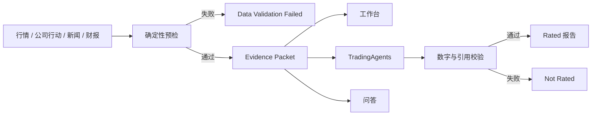

# TradingWorkbench 报告质量审计

审计时间：2026-07-24
审计范围：生产 `latest/history`、仓库 `public/reports` 中的 33 份成功报告，以及 1 条失败记录。

## 结论

这批报告不能作为同一质量等级的研究结论使用：

- `515880.SS/2026-07-24`、`512480.SS/2026-07-23`、`512480.SS/2026-07-24` 已确认被 ETF 份额拆分污染，状态为 `invalidated`。
- 其余 30 份报告标记为 `legacy_unverified`。这是“当前无法按证据标准验证”，不是断言每个数字都错误。
- `ISSUE` 是工作流输入解析错误，不是股票报告，状态为 `invalid_record`。
- 所有报告缺少逐项数字到原始证据的稳定映射；仓库中的基本面章节没有可审计的来源账本。
- ETF 使用了公司财务分析模板，目标价、组合比例、止损和清仓建议没有稳定的用户约束或可复算方法。

默认规则：失效报告保留用于审计，但不进入首页最新结论、推送和问答上下文。

## 报告清单

| 标的 | 日期 | 数量 | 状态 | 主要问题 |
|---|---|---:|---|---|
| 515880.SS | 2026-07-24 | 1 | invalidated | 拆分污染、ETF 模板、无逐项引用、重复最终提案 |
| 512480.SS | 2026-07-23、2026-07-24 | 2 | invalidated | 拆分污染、ETF 模板、强制 Sell/目标价 |
| 510050.SS | 2026-07-10 | 1 | legacy_unverified | ETF 结构数据不足 |
| SPY | 07-10、07-13、07-14、07-15、07-16、07-20、07-21、07-22 | 8 | legacy_unverified | ETF 结构证据不足、目标价不可复算 |
| 600519.SS | 07-10、07-13、07-14、07-15、07-16、07-20、07-21、07-22 | 8 | legacy_unverified | 评级频繁反转，缺少观点变更证据 |
| NVDA | 07-10、07-13、07-14、07-15、07-16、07-20、07-21、07-22 | 8 | legacy_unverified | 财务数字和目标价无逐项引用 |
| ORCL | 07-10、07-14、07-15 | 3 | legacy_unverified | 价格跳变、无依据的组合配置 |
| 000001.SZ | 2026-07-10 | 1 | legacy_unverified | 精确基本面数字无证据账本 |
| 002865.SZ | 2026-07-10 | 1 | legacy_unverified | 精确数字、极端措辞和交易动作缺少证据 |
| ISSUE | 2026-07-10 | 1 | invalid_record | Issue 标题被误解析成 ticker |

机器可读明细见 [`public/data/report-audit.json`](../public/data/report-audit.json)。

## 根因

当前系统的问题不是单一提示词：

1. 工作台与 TradingAgents 曾经使用不同的行情链，A 股 ETF 的份额拆分没有进入 Python 深度分析。
2. 验证快照只检查空值、过期和未来日期，没有检查拆分、分红、除权和成交量单位。
3. Schema 只允许 Buy/Overweight/Hold/Underweight/Sell，底层数据错误时仍然会生成明确动作。
4. 目标价没有统一保存估值方法、输入、区间和概率。
5. 新闻没有稳定区分官方证据、发现层、事实、传导推断和反证。
6. 历史财报按报告期而不是实际发布时间过滤，存在 look-ahead 风险。

## 修复边界

- 新增 `EvidencePacketV1`、公司行动校验和 `report_manifests`。
- 报告状态与历史审计状态分离：
  - 分析：`rated`、`not_rated`、`insufficient_evidence`、`data_validation_failed`
  - 审计：`verified`、`legacy_unverified`、`invalidated`
- ETF 改用指数、持仓、AUM、份额、NAV、折溢价、费用和跟踪误差模板。
- `GOOGL` 为 Alphabet 主标的，`GOOG` 为别名；`03887`/`3887`/`03887.HK` 规范化为 `3887.HK`。
- 官方公告、SEC、IR、HKEXnews 和监管机构属于证据层；Google News、Yahoo、GDELT 属于发现层。
- 没有用户持仓、成本、期限和风险预算时，不输出“立即清仓”或具体组合比例。
- 只有能够重建 point-in-time 证据时才重跑历史报告；无法重建的报告继续保留为 `legacy_unverified`。

## 参考项目取舍

| 项目 | 吸收 | 不整体引入的原因 |
|---|---|---|
| Vibe-Trading | Research Goal、证据账本、run card、降级链 | 全栈和 skills 过重 |
| OpenBB | 统一模型与可替换 provider | 避免平台级依赖和密钥膨胀 |
| Qlib | 后续离线 IC/ICIR、回测成本和最大回撤 | 不放入五分钟 Worker |
| FinGPT | 新闻实体、方向和情绪标注 | 情绪不直接当交易结论 |
| AI Hedge Fund | 技术、情绪、风险角色分工 | ETF 不照搬个股人物 Agent |
| Ashare / adata | A 股多源热备思想 | Python 深度任务适用，Worker 保持轻量 |
| Lightweight Charts | 多窗格、十字线、事件标记 | Apache 2.0 且不依赖授权库 |

## 验收标准

- 拆分日不会被报告写成资产价值腰斩。
- 数据校验失败不调用交易评级模型。
- 每个数字结论能够展开到 Evidence ID、来源、发布时间和采集时间。
- 目标价缺少方法时不展示。
- 失效报告不进入最新结论、推送和问答。
- GOOGL、GOOG、03887 和 3887.HK 的身份、市场时钟和历史样本状态正确。
- 任一新闻或行情 provider 失效只造成局部降级，不造成整页空白。
