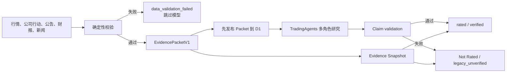

# Trading Workbench 报告质量审计

更新日期：2026-07-25  
机器索引：[`public/data/report-audit.json`](../public/data/report-audit.json)  
生产接口：`GET /api/report-audit`

## 结论

旧报告原文全部保留，但只按证据等级使用。当前只有三条原始报告被确认失效：

- `reports/515880.SS/2026-07-24/complete_report.md`
- `reports/512480.SS/2026-07-23/complete_report.md`
- `reports/512480.SS/2026-07-24/complete_report.md`

它们把 ETF 份额拆分或复权断点当成价格暴跌，技术指标和方向性结论不可继续使用。
`invalidated` 按完整报告路径判定；同一交易日生成的 `-v2`、`-v3` 修复版不会被连带
失效。其他旧报告若缺少可复算证据，状态为 `legacy_unverified`，表示“按当前标准无法
验证”，不表示报告中的每句话都错误。

截至本轮最终重验开始前，机器索引记录：

| 项目 | 数量 |
|---|---:|
| 有报告的运行结果 | 41 |
| `verified` | 0 |
| `legacy_unverified` | 38 |
| `invalidated` | 3 |
| 未形成报告的运行记录 | 6 |
| 其中证据预检失败 | 3 |
| 其中模型或流程失败 | 2 |
| 其中错误输入 | 1 |

最终五标的重验运行是
[GitHub Actions 30154765352](https://github.com/gaaiyun/TradingWorkbench/actions/runs/30154765352)。
它完成后，以上数量必须以机器索引重新生成的结果为准，不能手工改 JSON。

## 状态定义

分析状态和审计状态是两条独立轴：

| 维度 | 状态 | 含义 |
|---|---|---|
| 分析 | `rated` | 数据与文本门禁均通过，可以显示研究评级 |
| 分析 | `not_rated` | 本次没有形成评级 |
| 分析 | `insufficient_evidence` | 数据可用，但 Agent 文本的引用、目标价或仓位约束未通过 |
| 分析 | `data_validation_failed` | 确定性数据预检失败，模型不应运行 |
| 审计 | `verified` | Packet、Manifest、报告、引用和哈希全部一致 |
| 审计 | `legacy_unverified` | 报告保留，但无法按当前标准验证 |
| 审计 | `invalidated` | 已确认基础数据或方法错误，禁止进入当前结论 |

没有报告文件的运行另外记录 `failureClass`：

- `evidence_validation`：行情、复权、公司行动或时点检查失败，模型未运行；
- `analysis_execution`：模型、工具或工作流执行失败；
- `invalid_input`：输入不是合法标的，例如历史上的 `ISSUE`。

这三个数量之和必须等于 `invalidRecords`。

## 全量审计结果

### 原始存档

| 标的 | 日期 / 数量 | 审计状态 | 主要问题 |
|---|---|---|---|
| 515880.SS | 2026-07-24 | `invalidated` | 拆分污染、ETF 模板、无逐项引用 |
| 512480.SS | 2026-07-23、07-24 | `invalidated` | 拆分污染、强制评级和目标价 |
| 510050.SS | 1 份 | `legacy_unverified` | ETF 结构证据不足 |
| SPY | 8 份 | `legacy_unverified` | ETF 结构证据不足、目标价不可复算 |
| 600519.SS | 8 份 | `legacy_unverified` | 评级反复变化，缺少证据差异 |
| NVDA | 8 份 | `legacy_unverified` | 财务数字和目标价没有逐项证据 |
| ORCL | 3 份 | `legacy_unverified` | 价格异常未解释、组合比例没有用户约束 |
| 000001.SZ | 1 份 | `legacy_unverified` | 精确基本面数字缺少来源账本 |
| 002865.SZ | 1 份 | `legacy_unverified` | 精确数字和交易动作缺少证据 |
| ISSUE | 1 条失败记录 | `invalid_record` | Issue 标题曾被误识别为代码 |

### 2026-07-25 严格重验

两轮早期重验保留为版本化档案，不覆盖原报告：

1. [30150410693](https://github.com/gaaiyun/TradingWorkbench/actions/runs/30150410693)
   首次启用 Evidence Packet 和 claim validation。515880、512480、3887.HK 的数据预检
   通过，但模型文本没有保留 Evidence ID，因此为 `insufficient_evidence / Not Rated`；
   ORCL、GOOGL 当时读取到的历史链不完整，数据预检失败。
2. [30150722479](https://github.com/gaaiyun/TradingWorkbench/actions/runs/30150722479)
   补齐五年美股日线。GOOGL 与 3887.HK 形成版本报告，但引用门禁仍失败；ORCL 的
   2025-09-10 财报跳空被通用 25% 规则误当拆分异常。

随后完成三项修复：

- 版本目录路径允许 `YYYY-MM-DD-v2` 及后续版本，并同时校验 Manifest 日期与 Packet
  `asOf`，解决报告最终发布的 HTTP 400；
- ETF 的无公司行动大跳变继续硬拦截；单只股票的真实极端跳空改为
  `EXTREME_PRICE_MOVE` 警告，不能再把 ORCL 的真实事件行情当成拆分；
- Agent Schema 不再强迫输出仓位和价格，分析师不再提前给最终交易提案；所有数值必须
  保留 Evidence ID。报告顶部增加程序生成的 Evidence Snapshot。

## 证据与报告数据流

```mermaid
flowchart LR
    S["行情、公司行动、公告、财报、新闻"] --> V["确定性校验"]
    V -->|"失败"| F["data_validation_failed<br/>跳过模型"]
    V -->|"通过"| E["EvidencePacketV1"]
    E --> P["先发布 Packet 到 D1"]
    P --> A["TradingAgents 多角色研究"]
    A --> C["Claim validation"]
    C -->|"通过"| R["rated / verified"]
    C -->|"失败"| N["Not Rated / legacy_unverified"]
    E --> Q["Evidence Snapshot"]
    Q --> R
    Q --> N
```

`EvidencePacketV1` 包含标的身份、资产类型、市场、`asOf`、复权 OHLCV、公司行动、
指标、时点新闻、来源、降级过程、完整性状态和内容哈希。编号含义：

- `M#`：行情；
- `I#`：指标；
- `CA#`：公司行动；
- `N#`：新闻或公告；
- `S#`：来源。

模型运行前先发布 Packet，因此模型失败也不会丢失确定性证据。报告完成后再提交
Packet、Manifest 和版本报告路径。写接口校验鉴权、请求大小、Schema、哈希、标的、
日期、状态和路径，之后才参数化写入 D1。

## Claim validation

以下任一情况都会把报告降为 `insufficient_evidence / Not Rated`：

- 没有任何已知 Evidence ID；
- 引用了 Packet 中不存在的 Evidence ID；
- 数字所在段落没有可对应的 Evidence ID；
- 出现目标价但缺少方法、输入、区间和情景概率；
- 没有用户持仓、成本、期限和风险预算，却给出具体仓位、加减仓或清仓比例。

门禁失败不会删除草稿。完整 Agent 过程和 `evidence_packet.json` 保留用于复核，但首页、
问答、推送和组合结论只接受 `verified`。

## 页面和问答隔离

- 首页“最新观点”只读取 `verified`；
- 档案默认隐藏 `invalidated`，用户可进入“历史审计”查看原文；
- `legacy_unverified` 和 Not Rated 报告明确显示质量标签；
- 问答不把 `invalidated` 当作上下文；
- 同日重跑写入 `-v2`、`-v3`，不覆盖旧目录；
- `supersededBy` 只指向真正通过当前门禁的替代报告。

## 根因与修复

| 根因 | 修复 |
|---|---|
| 网页和 Python 曾使用不同的行情链 | 两者统一读取 D1 日线；A 股优先前复权 |
| ETF 拆分没有进入深度分析 | Packet 保存公司行动、复权口径和连续性错误 |
| 任意 25% 跳变都被视为坏数据 | ETF 保持硬门禁，个股极端跳空改为事件警告 |
| Schema 强迫输出动作、仓位和目标价 | 字段改为证据和用户约束不足时留空 |
| 分析师也输出最终提案 | 只有组合经理拥有最终评级出口 |
| 仅靠提示词要求引用 | 文件落盘前做确定性 claim validation |
| 失败原因混成一类 | 审计增加三种 `failureClass` |
| 同日重跑覆盖或无法发布 | 版本目录、路径白名单和日期一致性校验 |

## 参考项目与取舍

| 项目 | 借鉴 | 没有整体引入的原因 |
|---|---|---|
| HKUDS Vibe-Trading | Research Goal、证据账本、run card、数据源降级 | 全栈与 skills 规模超过当前需要 |
| OpenBB | 标准模型、可替换 provider | 避免平台依赖与付费密钥膨胀 |
| Microsoft Qlib | 后续离线 IC/ICIR、回测成本和最大回撤 | 不放入五分钟 Worker |
| FinGPT | 新闻实体、方向和情绪标签 | 情绪不直接等于交易结论 |
| AI Hedge Fund | 技术、情绪、风险角色分工 | ETF 不照搬个股人物型 Agent |
| Ashare / adata / AKShare | A 股多源热备 | 适合 Python 深度任务，边缘 Worker 保持轻量 |
| TradingView Lightweight Charts | 多窗格、十字线、事件标记 | Apache 2.0，且不把图表库当数据源 |

更完整的来源与架构取舍见
[`etf-monitoring-reference-and-decisions.md`](etf-monitoring-reference-and-decisions.md)。

## 验收标准

- 515880、512480 的拆分日不会再被写成资产价值腰斩；
- 数据校验失败时不调用评级模型；
- 版本报告可以发布到 D1，旧目录不被覆盖；
- 单股真实财报跳空保留警告，但不被 ETF 拆分规则误拦截；
- 报告顶部能直接看到带 Evidence ID 的行情、指标、新闻和来源；
- 目标价和仓位缺少方法或用户约束时不会成为正式结论；
- 审计数量守恒，三类失败之和等于 `invalidRecords`；
- 失效报告不进入首页、问答、提醒或组合结论；
- GOOGL/GOOG、03887/3887.HK 的身份与市场时钟一致；
- 任一免费来源失败只产生局部降级，不让整页空白。

