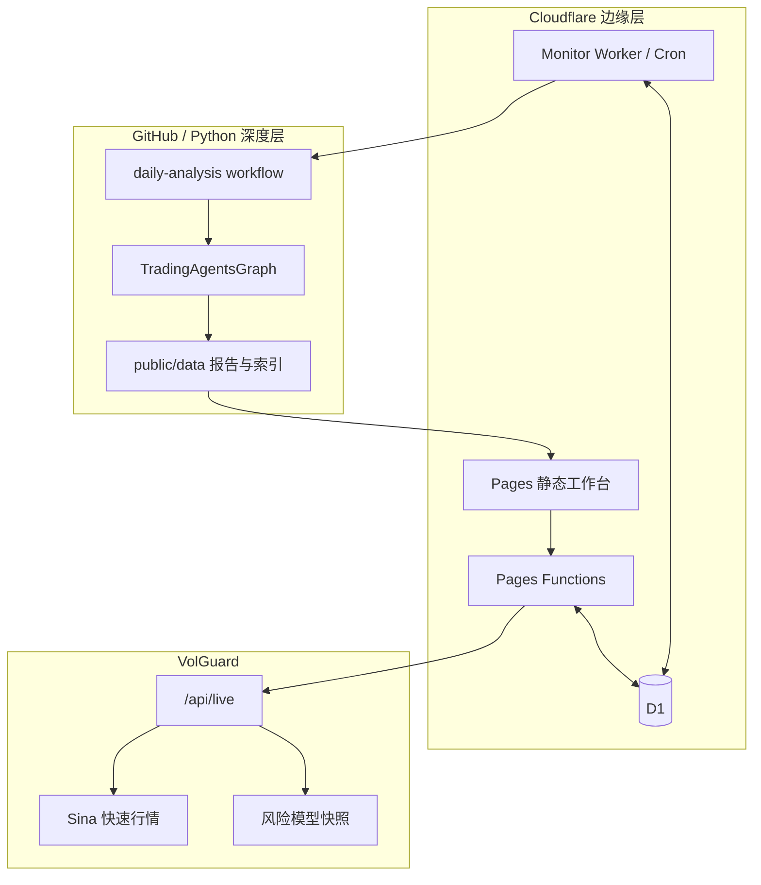
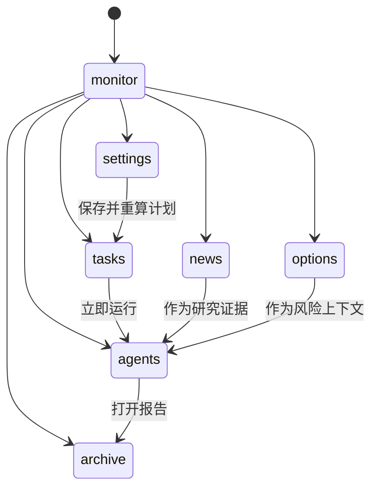
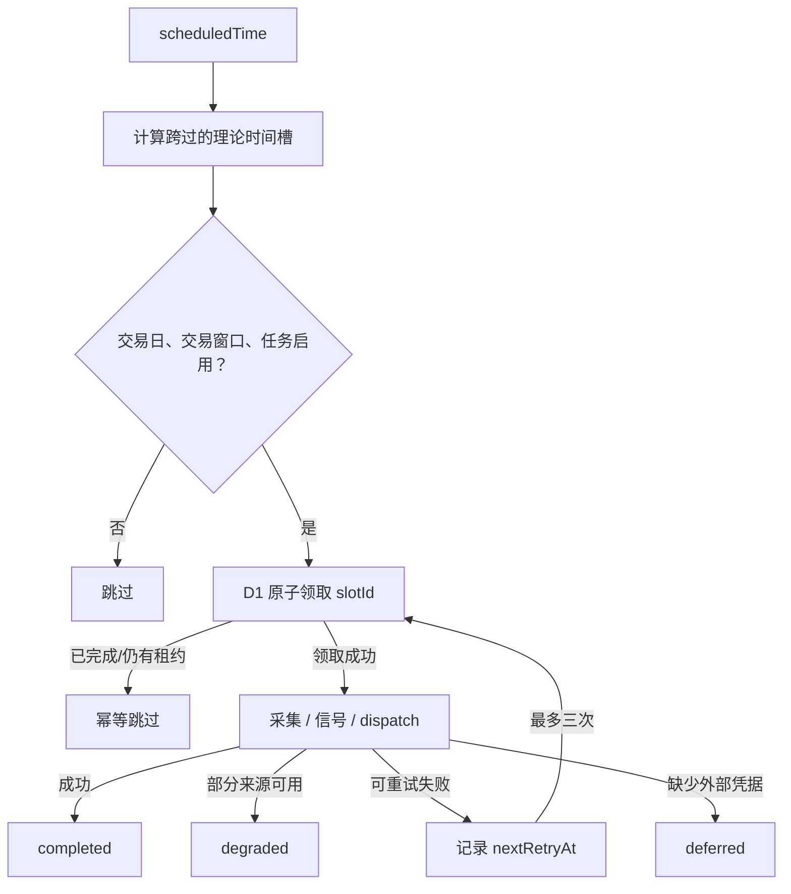
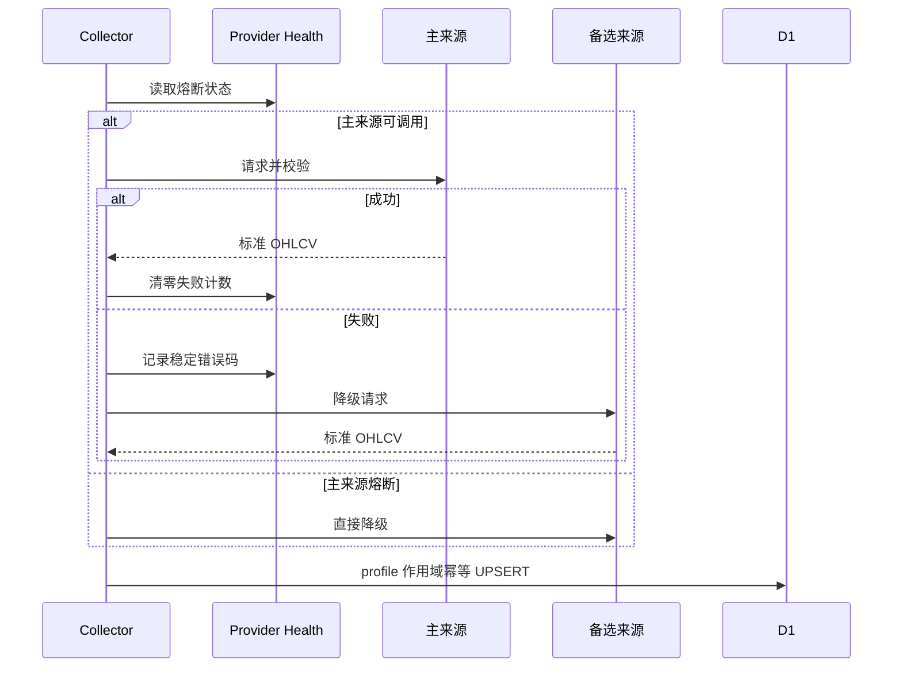
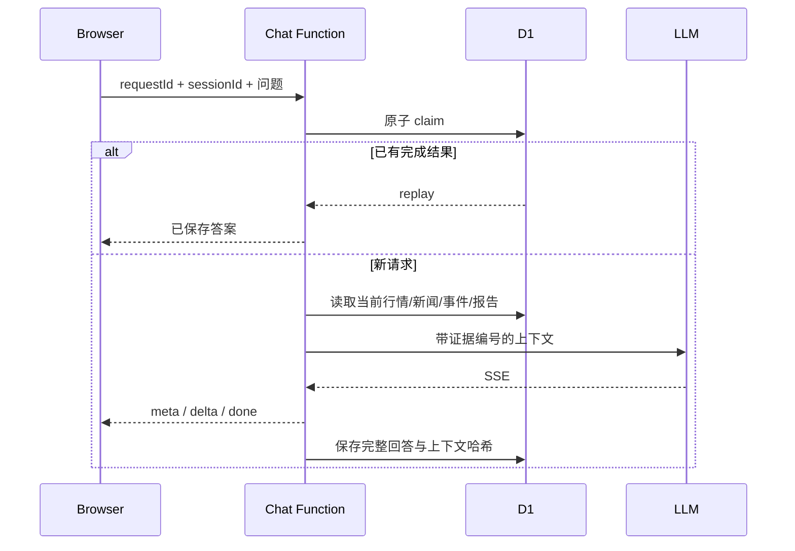

# 架构、接口与数据流

更新日期：2026-07-24

本文描述当前代码实际运行的结构。页面原型、未来设想和已经下线的旧入口不算“已实现”。

## 1. 产品与运行边界

Trading Workbench 由三个可独立失败、独立回退的运行单元组成：

| 单元 | 技术 | 职责 |
|---|---|---|
| 研究工作台 | Cloudflare Pages + Functions | 页面、动态 API、设置、问答、报告和 VolGuard 代理 |
| 监控调度器 | Cloudflare Worker + Cron | 五分钟采集、十五分钟信号、计划时间槽和 GitHub 深度分析触发 |
| 深度研究 | GitHub Actions + Python/LangGraph | TradingAgents 多智能体研究、报告落盘、历史归档和提醒 |

VolGuard 在第二个仓库中维护期权计算和独立 Pages 项目。研究工作台通过 `/api/volguard` 使用它的实时接口，失败时再读取静态快照。

## 2. 页面状态

`public/index.html` 只提供结构；行为按职责拆分：

- `workbench-router.mjs`：七个一级路由、hash 规范化和标题。
- `workbench-data.mjs`：动态响应、K 线批次、筛选和运行时间计算。
- `workbench-research.mjs`：研究历史、运行阶段和报告状态。
- `workbench-options.mjs`：VolGuard 新旧 payload 归一化、双时钟和风险字段。
- `workbench.js`：页面状态、请求、图表、设置、问答和交互编排。
- `workbench.css`：唯一的视觉 token、桌面布局和移动端布局。

路由只改变当前工作区，不销毁行情轮询、任务状态或问答会话。移动端用同一份状态和 API，不维护另一套数据。

## 3. 设置模型

`WorkbenchSettingsV2` 的真值在 D1。`public/data/workbench-settings.json` 只用于：

- 空数据库首次初始化；
- D1 不可用时的只读灾备；
- GitHub Actions 在无法读取 D1 时的兼容清单。

一次设置写入会校验：

- schema 版本；
- profile ID 唯一；
- 标的、市场、角色和分析深度；
- IANA 时区；
- 时间、交易窗口和间隔；
- 安静时段；
- Agent 每日预算；
- 客户端最后读取的 `updatedAt`。

`expectedUpdatedAt` 不匹配时返回冲突，防止两台设备互相覆盖。

## 4. 调度状态机

Worker 的 Cron 每五分钟触发一次，但业务任务不等于 Cron 次数。

时间槽字段包含计划时间、尝试次数、租约和 attempt token。旧执行即使在超时后返回，也不能覆盖新租约的结果。

常规 Cron 只执行到期任务。运维人员需要立即修复历史覆盖时，可以调用受
`MONITOR_RUN_TOKEN` 保护的 `/run-collection`；入口复用同一 Provider Registry、
校验和 D1 幂等写入，不另建一套临时数据逻辑。

任务语义：

| 任务 | 标的 | 周期 | 输出 |
|---|---|---|---|
| 美股收盘快照 | `role=driver` 且 `market=US` | 1d | 美股驱动日线 |
| 盘前简报 | 当前 profile | 轻量 | 盘前上下文 |
| A 股盘中采集 | `core/comparison` 且 `market=CN` | 5m | D1 行情 |
| A 股盘中信号 | 同上 | 15m | 价格/成交量事件 |
| 收盘深度分析 | `analysis=full` | 完整 Agent | GitHub run 和报告 |

## 5. Provider Registry

适配器必须先完成 symbol 映射、HTTP 状态、内容类型、字段和时间校验，再把 OHLCV 交给业务层。

同一 profile、symbol、timeframe、timestamp、source 只保存一条。API 读取时保留多源记录用于审计，再按时间戳选用最新采集结果。15m、30m、1h 和 4h 由服务端从 5m 原始条目聚合。

## 6. 动态 API

| 路径 | 方法 | 用途 | 写保护 |
|---|---|---|---|
| `/api/settings` | GET / PUT | 读取和保存 V2 设置 | PUT 需要访问码 |
| `/api/market` | GET | OHLCV、指标、覆盖范围和来源 | 只读 |
| `/api/news` | GET | 新闻查询 | 只读 |
| `/api/events` | GET | 行情、公告和信号事件 | 只读 |
| `/api/monitor-status` | GET | 市场状态、来源健康、下一任务 | 只读 |
| `/api/analyze` | POST | 触发 GitHub 深度分析 | 访问码 |
| `/api/runs` | GET | GitHub 运行状态 | 只读 |
| `/api/history` | GET | 研究档案索引 | 只读 |
| `/api/report` | GET | 报告正文 | 只读 |
| `/api/chat` | POST | 非流式或 SSE 问答 | 访问码 |
| `/api/chat-sessions` | GET | 持久会话与恢复 | 访问码 |
| `/api/volguard` | GET | 实时期权代理与快照降级 | 只读 |
| `/api/health` | GET | 能力布尔值和上游状态 | 只读 |

查询参数均经过 allow-list 和参数化 SQL。错误响应只返回稳定错误码，不回显上游响应、SQL、token 或 key。

## 7. 指标

动态行情 API 使用同一套服务端实现：

- MA20 / MA60；
- MACD 12/26/9；
- RSI14；
- ATR14；
- 20 期实现波动率。

指标结果同时返回版本和数据充分性。历史不够、输入异常或数据过期时，不返回看似精确的值。拆分复权元数据只来自来源，指标引擎不会自行声称已复权。

盘中信号使用：

- 15 分钟绝对涨跌达到 1%：中等；
- 15 分钟绝对涨跌达到 2%：高；
- 成交量 z-score 达到 2：中等；
- 成交量 z-score 达到 3：高。

信号 ID 与时间槽绑定，重复运行不会重复产生同一事件。

## 8. 问答、证据和恢复

浏览器断线不会取消已经计费的上游调用。服务端继续消费并保存；客户端用原
`requestId` 恢复。同一个 `requestId` 被用于不同问题时返回冲突。

Chat Function 会读取当前 profile 的标的清单。问题里出现精确代码或配置名称时，
它优先使用问题目标，不沿用图表里另一个标的；匹配范围只限当前 profile，避免把
普通英文缩写误当美股代码。

证据读取遵循实际落库周期：A 股先读 Worker 保存的 5m 原始线，再兼容旧 15m 记录；
ORCL、SOXX 等美股读 1d。指标使用同一套服务端计算函数，不从页面显示值反推。

证据标签：

- `[M#]`：行情；
- `[I#]`：服务端指标快照；
- `[N#]`：新闻；
- `[E#]`：事件；
- 报告和 VolGuard 作为具名上下文源。

证据编号不是因果证明。系统提示会要求模型区分“数据事实”“可能传导”和“证据不足”。

## 9. 期权双时钟

VolGuard `/api/live` schema v2 包含：

- `underlying`：标的报价和行情时间；
- `quick_metrics`：当前链可快速计算的指标；
- `contracts`：合约表；
- `slow_metrics`：历史模型和风险快照；
- `source_status`、`source_asof`：来源状态。

研究工作台也兼容旧静态 snapshot，但会标记为 `snapshot/stale`。快速层每 30 秒轮询，慢速层沿用其独立计算时间。休市时行情源可以是健康的 `market_closed`，不能显示成“数据故障”。

## 10. 保留的原 TradingAgents 契约

以下内容受回归测试保护：

- `TradingAgentsGraph` 和各职责 Agent；
- CLI；
- 检查点恢复和决策记忆；
- Python 数据 Provider 与模型 Provider；
- `daily-analysis.yml` 和 `analysis-request.yml`；
- 报告生成、索引和历史读取；
- 网页触发 workflow 的 API。

ETF 工作台是产品编排层，不是原框架的替代实现。
