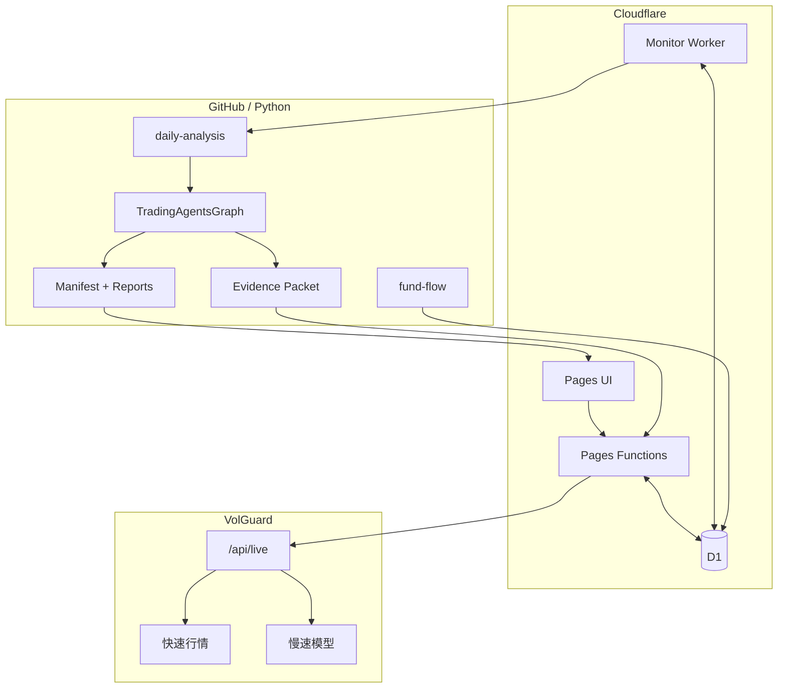
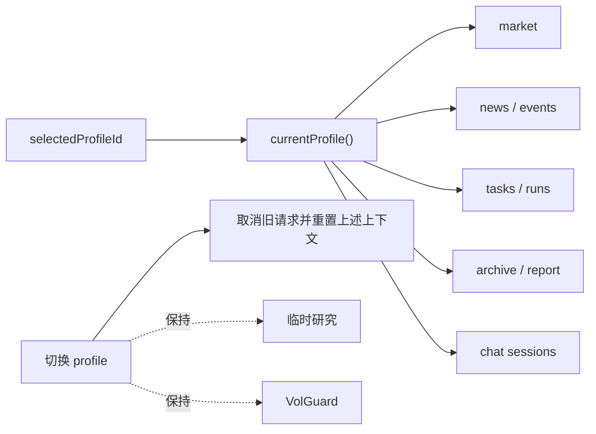
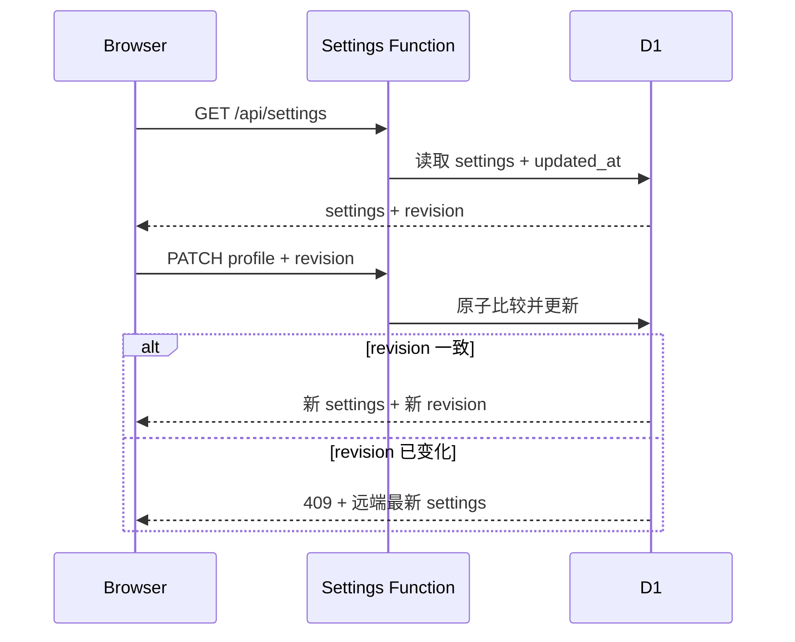
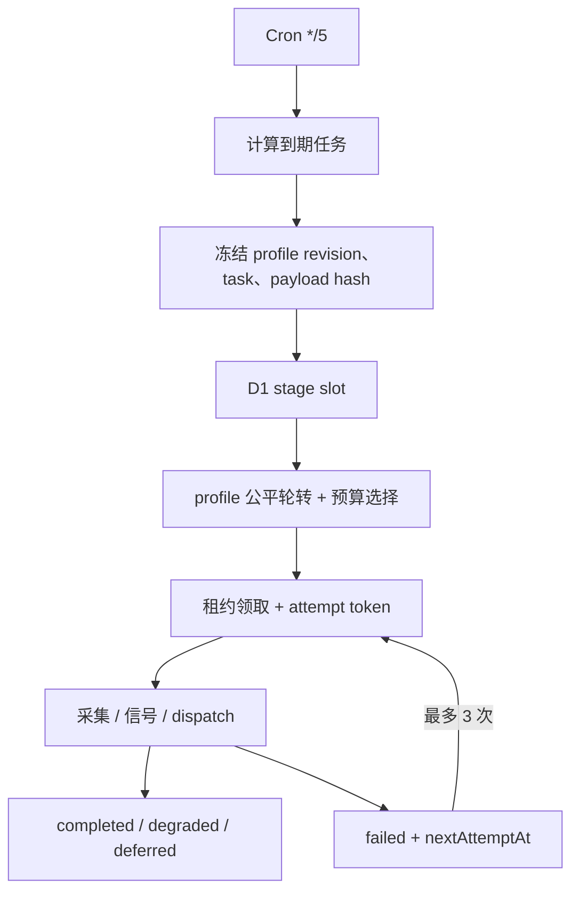
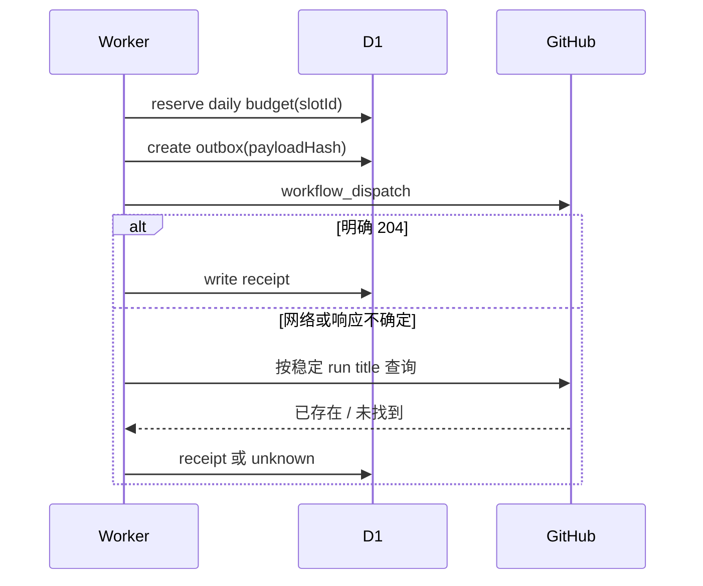
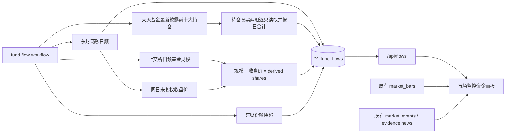
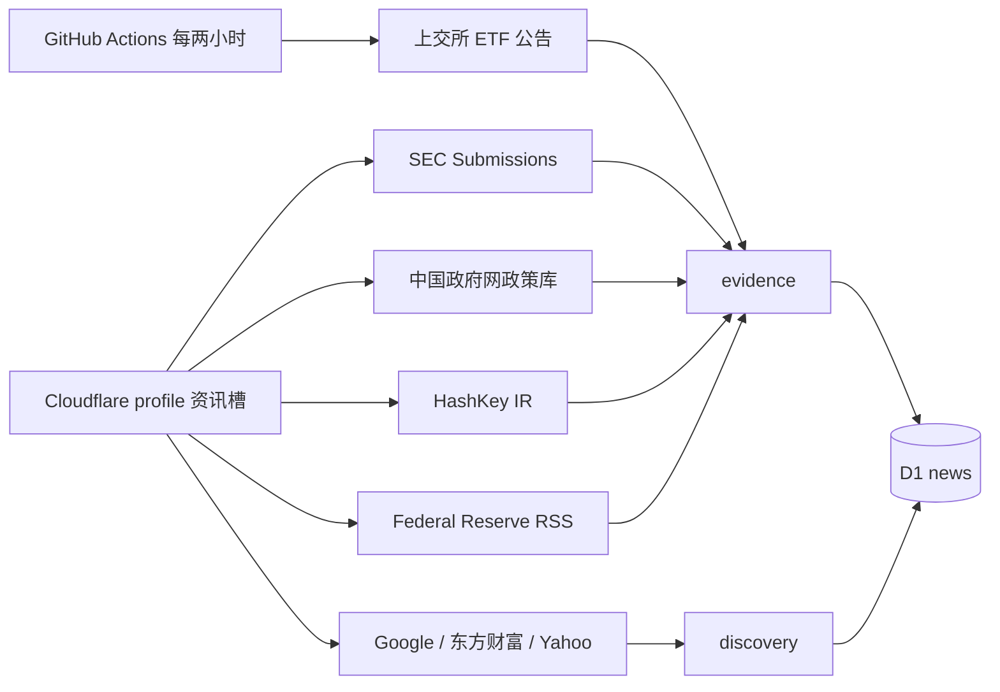
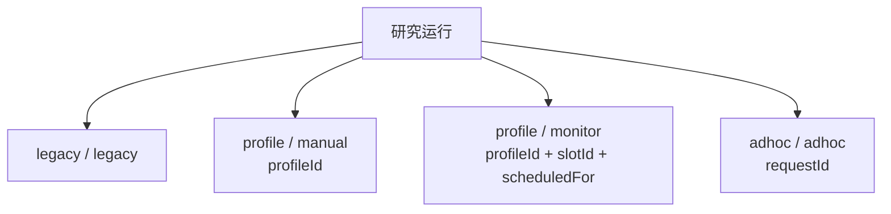
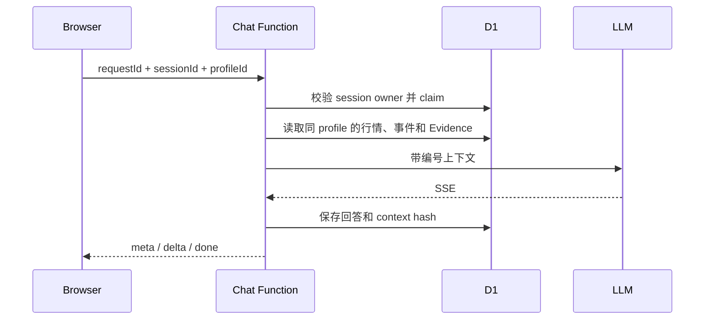

# 架构、接口与数据流

更新日期：2026-07-28

代码基线：`main`；运行版本由 Pages `/api/health` 与 Worker `/health` 的 commit SHA 证明。

本文只描述当前代码。生产是否已更新，要用部署记录和运行时 SHA 证明。

## 1. 运行单元

| 单元 | 技术 | 职责 |
|---|---|---|
| 研究工作台 | Cloudflare Pages + Functions | 页面、profile API、动态查询、问答、报告、Evidence、VolGuard 代理 |
| 监控调度器 | Cloudflare Worker + Cron | 轻量采集、slot、预算、outbox、规则信号、提醒 shadow |
| 深度研究 | GitHub Actions + Python/LangGraph | TradingAgents、多模型调用、Evidence、报告、索引和审计 |
| 资金流采集 | GitHub Actions + Node.js | 两融日频、ETF 规模/份额回填与工作日增量，参数化写入 D1 |
| 期权服务 | VolGuard 独立仓库与 Pages | 期权快行情和慢风险模型 |


```mermaid
flowchart TB
    subgraph Edge["Cloudflare"]
        UI["Pages UI"]
        API["Pages Functions"]
        W["Monitor Worker"]
        D[("D1")]
    end

    subgraph Research["GitHub / Python"]
        GH["daily-analysis"]
        FF["fund-flow"]
        TA["TradingAgentsGraph"]
        EV["Evidence Packet"]
        MF["Manifest + Reports"]
    end

    subgraph Options["VolGuard"]
        VL["/api/live"]
        FAST["快速行情"]
        SLOW["慢速模型"]
    end

    UI --> API
    API <--> D
    W <--> D
    W --> GH
    FF --> D
    GH --> TA
    TA --> EV
    TA --> MF
    EV --> API
    MF --> UI
    API --> VL
    VL --> FAST
    VL --> SLOW
```

Cloudflare 负责有界 I/O 和状态机。Python、LangGraph、LLM 辩论、GARCH、BSADF 和长历史回测留在 GitHub Actions 或 VolGuard。

## 2. 浏览器状态

页面模块按职责拆分：

- `workbench-router.mjs`：七个一级路由。
- `workbench-profiles.mjs`：profile 选择、恢复、请求世代和切换重置计划。
- `workbench-data.mjs`：动态响应、筛选、下一次运行和提醒徽标。
- `workbench-research.mjs`：运行身份、阶段、档案和报告状态。
- `workbench-options.mjs`：VolGuard schema 归一化和双时钟。
- `workbench-markdown.mjs`：安全报告渲染。
- `workbench-fundflow.mjs`：资金面适用性、上海交易日、分位、标的驱动篮子、规则观察和缺失值展示模型。
- `workbench.js`：网络请求、图表、设置、研究和问答编排。


```mermaid
flowchart LR
    S["selectedProfileId"] --> P["currentProfile()"]
    P --> M["market"]
    P --> N["news / events"]
    P --> T["tasks / runs"]
    P --> A["archive / report"]
    P --> C["chat sessions"]
    X["切换 profile"] --> R["取消旧请求并重置上述上下文"]
    X -. "保持" .-> AD["临时研究"]
    X -. "保持" .-> V["VolGuard"]
```

普通 hash 路由切换不会销毁状态。profile 切换会提高请求 generation，旧 profile 的异步响应即使晚到也不能覆盖当前页面。

## 3. 设置模型和 profile API

`WorkbenchSettingsV2` 的在线真值在 D1：

- 最多 8 个 profile；
- 每组最多 14 个 targets、12 个 system benchmarks；
- profile ID 符合 `[A-Za-z0-9_-]{1,64}`，创建后不可修改；
- 至少保留一个 profile；
- 设置 JSON 最多 50 KiB；
- D1 不可用时，profile 写接口返回 503，不回退到 GitHub 异步写入。

GET 同时返回 `revision` 和兼容字段 `updatedAt`。写操作使用 revision 做 CAS：


```mermaid
sequenceDiagram
    participant B as Browser
    participant F as Settings Function
    participant D as D1

    B->>F: GET /api/settings
    F->>D: 读取 settings + updated_at
    D-->>B: settings + revision
    B->>F: PATCH profile + revision
    F->>D: 原子比较并更新
    alt revision 一致
        D-->>B: 新 settings + 新 revision
    else revision 已变化
        D-->>B: 409 + 远端最新 settings
    end
```

| 路径 | 方法 | 用途 |
|---|---|---|
| `/api/settings` | GET / PUT | 读取或完整保存 V2 设置 |
| `/api/settings/profiles` | POST | 创建 profile |
| `/api/settings/profiles/:id` | PATCH / DELETE | 局部更新或删除 profile |
| `/api/settings/profiles/:id/copy` | POST | 复制 profile，副本默认 disabled |

已有设置的完整 PUT 和所有 profile 写操作都要求 revision。缺失返回 428，冲突返回 409。写请求只从 header 读取访问码。

## 4. 调度状态机

Cron 每五分钟运行。业务任务按 profile 时区和理论时间槽计算，不以 Cron 触发次数计数。


```mermaid
flowchart TD
    C["Cron */5"] --> DUE["计算到期任务"]
    DUE --> SNAP["冻结 profile revision、task、payload hash"]
    SNAP --> STAGE["D1 stage slot"]
    STAGE --> FAIR["profile 公平轮转 + 预算选择"]
    FAIR --> CLAIM["租约领取 + attempt token"]
    CLAIM --> EXEC["采集 / 信号 / dispatch"]
    EXEC --> DONE["completed / degraded / deferred"]
    EXEC --> RETRY["failed + nextAttemptAt"]
    RETRY -->|"最多 3 次"| CLAIM
```

### 4.1 不可变 slot

`scheduled_slots` 保存：

- `profile_revision`
- `payload_json`
- `payload_hash`
- `local_date`
- 计划时间、状态、尝试次数、租约和错误码

D1 trigger 禁止修改 slot payload。profile 被删除、停用或 revision 变化后，Worker 用 `PROFILE_DELETED`、`PROFILE_DISABLED` 或 `PROFILE_REVISED` 取消未执行旧 slot。migration 0013 会把无法恢复快照的旧活动 slot 标为 `LEGACY_SLOT_PAYLOAD_UNAVAILABLE`。

### 4.2 Bootstrap

`monitor_bootstrap_targets` 的主键包含 profile、symbol、timeframe、schema 和 target hash。新建 profile、增加标的或改变目标定义后会产生新的 bootstrap 需求。每个 tick 只处理有限 profile，避免空库回填占满一次 Cron。

### 4.3 公平与负载

- 计划任务外部请求上限：32。
- 可选择预算硬上限：40；direct fallback 默认使用 32。
- Queue 每次发现最多 10 个任务，consumer 每批只执行 1 个。
- profile 采用轮转顺序，避免第一个 profile 长期占满预算。
- `/run-collection` 返回 cursor 和 backlog，调用方可继续补跑；一次请求不会扫描无限工作量。

超出预算的任务留在 backlog，并在摘要中记录 `capped`、`backlog` 和稳定错误码。

### 4.4 完整分析预算和 dispatch

`full_analysis_reservations` 按 `profileId + localDate` 原子预留。`fullAnalysesPerDay=0` 不 dispatch。


```mermaid
sequenceDiagram
    participant W as Worker
    participant D as D1
    participant G as GitHub

    W->>D: reserve daily budget(slotId)
    W->>D: create outbox(payloadHash)
    W->>G: workflow_dispatch
    alt 明确 204
        W->>D: write receipt
    else 网络或响应不确定
        W->>G: 按稳定 run title 查询
        G-->>W: 已存在 / 未找到
        W->>D: receipt 或 unknown
    end
```

`github_dispatch_outbox` 和 `github_dispatch_receipts` 以 slot 为键。Worker 先 reconcile 再重试 POST，避免 GitHub 已接收但客户端未确认时重复触发。

## 5. 默认任务

| 任务 | 目标 | 默认时间 |
|---|---|---|
| 美股收盘快照 | US/HK driver | 05:35 |
| 全天新闻采集 | profile 主题与实体 | 默认每 15 分钟，可配置为 30/60 分钟；交易日 08:25 幂等补采 |
| 盘前上下文 | 当前 profile | 08:25 |
| A 股盘中采集 | CN core/comparison | 09:30–11:30、13:00–15:00，每 5 分钟 |
| A 股规则信号 | CN core/comparison | 盘中每 15 分钟 |
| 美股盘中采集 | `SOXX / NVDA` driver | 纽约 09:30–16:00，每 15 分钟抓取 5m 序列 |
| A 股日线回填 | CN core/comparison | 15:20 |
| 收盘深度分析 | `analysis=full` | 15:20 |
| ETF 资金面日更 | `515880.SS / 512480.SS / 159995.SZ` | GitHub Actions，工作日 20:17；不占 Worker 32 次请求预算 |

Cron 的 5 分钟即时发现窗口不再是关键日任务的唯一入口。启用
`DAILY_RECOVERY_ENABLED=true` 后，每个 tick 还会查看 profile 本地日期的当天和前一天，
只恢复 36 小时内应出现的 `cnDailySnapshot`、`closeFullAnalysis` 和
`usCloseSnapshot`。候选时间先按 profile IANA 时区转换成 UTC，再复用原交易日/节假日
判定；稳定 slotId 和 D1 `ON CONFLICT DO NOTHING` 保证重复发现不重复执行。盘中采集、
规则信号和新闻不做历史追赶，避免一次故障形成无界任务风暴。

## 6. Provider 和行情写入

Provider Registry 保存 transport、authority、freshness、授权用途和失败轨迹。适配器先校验 HTTP、内容类型、字段、时间和 OHLC 区间，再把标准记录交给写入层。

同一 `profile + symbol + timeframe + timestamp + source` 只保存一条。15m、30m、1h 和 4h 从 5m 原始记录聚合。

美股分时不复用 A 股盘中 slot。`usIntradayCollect` 由纽约交易日和 `09:30–16:00 America/New_York` 决定，每 15 分钟对 `SOXX / NVDA` 各取一段 5 分钟历史；来源顺序为 Yahoo、东方财富、可选 Alpha Vantage。Yahoo 时间戳本身是 UTC，但响应末尾可能追加一个带秒数的未完成实时柱，或在 16:00 追加 `O=H=L=C / volume=0` 的收盘哨兵；适配器拒绝非整 5 分钟临时柱和收盘哨兵，API 读取层也过滤历史中已存的哨兵。东方财富美股 5 分钟字符串使用北京时间，适配器按 `Asia/Shanghai` 转 UTC；Alpha Vantage 才按 `America/New_York` 处理。三条链不能共用固定时差。写入仍走原有 `market_bars`、90 天 5m 保留期和 provider circuit breaker，不影响 A 股 `intradayCollect`、新闻健康或 Evidence。

行情历史的 `adjustment` 保留来源语义：

- A 股 D1 主路径：`qfq`；
- Yahoo `auto_adjust=True`：`split-and-dividend-adjusted`；
- 多种或缺失口径：报告写为 `mixed` 或 `unknown`，不猜测。

报告 Market history 披露 `source`、`adjustment`、`start`、`end` 和 `sampleCount`。指标与报告使用同一批历史。

EvidencePacket 存在时，Market、News、Fundamentals 三个分析节点全部进入 ledger-only
模式，关闭各自的行情、聚合新闻、宏观/预测市场和上市公司财务平行工具。ETF 公告标题
只能证明公告存在，不能推断未读取正文中的拆分比例、持仓、费率或 NAV。claim validation
失败后，`complete_report.md` 是唯一可公开读取的报告页；角色分卷继续进 GitHub 归档供
开发审计，但前端不生成标签页，带 profile/request 身份的报告 API 也拒绝返回。

`AgentState` 必须声明 `evidence_packet` 与 `analysis_status`。LangGraph 会按状态 schema
过滤未声明字段；只在初始字典附加会让运行时节点看不到 Evidence ledger。packet 模式的
报告写入分为两层：角色分卷保存原始输出用于复盘；用户可见汇总只渲染 Evidence
Snapshot 与经过逐段门禁的 Portfolio Decision。门禁不修补模型文本，只省略含非法或
未知引用、无引用数字、目标价或数字仓位的段落，并把省略数写入 Manifest。剩余结论
若没有合法 Evidence ID，汇总回退为 `Not Rated`。组合/范围引用在有界解析器中展开，
Markdown link 不作为 Evidence；容器长度、编号位数和最大展开数量均有预算，超限输入
按非法引用 fail-closed。
语义上，OHLCV 与技术指标只能支持价格、成交量和指标描述；不能把回撤或放量改写成
资金流、申赎，或归因到止损盘、量化、散户、机构、国家队等主体。`unavailable` 只
表示不能评估，不能被当作折溢价、流动性失效或隐性尾部风险的证据。

### 6.1 资金流数据流

`fund_flows` 是独立 long-form 表，业务唯一键仍兼容 `profile + symbol + flow_type + period + ts + source + adjustment`，同时以 `trade_date` 明示 Asia/Shanghai 业务日。写入使用参数化 JSON1 批次 UPSERT，只有更晚或相同的 `fetched_at` 可以覆盖旧记录。migration `0018` 仅增加、回填并索引 `trade_date`，不删除或重写任何既有表。它不复用 `market_bars`、新闻健康、Monitor slot 或 Evidence 表。


```mermaid
flowchart LR
    A["fund-flow workflow"] --> M["东财两融日频"]
    A --> H["天天基金最新披露前十大持仓"]
    H --> CM["持仓股票两融逐只读取并按日合计"]
    A --> S["上交所日频基金规模"]
    A --> Q["东财份额快照"]
    M --> C["同日未复权收盘价"]
    S --> D["规模 ÷ 收盘价 = derived shares"]
    C --> D
    M --> F[("D1 fund_flows")]
    CM --> F
    D --> F
    Q --> F
    F --> API["/api/flows"]
    API --> UI["市场监控资金面板"]
    B["既有 market_bars"] --> UI
    E["既有 market_events / evidence news"] --> UI
```

两融、成分股聚合与份额源按来源隔离：上交所被 403 或网络阻断时，批次降级为当前份额快照，但已取得的 ETF 两融和成分股聚合仍写入；任一 ETF 自身两融失败也不会丢弃其它标的。每个 ETF 必须解析出最新披露的 10 个不同持仓代码，跨 ETF 重叠股票只请求一次，同一股票同一日期只计一次；覆盖不足 80% 的交易日不写合计。聚合写成 `constituent_margin_balance / constituent_margin_net_buy`，`source=eastmoney-constituent-margin`，`method` 携带披露日和覆盖数，`quality=current_top_N_approximation`。partial 聚合使 API 顶层为 degraded，且不能覆盖同日已有完整聚合。这是当前披露篮子的历史回算，存在持仓变更与存活偏差，不能冒充历史真实指数成分。

沪市历史份额为 `derived`；深市 `159995.SZ` 仅从上线日起累积 `snapshot_unstamped`。深市卡片必须显式标为“仅快照、历史份额不可用、无可比历史”，不得与沪市 derived 历史并列成同口径。页面三卡仍只显示融资余额、融资净买入和 ETF 份额；基准从 2024-01-01 开始，当前值不进入 mid-rank 样本，少于 60 个历史观察不输出分位。份额面板分析日度变化而不是绝对份额，相邻变化超过 35% 时按 `possible_split_or_method_change` 留空，防止拆分被叙述成资金异动。`trade_date` 是业务真源；`ts` 只是上海交易日 00:00 对应的 UTC 瞬时和兼容游标，不能再由调用方自行截断猜日期。

资金面叙事由确定性规则组合标的专属隔夜驱动篮子、ETF 日涨跌、ETF 自身融资净买入和前十大持仓股票融资净买入简单合计（不按 ETF 权重）。`515880.SS` 映射 `NVDA + AVGO`，`512480.SS / 159995.SZ` 映射 `SOXX + SMH`；不再全局硬编码单个 SOXX。A 股日涨跌与图表周期隔离，使用最新 5 分钟精确价和前一交易日日线收盘价，且拒绝早于日线的陈旧盘中值。双线先分别计算近 5 个可用交易日累计，再以 2024-01-01 起的全部自身历史计算分位，图上只展示最近 60 个点；方向由累计值正负决定，分位只描述相对力度。两端交易日不一致时输出日期并标记“暂不可比”，不得硬作方向比较；同日则按显著尾部、偏弱区间、方向分化和相对更明显等中性词汇表达，并同时披露最新持仓近似的披露日与覆盖数。`market_events` 和 evidence 新闻只作为同期时间锚，不能被写成因果。没有 verified 报告时可显示明确标注的“主题观察”，但资金面仍不进入 EvidencePacket、Manifest、报告哈希或 verified 门禁，也不得被叙述为国家队、主力或具体机构买卖。

## 7. 新闻证据流


```mermaid
flowchart LR
    Q["Cloudflare profile 资讯槽"] --> SEC["SEC Submissions"]
    Q --> GOV["中国政府网政策库"]
    Q --> IR["HashKey IR"]
    Q --> FED["Federal Reserve RSS"]
    Q --> DISC["Google / 东方财富 / Yahoo"]
    A["GitHub Actions 每两小时"] --> SSE["上交所 ETF 公告"]
    SEC --> E["evidence"]
    GOV --> E
    SSE --> E
    IR --> E
    FED --> E
    DISC --> D["discovery"]
    E --> DB[("D1 news")]
    D --> DB
```

SEC 只接受 `8-K/8-K/A` 和 `sec.gov/Archives` 链接。请求必须提供符合 fair-access 的组织和联系邮箱。

中国政府网请求使用官网前端的真实参数组合，分别查询“通信”和“集成电路”，再按上海日历执行 30 天 point-in-time 过滤。部门文件、国务院公文和公报进入 evidence；政策解读只作 discovery。解析器拒绝未来、窗口外、非 `www.gov.cn` 原文和不受支持的路径，每个查询最多保留 8 条。A 股聚合发现层统一执行标题优先的主题门禁：通信与半导体主题必须在标题中直接命中对应行业词；政策主题只有在标题同时命中明确政策机关与政策动作时，才允许用摘要中的行业词补充匹配。采集器与 `/api/news` 读取层执行同一门禁，因此历史误入库记录也不会继续展示。这会拒绝“碳酸锂”、投资日历、宽基 ETF 或海外个案等仅在摘要、标签或风险提示中顺带出现行业词的文章。

上交所的两个查询入口从本机和 GitHub runner 可用，但从 Cloudflare 出口稳定返回 403。为避免持续制造 Worker degraded 和浪费 15 分钟采集预算，`.github/workflows/official-news.yml` 每两小时第 17 分钟从 GitHub runner 执行一次。脚本读取 D1 当前 settings，只向包含目标 ETF 的 enabled profile 分发；按证券代码精确查询 `515880`、`512480`，只接受 `www.sse.com.cn/disclosure/fund/announcement/` 的原始 PDF，并使用 JSON1 参数化 UPSERT。季度报告、招募说明书和份额拆分公告直接关联对应 ETF，不靠标题模糊猜标的。

发现层成功不会中断 Monitor 内的 SEC、中国政府网、HashKey 或 Federal Reserve 查询。任一计划内官方源出现 HTTP、结构或大小错误时，本次 Worker 结果保持 degraded，即使 discovery 返回了新闻。上交所属于独立 Actions 故障域：脚本只对网络异常、HTTP 429/5xx 和临时无效响应做两次有界重试；重试耗尽、其它 4xx、缺 Cloudflare 凭据、响应过大或 D1 写入失败时 workflow 直接失败。它不再参与 Worker `/health.newsProviders`，其健康状态以 `official-news` run 为准。

D1 有意按“原文 × 关联标的”保存，便于按 profile 和 symbol 查询。网页读取后按 `cluster_id`、原文 URL、规范化标题依次聚合为一张资讯卡，并展示全部关联标的；事件与新闻使用不同分组，不互相吞并。新闻页和监控页在页面可见时每 60 秒刷新，后台标签页停止轮询，恢复可见后立即补一次请求。界面同时显示文章时间和最近请求完成时间，不能用文章发布时间冒充刷新时间。

## 8. 运行身份和报告选择


```mermaid
flowchart TD
    R["研究运行"] --> L["legacy / legacy"]
    R --> PM["profile / manual<br/>profileId"]
    R --> PS["profile / monitor<br/>profileId + slotId + scheduledFor"]
    R --> AD["adhoc / adhoc<br/>requestId"]
```

规则：

- profile 和 adhoc 身份互斥；
- monitor 三个字段缺一即拒绝；
- workflow run name 编码 identity；
- Python 把 identity 写入 history、Manifest 和 Evidence；
- `/api/history`、`/api/latest`、`/api/runs`、`/api/report-audit` 和 `/api/report` 使用 `profile` 或 `requestId` 过滤；`/api/latest` 无论是否带 selector 都会再以 `report-audit.json` 做 verified-only 交叉门禁，后续被 invalidated 的报告不能继续沿历史批次冒充“最新已验证观点”；
- identity 上线前生成的报告只作为显式 `legacy` 数据源读取；`legacy_unverified` 可以带警告阅读，`invalidated` 只在历史审计出现，两者都不能进入问答；
- 报告正文请求带 selector 时，服务端读取相邻 Manifest 并校验 identity。
- 最终结论的派生数字必须先成为 Evidence ledger 的确定性字段；Agent 不能在正文临时
  计算收益率、比例、均线偏离或交易日数量。单个指标快照不能支持“扩张/收敛/加速”
  等时间趋势，均线排列还要由最新收盘、MA20、MA60 的实际顺序做确定性校验。

旧报告可以继续阅读，但服务端不会为缺失 identity 的历史数据猜 profile。

## 9. Chat 和 Evidence scope

### 9.1 Chat


```mermaid
sequenceDiagram
    participant B as Browser
    participant C as Chat Function
    participant D as D1
    participant L as LLM

    B->>C: requestId + sessionId + profileId
    C->>D: 校验 session owner 并 claim
    C->>D: 读取同 profile 的行情、事件和 Evidence
    C->>L: 带编号上下文
    L-->>C: SSE
    C->>D: 保存回答和 context hash
    C-->>B: meta / delta / done
```

`chat_sessions.profile_id` 绑定会话所有者。跨 profile 使用同一 session 返回 409。GET 和 DELETE 都要求匹配 profile。

报告上下文只能选一种：

- profile 报告：`profileId`
- 临时报告：`reportRequestId`
- 全局报告：`reportScope=global`

服务端拒绝混合范围。Manifest 必须满足 identity、路径、评级、审计、引用校验和 Evidence 哈希门禁。

### 9.2 Evidence

migration 0014 为 `evidence_packets` 和 `report_manifests` 增加：

- `scope`
- `profile_id`
- `request_id`
- `slot_id`
- `run_id`

GET selector：

| 参数 | scope |
|---|---|
| `profile=<id>` | `profile` |
| `requestId=<uuid>` | `adhoc` |
| `scope=global` | `global` |
| 无 selector | `legacy` |

selector 互斥。POST 会校验提交 identity 与 Manifest identity 完全一致。D1 在线保留 180 天；报告目录中的 Packet 和 Manifest 作为长期审计副本。

## 10. 提醒 shadow 账本

migration 0015 扩展 `market_events` 的 provider provenance，并创建 `notification_deliveries`：

- `event_id + channel` 唯一；
- channel 为 `web` 或 `pushPlus`；
- 保存 policy snapshot、reason code、attempt、下一次尝试和发送时间；
- API 按 profile 返回安全状态，不返回 token 或上游正文。

当前信号写入固定调用：

```text
mode = shadow
hasPushPlusToken = false
```

Web 满足阈值时记录 `sent / WEB_EVENT_PERSISTED`，含义是网页可见。PushPlus 记录 `skipped / SHADOW_MODE`，不会发往手机。live 状态机已覆盖阈值、静默时段、critical 例外和缺 token，但当前执行路径没有启用 live。

## 11. 动态 API

| 路径 | 方法 | 选择范围 |
|---|---|---|
| `/api/settings` | GET / PUT | 全部设置 |
| `/api/settings/profiles...` | POST / PATCH / DELETE | profile + revision |
| `/api/market` | GET | `profile + symbol + timeframe` |
| `/api/flows` | GET | `profile + symbol + type + period`；仅显式 ETF allow-list |
| `/api/news`、`/api/events` | GET | profile |
| `/api/monitor-status` | GET | profile，返回来源健康和提醒状态；显式 `capacity=1` 时附有界 D1 容量快照（默认 3000ms、硬上限 5000ms，不重试） |
| `/api/analyze` | POST | profile manual 或 adhoc |
| `/api/runs`、`/api/history`、`/api/latest` | GET | profile 或 requestId |
| `/api/report`、`/api/report-audit` | GET | profile 或 requestId |
| `/api/v1/evidence` | GET / POST | profile、requestId、global 或 legacy |
| `/api/chat` | POST | profile + session |
| `/api/chat-sessions` | GET / DELETE | profile owner |
| `/api/health` | GET | Pages 功能状态 |
| Worker `/health` | GET | Worker SHA、部署时间、新闻 provider health |
| `/api/volguard` | GET | VolGuard 实时代理和 snapshot 降级 |

查询参数使用 allow-list 和参数化 SQL。错误响应只包含稳定错误码。

## 12. Migration

| 文件 | 用途 |
|---|---|
| `0013_monitor_reliability.sql` | 不可变 slot、预算、outbox/receipt、bootstrap、公平轮转、新闻健康 |
| `0014_chat_evidence_scope.sql` | Chat/Evidence/Manifest 的 scope 与 owner |
| `0015_notification_deliveries.sql` | 事件来源字段和提醒 shadow 账本 |
| `0016_fund_flows.sql` | 独立资金流 long-form 表、自然键和查询索引 |
| `0017_deployment_metadata.sql` | Pages 当前 SHA、部署时间和分支的 D1 持久化兜底 |

migration 只向前追加。代码回退时保留新增列和表。

## 13. 部署身份

`deploy-monitor.yml` 在部署时注入：

- `WORKER_COMMIT_SHA=$GITHUB_SHA`
- `WORKER_DEPLOYED_AT=<UTC ISO time>`

workflow 缺少 Cloudflare 凭据、account ID 或 `MONITOR_WORKER_URL` 时直接失败。部署完成后，它请求线上 `/health` 并要求运行时 SHA 等于 `GITHUB_SHA`。

Worker `/health` 返回：

```json
{
  "ok": true,
  "service": "monitor-worker",
  "deployment": {
    "commitSha": "...",
    "deployedAt": "..."
  },
  "newsProviders": {
    "status": "ok",
    "reason": null,
    "providers": []
  }
}
```

`ok=true` 只表示 health handler 可响应。验收人员还要检查 commit SHA、部署时间、`newsProviders.status` 和 `reason`。`no_binding`、`query_timeout`、`empty_table`、`query_error` 四种未知原因不会再塌缩成同一个空数组；冷启动超时只重试一次。

Workbench Pages `/api/health` 另返回：

```json
{
  "deployment": {
    "service": "pages-functions",
    "commitSha": "...",
    "deployedAt": "...",
    "branch": "main",
    "url": "https://<deployment>.tradingagents-board.pages.dev/"
  }
}
```

`deploy-workbench.yml` 在发布前生成 `public/data/deployment.json`，将实际 checkout SHA、构建时 UTC 时间和 branch 随静态站一起发布。Pages health 只在该 manifest SHA 与 `CF_PAGES_COMMIT_SHA` 一致时显示 `deployedAt`，随后 workflow 从生产域名回读 SHA 和时间；因此 Pages 与 Worker 都具有可外部验证的版本闭环。

报告产物由 `daily-analysis.yml` 内的 `GITHUB_TOKEN` 提交到 `main`。GitHub 对机器人 push 有工作流递归保护，不能把 `deploy-workbench.yml` 的 `on: push` 当作可靠级联路径。因此同一 job 在报告持久化成功后以 `actions: write` 的最小权限显式执行 `workflow_dispatch`。部署 job 自己重新检出运行时最新 `main`，并受 `cloudflare-workbench` 并发锁保护；这既覆盖报告数据提交，也避免引入额外 PAT。若持久化失败则不 dispatch，若 dispatch 失败则日报 job 失败。

报告审计不只信历史 manifest 的一次性结论。旧 bundle 若声称 rated/verified、但同时
记录 `omittedUnsafeParagraphs > 0`，当前索引会将其标为 `invalidated`；人工证实的
早期语义绕过按报告路径进入失效清单。这样最新报告失败时不会回退到旧的不安全评级。
Workbench health 对 VolGuard live 使用与代理一致的 8 秒有界预算和 15 秒 Cloudflare
缓存，无自动重试。

## 14. 保留的契约

回归测试保护以下能力：

- 七个一级入口和移动端导航；
- `TradingAgentsGraph`、CLI、检查点和模型 Provider；
- 临时研究、监控研究和 13 个报告分栏；
- 持久问答、Evidence 门禁和报告审计；
- VolGuard 双时钟、期权链和慢指标；
- 五个 GET-only MCP 工具。

ETF 工作台是编排层，不替代原 TradingAgents 内核。

## 15. 参考项目与取舍

| 项目 | 借鉴内容 | 当前取舍 |
|---|---|---|
| TradingAgents | 角色分工、辩论、风险审查和组合经理出口 | 保留原 Python/LangGraph 内核，工作台只增加编排和证据门禁 |
| OpenBB | 统一数据接口、来源元数据和可替换 Provider | 使用轻量 Provider Registry，不引入完整平台运行时 |
| Qlib | 离线因子评价、回测和实验可复现 | 保留为离线扩展，不放进五分钟 Worker |
| FinGPT | 金融语料、领域模型和证据敏感提示 | 当前使用多模型 Provider，未绑定单一金融模型 |
| Lightweight Charts | 高性能时间序列与增量更新 | vendored 前端依赖，只负责展示，不计算数据真值 |
| VolGuard | 期权快行情和慢模型分层 | 保持独立仓库与部署，工作台通过 API 接入 |

免费来源的授权和稳定性不同。系统保存来源、时间、质量和降级轨迹，不把可访问等同于官方授权，也不把 discovery 升级为 evidence。更多项目评估见 [参考项目与架构决策](etf-monitoring-reference-and-decisions.md)。

## 16. 输出质量与边缘调度保护

Monitor Worker 的生产 direct 模式运行在 Cloudflare 免费 CPU 预算内。调度器每次 cron 最多执行一个任务，发现阶段按最多三个外部请求拆 shard；定时 5 分钟任务每个标的只解析和写入最近 96 根，日线仍保留 1500 根回填窗口，D1 的 90 天 5 分钟保留策略不变。旧的高频行情、信号、新闻和美股分时 slot 在有至少晚 15 分钟的新 slot 时标为 `SUPERSEDED_BY_NEWER_SLOT`；无论是否已有更新 slot，超过 30 分钟仍未执行的高频 slot 都以 `STALE_SLOT_EXPIRED` 收口，三次重试耗尽的 failed 或过期 claimed slot 标为 `RETRY_EXHAUSTED`。这只清理不可再执行的调度状态，不删除行情、新闻、Evidence 或报告。

同一任务的多个 shard 使用相差一秒的 `scheduled_for`，兼容既有 `profile + slot_type + scheduled_for` 唯一约束，避免第二 shard 静默丢失。slot staging 先用一次 JSON1 查询区分幂等重复和真实唯一键冲突；后者计入 `conflicted` 并把本轮标成 `SCHEDULER_STAGE_CONFLICT`，不会静默吞掉。每个 profile 的 backlog 按 `local_date → task_priority → scheduled_for → id` 排序，保证同一业务日日线采集的所有 shard 先于 `closeFullAnalysis`，同时防止次日新行情饿死前一日分析；profile 之间仍按 rank 公平轮转并保留原有 attempt fencing。市场类任务也因此在同一业务日优先于新闻。若生产 tail 继续出现 `exceededCpu`，应保持 fail-closed，并考虑把异步执行迁到已设计但尚未启用的 Queue；不得仅把 direct 上限调大。

新闻读取层支持 `tier=evidence|discovery`。前端分别取两层各 200 条后聚合，来源筛选仍保留层级。`source_health` 对外带稳定错误码、最近成功时间、连续失败次数和暂停时间；`market_events` freshness 在读取时按四天重算。5 分钟行情及由它派生的 15m/30m/1h/4h 使用同一套 session-aware freshness：聚合柱继承最后一个 5 分钟端点的存储状态，API 再按该端点和请求周期的容忍窗口计算顶层状态，不能让桶内较早记录的旧 `stale` 污染当前聚合柱。上海午休、收盘、周末冻结在最近完成的合法 5 分钟端点，纽约按 `America/New_York` 的 DST 与常规时段处理。腾讯把正在形成的 A 股柱标到区间结束时刻，读取层仅容忍不超过一个 5 分钟步长且属于合法会话端点的前置标签，避免状态每五分钟规律性闪烁；更远未来、非整 5 分钟、时段外端点和日线健康记录不会被误洗成 fresh。

报告生成只有一个精确市场数值真源：存在 EvidencePacket 时，Market Analyst 不再额外调用另一套行情工具。Evidence `asOf` 取交易日结束和当前时点中较早者，禁止未来截止时间；官方“份额拆分”公告只形成带日期、标题、来源和 URL 的公司行动通知，不猜测比例或除权日。确定性派生层将窗口交易日数、窗口/最新收盘涨跌、ATR 占最新收盘、最新收盘距 MA20/MA60、严格均线排列及 RSI 30/50/70 固定惯例写成 `D#` ledger；每行保存方法、窗口和输入 Evidence ID。Risk debate 与 Portfolio Manager 把上游辩论视为不可信文本，只能引用 ledger 已有数字，禁止临时计算，也禁止从价量推断承接盘、资金流或具体主体。公开汇总不再拼接全部 Agent 草稿：它逐段复用 claim validator，识别无引用定性叙事、未预计算的窗口极值/排名、面值判断、价量路径因果和“相互独立指标”等越界段落；任何一段被过滤都触发 `FILTERED_UNSAFE_PUBLIC_CLAIM`，整份方向性结论降为 `Not Rated`，不能删掉坏段后继续保留评级。程度/罕见性、随机/噪音、置信度、波动率到未来路径及公司行动经济效果采用证据能力契约：只有所引证据显式声明对应 `claimCapabilities` 才能发布，普通 M/I/D/N/CA 引用不自动授权。结构识别只接受受控 Rating/Time Horizon 格式，Markdown 标题或 Rating 尾随文字不能逃过引用检查；只剩评级、引用残片、条件句或下一步观察时触发 `NO_SUBSTANTIVE_SUPPORTED_CONCLUSION`。资金归因的否定按局部从句判定，泛化的 N#/CA# 引用不授权无关因果或连续路径。Manifest 记录引用结果与 `omittedUnsafeParagraphs`，原始角色分卷仍只供 GitHub 开发审计；失败时只输出 Snapshot、`Not Rated` 和全部稳定失败码。

界面分时能力由真实采集能力决定：A 股核心标的和 `SOXX / NVDA` 可选分时，其他美股/港股锁定日线。15m/1h 聚合在当地 session close 时把终点柱并入前一桶，避免收盘瞬间生成单点零成交伪 K 线。任务看板未接入任务级结果时统一显示 `unknown / 未验证`。
