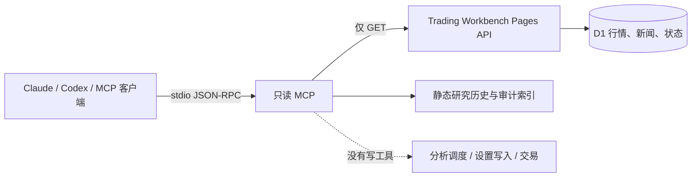

# Trading Workbench 只读 MCP

`scripts/workbench-mcp.mjs` 把生产工作台中已经公开或经审计的查询能力暴露为本地
stdio MCP。它不监听端口，不保存凭据，也不包含运行分析、修改设置、写入 D1 或触发
GitHub Actions 的工具。



## 工具

| 工具 | 返回内容 | 数据入口 |
|---|---|---|
| `list_monitor_profiles` | 监控目标、标的角色、任务设置 | `/api/settings` |
| `get_monitor_snapshot` | 数据新鲜度、来源健康、下一任务时间 | `/api/monitor-status` |
| `get_market_bars` | 5m/15m/1h/1d OHLCV 与来源状态 | `/api/market` |
| `search_market_news` | 新闻、官方公告、来源等级和原文链接 | `/api/news` |
| `get_research_run` | 最近/指定日期的结果、审计状态和报告链接 | `history.json` + `report-audit.json` |

输入有固定白名单：周期最多到日线，行情最多 1260 根，新闻最多 100 条，标的和日期
都经过格式校验。上游响应超过 2 MB、不是 JSON、超时或返回非 2xx 时，工具会明确失败，
不会改用示例数据。

## 启动

仓库内直接运行：

```powershell
npm run mcp:readonly
```

默认读取 `https://tradingagents-board.pages.dev/`。需要连接本地或其他已部署环境时，只
设置基地址：

```powershell
$env:TRADING_WORKBENCH_URL = "http://127.0.0.1:8788/"
npm run mcp:readonly
```

MCP 客户端配置示例：

```json
{
  "mcpServers": {
    "trading-workbench": {
      "command": "node",
      "args": [
        "G:\\worktrees\\TradingWorkbench\\report-evidence-pipeline\\scripts\\workbench-mcp.mjs"
      ],
      "env": {
        "TRADING_WORKBENCH_URL": "https://tradingagents-board.pages.dev/"
      }
    }
  }
}
```

不要把 `ACCESS_CODE`、`EVIDENCE_WRITE_TOKEN` 或 GitHub token 放进这个配置。当前五个
工具不需要写入密钥。若以后增加“触发深度分析”，必须使用独立命令、独立访问码和明确
批准；不能扩展当前只读进程的权限。

## 协议与验收

服务支持 `initialize`、`notifications/initialized`、`tools/list` 和 `tools/call`，
每行一条 JSON-RPC 消息。自动测试同时验证工具清单、GET-only 请求、输入边界、研究
历史与审计状态的联结，以及对未知写工具的拒绝：

```powershell
node --test tests/test_workbench_mcp.mjs
```
