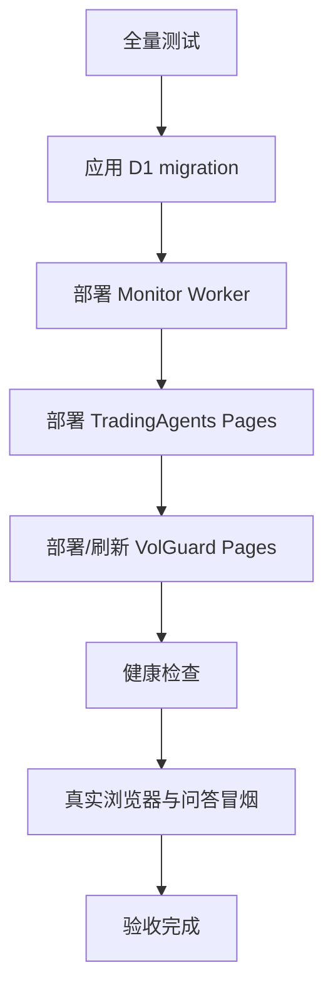

# 部署、密钥、验收与回退

更新日期：2026-07-24

本文只记录可以复现的操作。命令中的项目名是当前生产名，不要自行替换 opaque ID。

## 1. 生产对象

| 对象 | 名称 | 仓库 |
|---|---|---|
| 工作台 Pages | `tradingagents-board` | TradingWorkbench |
| D1 | `tradingagents-workbench` | TradingWorkbench |
| Monitor Worker | `tradingagents-monitor` | TradingWorkbench |
| VolGuard Pages | `sh50-volguard` | SH_50_Index_Option_Trading_Signals |

两个 Pages 项目在页面上连通，但部署和故障域独立。

## 2. 密钥和变量

密钥只存 Cloudflare 或 GitHub Secret。不要写入 D1、前端、日志、Issue、报告或仓库文件。

### Pages Functions

| 名称 | 必需 | 用途 |
|---|---|---|
| `ACCESS_CODE` | 是 | 设置、分析和问答写操作 |
| `OPENAI_COMPATIBLE_API_KEY` 或 `TRADINGAGENTS_CHAT_API_KEY` | 是 | 研究问答 |
| `TRADINGAGENTS_LLM_BACKEND_URL` | 是 | OpenAI-compatible endpoint |
| `TRADINGAGENTS_CHAT_MODEL` | 建议 | 问答模型 |
| `GITHUB_DISPATCH_TOKEN` | 是 | 网页触发 `daily-analysis.yml` |
| `VOLGUARD_LIVE_URL` | 建议 | 默认指向 VolGuard `/api/live` |
| `VOLGUARD_SNAPSHOT_URL` | 建议 | 实时接口失败后的静态快照 |

### Monitor Worker

| 名称 | 必需 | 用途 |
|---|---|---|
| `GITHUB_DISPATCH_TOKEN` | 深度调度必需 | 触发 GitHub workflow |
| `MONITOR_RUN_TOKEN` | 手工补跑必需 | 保护运维采集入口 |
| `ALPHA_VANTAGE_API_KEY` | 否 | 美股日线可选来源 |
| `CN_HOLIDAY_DATES` | 否 | 额外 A 股休市日 |
| `US_HOLIDAY_DATES` | 否 | 额外美股休市日 |

### GitHub Actions

至少配置一个可用 LLM key。当前支持 `OPENAI_COMPATIBLE_API_KEY`、`OPENAI_API_KEY`、`ANTHROPIC_API_KEY`、`GOOGLE_API_KEY`、`DEEPSEEK_API_KEY` 等；可选数据 key 包括 `ALPHA_VANTAGE_API_KEY`、`FRED_API_KEY`。重大事件提醒使用 `PUSHPLUS_TOKEN`。

GitHub 只能列出 Secret 名称和更新时间，不能读取原值。忘记 `ACCESS_CODE` 时不要“查日志”，应在 Cloudflare 中轮换，然后用新值重新做问答和设置冒烟。

## 3. 本地验证

先检查差异：

```powershell
git status --short
git diff --check
```

接口与前端：

```powershell
npm run test:functions
npm run test:frontend
npm run check:workbench
```

原 TradingAgents：

```powershell
.\.venv\Scripts\python.exe -m pytest -q --ignore=tests/e2e_workbench.py
```

浏览器验收：

```powershell
$env:PLAYWRIGHT_BROWSERS_PATH = "G:\ClaudeData\ms-playwright"
python tests/e2e_workbench.py
```

VolGuard：

```powershell
python -m pytest -q
node --test tests/js/live.test.mjs
```

浏览器测试与完整 Python 测试会同时占用较多内存。在 Windows 上串行执行，避免临时 HTTP 服务出现模块传输中断。

## 4. D1 migration

本地：

```powershell
npx --yes wrangler@4.113.0 d1 migrations apply tradingagents-workbench --local --config wrangler.monitor.toml
```

生产：

```powershell
npx --yes wrangler@4.113.0 d1 migrations apply tradingagents-workbench --remote --config wrangler.monitor.toml
```

migration 必须先于依赖新字段的 Worker 和 Pages 部署。migration 文件只追加，不修改已经上线的历史 migration。

部署后只读核验：

```powershell
npx --yes wrangler@4.113.0 d1 execute tradingagents-workbench --remote --config wrangler.monitor.toml --command "SELECT name FROM sqlite_schema WHERE type='table' ORDER BY name;"
```

不要在生产 D1 上直接执行未经 migration 记录的写 SQL。

## 5. 部署顺序



Worker：

```powershell
npx --yes wrangler@4.113.0 deploy --config wrangler.monitor.toml
```

需要立即补跑行情或新闻时，调用 Worker 的受保护采集入口。Token 只从密码管理器或
Worker Secret 交给请求进程，不写进仓库或日志：

```powershell
Invoke-RestMethod `
  -Method Post `
  -Uri "https://tradingagents-monitor.gaaiyun-risk-selfcheck.workers.dev/run-collection?task=usCloseSnapshot" `
  -Headers @{ Authorization = "Bearer <MONITOR_RUN_TOKEN>" }
```

入口复用生产 Provider Registry 和 D1 UPSERT。重复补跑不会复制同一
`profile + symbol + timeframe + timestamp + source` 记录。A 股盘中补跑使用
`task=intradayCollect`，A 股日线使用 `task=cnDailySnapshot`，新闻使用
`task=newsCollect`。只有这个受保护入口会忽略旧的十五分钟熔断状态并强制探测；
五分钟定时任务仍遵守三次失败后暂停十五分钟的规则。

补跑成功不能只看 HTTP 200。至少逐个检查：

- 返回的 `succeeded` 与目标数一致，`written` 大于零；
- `/api/market` 的交易日唯一，没有同一天两个来源重复进入指标；
- 最近两个交易日之间没有异常长缺口；
- 五年范围约有 1,250 根日线，短于该范围时说明上市日期或降级原因；
- 页面涨跌幅由相邻交易日计算，不把多年断口算成一天。
- `512480.SS` 在 2026-07-03 附近不得出现拆分导致的约 50% 假跌幅，日线来源应标记为 `qfq`。
- `/api/news` 返回发布者、发布时间、主题和原文链接；`quality=discovery` 不能在报告中当作官方公告。

Cloudflare 出口访问免费源时可能需要来源请求头。当前 adapter 会为 Yahoo、
东方财富和腾讯分别发送 `Accept`、`Referer` 和浏览器兼容的 `User-Agent`；修改这些
请求头后必须在生产 Worker 中补跑验证，不能用本机直连成功代替云端验收。

工作台：

```powershell
npx --yes wrangler@4.113.0 pages deploy public --project-name tradingagents-board --branch main
```

VolGuard 仓库当前保存的 Cloudflare token 只有 Pages Edit 权限。
`pages-snapshot` 会定时发布 VolGuard 和 Trading Workbench 两个 Pages 项目；
`deploy-trading-workbench` 的默认路径也只验证并发布工作台 Pages。

生产 `tradingagents-monitor` 目前由本机 Wrangler OAuth 发布。只有 token 已补充
Workers Scripts Edit 权限时，才在手动 workflow 中勾选 `deploy_worker`；只有存在
新 migration 且 token 具备 D1 Edit 权限时，才勾选 `apply_migrations`。要恢复完整
自动发布，请轮换一个同时具备 Pages Edit、Workers Scripts Edit 和 D1 Edit 的最小
权限 token。工作台自己的 `deploy-workbench` workflow 在凭据未配置时只做测试并明确
跳过部署。

## 6. 生产健康检查

基础接口：

```powershell
Invoke-RestMethod https://tradingagents-board.pages.dev/api/health
Invoke-RestMethod https://tradingagents-board.pages.dev/api/monitor-status
Invoke-RestMethod "https://tradingagents-board.pages.dev/api/market?profile=cn-semi-comms&symbol=512480.SS&timeframe=15m&limit=240"
Invoke-RestMethod https://tradingagents-board.pages.dev/api/volguard
Invoke-RestMethod https://sh50-volguard.pages.dev/api/live
```

检查点：

- `status` 只能是约定的四种状态。
- 行情包含实际 `source`、`asOf`、`fetchedAt` 和覆盖范围。
- 休市可以返回 stale 或 market closed，但不能用 fixture 冒充实时。
- VolGuard 要同时有报价时间和模型时间；合约表可以为空，但不能显示伪造的零 Greeks。
- 页面七个一级入口可进入，横向无溢出，移动端可以完成设置、运行和查看报告。

## 7. 问答验收

自动测试通过后仍要做一次生产冒烟：

> 今天 512480 为什么涨跌？

合格答案需要：

- 写明价格或 K 线的数据时间；
- 引用实际行情、指标和新闻/事件；
- 即使当前图表不是 `512480.SS`，也应按问题中的 `512480` 读取对应证据；
- 区分事实与推测；
- 没有新闻或行情过期时直接说明无法可靠归因；
- 刷新页面后，会话仍可从服务端恢复；
- 同一个 `requestId` 重放时不再调用模型。

错误访问码应返回 401，缺少模型配置应返回稳定的配置错误，不能回显上游 key 或错误正文。

## 8. 故障定位

### 页面全部无数据

1. 看 `/api/health` 的 D1、VolGuard 和 chat 能力。
2. 看 `/api/monitor-status` 是否有来源健康记录。
3. 区分“D1 没有记录”“记录已过期”“所有 Provider 失败”。
4. 不要临时打开 fixture provider 到生产。

### 单个标的无数据

1. 核对 symbol 与市场后缀。
2. 查看该标的来源健康和熔断时间。
3. 检查返回的覆盖范围和数据连续性。
4. 美股只支持 1d 时，网页应自动切换日线，不能循环请求 5m。

### Agent 没有运行

1. 检查设置中是否为 `analysis=full`。
2. 检查时间槽状态是 `completed`、`deferred` 还是 `failed`。
3. `deferred` 通常表示 Worker 缺 `GITHUB_DISPATCH_TOKEN`。
4. 检查 GitHub workflow run，而不是只看网页按钮。

### 期权指标不更新

1. 分别检查 `/api/live` 的 `source_asof` 和 `slow_metrics` 时间。
2. 休市时快层不产生新报价是正常状态。
3. 快层可用、慢层旧时，页面应保留报价并单独标记模型过期。
4. 两层都失败时才退到 snapshot。

## 9. 回退

- Pages：在 Cloudflare deployments 中选择前一个已验证版本。
- Worker：部署前一个 Git tag 对应的 `wrangler.monitor.toml` 和代码。
- D1：migration 设计为向前兼容；不要删除新列或表。需要回退代码时保留新增 schema。
- Git：使用已验证 tag 或常规 revert，不 force push，不重写共享历史。
- 设置：D1 是真值；仓库 JSON 只能作为灾备种子，不能覆盖已有 D1 用户设置。

每次回退后重新执行健康检查和只读冒烟。
