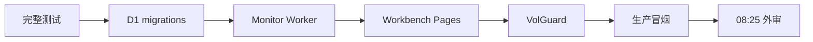

# 部署、验收与回退

更新日期：2026-07-26

代码基线：`main`。精确版本以 `git rev-parse origin/main`、Pages `/api/health` 和 Worker `/health` 三方回读为准，不在文档中维护容易失真的固定 SHA。

2026-07-26 已完成 D1 `0013`–`0015`、Monitor Worker、Workbench Pages 和 VolGuard 生产冒烟。周一 08:25 的官方新闻源真实采集尚待执行；该项与“代码已发布”分开记录。

## 1. 生产对象

| 对象 | 名称或地址 |
|---|---|
| Workbench Pages | `tradingagents-board` |
| Pages 生产域名 | `https://tradingagents-board.pages.dev/` |
| D1 | `tradingagents-workbench` |
| Monitor Worker | `tradingagents-monitor` |
| Worker 地址 | `https://tradingagents-monitor.gaaiyun-risk-selfcheck.workers.dev/` |
| VolGuard Pages | `https://sh50-volguard.pages.dev/` |

Workbench、Monitor Worker 和 VolGuard 有独立部署记录与回退路径。

## 2. Secret 和变量

密钥只放 Cloudflare 或 GitHub Secret。不要写入 D1、前端、日志、Issue、报告或本文。

### Pages Functions

| 名称 | 用途 |
|---|---|
| `ACCESS_CODE` | 设置、分析和问答写操作 |
| `OPENAI_COMPATIBLE_API_KEY` 或 `TRADINGAGENTS_CHAT_API_KEY` | 问答模型 |
| `TRADINGAGENTS_LLM_BACKEND_URL` | OpenAI-compatible endpoint |
| `TRADINGAGENTS_CHAT_MODEL` | 问答模型名 |
| `GITHUB_DISPATCH_TOKEN` | 网页触发 `daily-analysis.yml` |
| `VOLGUARD_LIVE_URL` | VolGuard `/api/live` |
| `VOLGUARD_SNAPSHOT_URL` | 实时接口失败时的快照 |
| `EVIDENCE_READ_TOKEN` | Evidence 读取，缺失时 fail-closed |
| `EVIDENCE_WRITE_TOKEN` | GitHub 任务发布 Packet 和 Manifest |

### Monitor Worker

| 名称 | 用途 |
|---|---|
| `GITHUB_DISPATCH_TOKEN` | 触发深度研究 |
| `MONITOR_RUN_TOKEN` | 保护 `/run-collection` |
| `ALPHA_VANTAGE_API_KEY` | 可选美股来源 |
| `CN_HOLIDAY_DATES`、`US_HOLIDAY_DATES` | 额外休市日 |
| `SEC_CONTACT_EMAIL` | SEC fair-access 联系邮箱 |

Worker vars：

| 名称 | 用途 |
|---|---|
| `GITHUB_REPOSITORY` | 默认 `gaaiyun/TradingWorkbench` |
| `GITHUB_WORKFLOW_ID` | 默认 `daily-analysis.yml` |
| `WORKER_COMMIT_SHA` | 部署代码 SHA |
| `WORKER_DEPLOYED_AT` | UTC 部署时间 |

GitHub repository variable `MONITOR_WORKER_URL` 用于部署后 SHA 验证。`deploy-monitor` 缺 Cloudflare 凭据、account ID 或该 URL 时直接失败。

GitHub Actions 的 Python 深度研究另需 secret `TRADINGAGENTS_SEC_CONTACT_EMAIL`。它只用于构造 SEC EDGAR 的合规 User-Agent，不会写入报告、D1 或日志；缺失时 SEC 仍按失败轨迹降级到发现层。

当前 PushPlus 只运行 shadow 策略。即使环境中存在 `PUSHPLUS_TOKEN`，现有信号写入路径也不会 live 发送。

## 3. 发布前检查

```powershell
Set-Location "G:\worktrees\TradingWorkbench\report-evidence-pipeline"

git status --short
git diff --check
git rev-parse HEAD

npm run test:functions
npm run test:frontend
npm run check:workbench
npm run check:asset-version

G:\venvs\tradingworkbench-report-evidence\Scripts\python.exe -m ruff check .
G:\venvs\tradingworkbench-report-evidence\Scripts\python.exe -m pytest -q

$env:PLAYWRIGHT_BROWSERS_PATH = "G:\ClaudeData\ms-playwright"
$env:WORKBENCH_SCREENSHOT_DIR = "G:\codex-home\visualizations\2026\07\26\tradingworkbench"
G:\venvs\tradingworkbench-report-evidence\Scripts\python.exe tests\e2e_workbench.py
```

Python 全量测试和浏览器测试在 Windows 上串行执行。交接文档只记录本轮实际运行的命令和输出数字。

## 4. D1 migration

当前发布要求应用：

| Migration | 关键对象 |
|---|---|
| `0013_monitor_reliability.sql` | slot snapshot、预算、outbox/receipt、bootstrap、scheduler state、新闻健康 |
| `0014_chat_evidence_scope.sql` | Evidence 和 Manifest scope/owner |
| `0015_notification_deliveries.sql` | event provenance、通知 shadow 账本 |

本地：

```powershell
npx --yes wrangler@4.113.0 d1 migrations apply tradingagents-workbench --local --config wrangler.monitor.toml
```

生产：

```powershell
npx --yes wrangler@4.113.0 d1 migrations apply tradingagents-workbench --remote --config wrangler.monitor.toml
```

部署后只读检查：

```powershell
npx --yes wrangler@4.113.0 d1 migrations list tradingagents-workbench --remote --config wrangler.monitor.toml

npx --yes wrangler@4.113.0 d1 execute tradingagents-workbench `
  --remote `
  --config wrangler.monitor.toml `
  --command "SELECT name FROM sqlite_schema WHERE type='table' AND name IN ('full_analysis_reservations','github_dispatch_outbox','github_dispatch_receipts','monitor_bootstrap_targets','monitor_scheduler_state','monitor_news_provider_health','notification_deliveries') ORDER BY name;"
```

不要改写已经发布的 migration，也不要在生产 D1 执行未进入 migration 的写 SQL。

## 5. 部署顺序


```mermaid
flowchart LR
    T["完整测试"] --> M["D1 migrations"]
    M --> W["Monitor Worker"]
    W --> P["Workbench Pages"]
    P --> V["VolGuard"]
    V --> S["生产冒烟"]
    S --> E["08:25 外审"]
```

### 5.1 GitHub 自动部署 Worker

`.github/workflows/deploy-monitor.yml` 在 main 的 Worker、migration 或配置变化时运行：

1. 检查 Cloudflare 凭据和 `MONITOR_WORKER_URL`，缺少任何一项即失败。
2. 运行 monitor reliability、slot 和 Worker 测试。
3. 应用远端 migration。
4. 部署 Worker，并注入 `GITHUB_SHA` 和部署时间。
5. 请求 Worker `/health`，要求 `deployment.commitSha === GITHUB_SHA`。

绿色 workflow 的判断标准是上述步骤都成功。只看 workflow 总结页不足以证明部署；验收人员还要打开各步骤，确认 migration、deploy 和 SHA verify 没有 skipped。

### 5.2 手工部署 Worker

手工部署也必须写入身份：

```powershell
$workerCommit = git rev-parse HEAD
$workerDeployedAt = (Get-Date).ToUniversalTime().ToString("yyyy-MM-ddTHH:mm:ssZ")

npx --yes wrangler@4.113.0 deploy `
  --config wrangler.monitor.toml `
  --var "WORKER_COMMIT_SHA:$workerCommit" `
  --var "WORKER_DEPLOYED_AT:$workerDeployedAt"
```

随后核对：

```powershell
$workerHealth = Invoke-RestMethod `
  "https://tradingagents-monitor.gaaiyun-risk-selfcheck.workers.dev/health"

if ($workerHealth.deployment.commitSha -ne $workerCommit) {
  throw "Worker SHA 不匹配"
}
if ($workerHealth.deployment.deployedAt -eq "unknown") {
  throw "Worker 部署时间未知"
}
```

顶层 `ok=true` 只说明 health handler 可响应。还要检查 `newsProviders.status` 和每个 provider 的成功、失败时间与错误码。

默认 `/health` 的 D1 provider 查询超时为 750ms，可用 `HEALTH_QUERY_TIMEOUT_MS` 在 10–1500ms 内覆盖。它是有界探针，不代表整个 Worker 运行时间；50ms 在生产跨区域 D1 上会产生已有健康记录却返回空数组的假 `unavailable`。

### 5.2.1 Queue（可选）

Worker 代码已经支持队列消费、幂等去重、批次重试和 DLQ，但默认部署保持 direct 模式，以免在未确认 Cloudflare Queue 计费/配额前自动创建资源。队列配置已落在 `wrangler.monitor.queue.toml`：

```powershell
npx --yes wrangler@4.113.0 queues create tradingagents-monitor-tasks
npx --yes wrangler@4.113.0 queues create tradingagents-monitor-dlq
npx --yes wrangler@4.113.0 deploy --config wrangler.monitor.queue.toml `
  --var "WORKER_COMMIT_SHA:$workerCommit" `
  --var "WORKER_DEPLOYED_AT:$workerDeployedAt"
```

只有确认账户已开通 Queue 且希望启用异步消费时才使用该配置；否则继续用 `wrangler.monitor.toml`，调度器的 direct fallback、租约和 attempt fencing 不变。

### 5.3 部署 Workbench Pages

```powershell
$pagesCommit = git rev-parse HEAD

npx --yes wrangler@4.113.0 pages deploy public `
  --project-name tradingagents-board `
  --branch main `
  --commit-hash $pagesCommit `
  --commit-dirty=false

$pagesHealth = Invoke-RestMethod `
  "https://tradingagents-board.pages.dev/api/health?ts=$([DateTimeOffset]::UtcNow.ToUnixTimeMilliseconds())"

if ($pagesHealth.deployment.commitSha -ne $pagesCommit) {
  throw "Pages SHA 不匹配"
}
```

`deploy-workbench` 缺 Cloudflare 凭据时直接失败，不再跳过。发布后 workflow 最多等待约两分钟，直到生产域名 `/api/health` 回读到目标 SHA；超时或不一致都视为发布失败。`CF_PAGES_URL` 同时保留本次不可变 deployment URL，便于核对生产 alias 的传播。

### 5.4 VolGuard

VolGuard 从独立仓库部署。工作台只通过 `/api/volguard` 代理其 `/api/live`，失败时降级到 snapshot。不要把 Workbench 的部署状态推断为 VolGuard 状态。

## 6. 设置和 profile 冒烟

生产写测试使用一个 disabled 临时 profile，并在 `finally` 中删除。不要修改正在调度的真实 profile。

验收项：

- `GET /api/settings` 返回 D1 `storage.source` 和 revision；
- 创建、复制、PATCH、启停和删除都返回新 revision；
- 缺 revision 返回 428；
- 使用旧 revision 返回 409，并附远端最新设置；
- 最后一组不能删除；
- profile 上限为 8，每组 target 上限为 14；
- 刷新页面后选择仍恢复；
- 切换 profile 后，旧行情、新闻、任务、档案、报告和聊天响应不能串入新组；
- 临时研究和 VolGuard 状态保持不变。

## 7. 运行身份冒烟

| 场景 | 预期 identity |
|---|---|
| 当前 profile 手工运行 | `profile/manual + profileId` |
| Worker 定时运行 | `profile/monitor + profileId + slotId + scheduledFor` |
| 临时研究 | `adhoc/adhoc + requestId` |
| 旧入口 | `legacy/legacy` |

检查 GitHub run title、`/api/runs`、history、Manifest、Evidence 和报告选择器。profile 与 requestId 不能同时出现；monitor 三字段缺一时 workflow 必须失败。

## 8. Chat 和 Evidence 冒烟

### Chat

使用真实访问码验证：

- 问“今天 512480 为什么涨跌”，检查行情时间、证据编号和无法归因行为；
- 同一 `requestId` 重放，确认 `replayed=true`；
- SSE 依次包含 `meta`、`delta`、`done`；
- 刷新页面后恢复同 profile 会话；
- 把同一 `sessionId` 用于另一 profile，确认返回 409；
- 选择 adhoc 报告时传 `reportRequestId`，不同时传 `profileId`；
- 指定失效或 identity 不匹配的报告时，服务端不读取正文。

### Evidence

新数据必须显式带 scope：

```powershell
Invoke-RestMethod `
  "https://tradingagents-board.pages.dev/api/v1/evidence?symbol=512480.SS&profile=cn-semi-comms&depth=summary" `
  -Headers @{ Authorization = "Bearer <EVIDENCE_READ_TOKEN>" }
```

临时研究使用 `requestId`，全局材料使用 `scope=global`。无 selector 只查 legacy。selector 混用返回 400。

POST 时检查：

- Packet 和 Manifest identity 完全一致；
- symbol、trade date、asOf、content hash 和报告路径一致；
- 正文不超过 1 MiB；
- 未授权为 JSON 401，缺写 token 为 503；
- `data_validation_failed` Packet 可以保存，但不能生成正式评级。

## 9. 行情与 history adjustment 验收

```powershell
Invoke-RestMethod `
  "https://tradingagents-board.pages.dev/api/market?profile=cn-semi-comms&symbol=512480.SS&timeframe=1d&limit=1260"
```

检查：

- A 股工作台日线主路径为 `qfq`；
- Yahoo `auto_adjust=True` 写为 `split-and-dividend-adjusted`；
- 报告 Market history 披露 source、adjustment、起止日期和样本数；
- 混合口径显示 `mixed`，缺失显示 `unknown`，不能猜成 qfq；
- `512480.SS` 在 2026-07-03 附近没有约 50% 假跌幅；
- 同一交易日按来源和采集时间去重；
- 五年历史不足时显示真实上市日期或降级原因；
- 页面、Packet、指标和报告使用相同截止时间与口径。

## 10. 提醒 shadow 验收

当前 signal writer 固定使用 shadow：

- Web 满足阈值后记录 `sent / WEB_EVENT_PERSISTED`，表示网页可见；
- PushPlus 记录 `skipped / SHADOW_MODE`；
- 页面显示 `PushPlus · SHADOW`；
- `notification_deliveries` 保持 `event_id + channel` 唯一；
- policy snapshot 记录 profile、时区、阈值、静默时段、event 和评估结果；
- token、请求正文和上游响应不能进入 D1 或 API。

不要执行 live PushPlus canary，除非用户另行授权，并且已经准备回退、去重和结果不确定处理。

## 11. Worker 手工补跑

入口使用 Bearer token：

```powershell
Invoke-RestMethod `
  -Method Post `
  -Uri "https://tradingagents-monitor.gaaiyun-risk-selfcheck.workers.dev/run-collection?task=newsCollect" `
  -Headers @{ Authorization = "Bearer <MONITOR_RUN_TOKEN>" }
```

支持 `usCloseSnapshot`、`intradayCollect`、`cnDailySnapshot` 和 `newsCollect`。响应包含 cursor、backlog、工作量预算和来源结果。调用方按 cursor 继续，不要用一个请求要求无限补跑。

补跑成功要检查写入数、唯一交易日、来源轨迹和错误码。HTTP 200 本身不是成功证据。

## 12. 2026-07-27 周一 08:25 外审协议

时区：`Asia/Shanghai`。理论计划时间为 `2026-07-27T08:25:00+08:00`，即 `2026-07-27T00:25:00Z`。

### 12.1 08:20 前

1. 记录待验 main SHA。
2. 确认 migrations 0013、0014、0015 已应用。
3. 打开 `deploy-monitor` run，确认 credentials、migration、deploy、SHA verify 四个关键步骤成功且没有 skipped。
4. 请求 Worker `/health`，记录：
   - `deployment.commitSha` 等于待验 SHA；
   - `deployment.deployedAt` 不是 `unknown`；
   - `newsProviders.status` 和各 provider 当前状态。
5. 读取 enabled profile 的 revision、时区和 08:25 计划；不改生产配置。

任一 SHA 不符、步骤 skipped 或 deployment identity 为 unknown，外审直接判失败。

### 12.2 08:25–08:30

观察每个 enabled profile 的两个 slot：

- `newsCollect`
- `premarketBrief`

D1 只读核对：

- `scheduled_for = 2026-07-27T00:25:00.000Z`；
- `profile_revision` 与 08:20 记录一致；
- `payload_json`、`payload_hash`、`local_date` 非空；
- 同一 profile、任务和理论槽只有一个 slot；
- payload 在运行前后不变。

### 12.3 08:30–08:35

slot 应进入 completed、degraded 或带明确原因的 deferred/failed。检查：

- attempt 不超过 3；
- 没有超时 claimed；
- `capped`、`backlog` 和工作量预算有值；
- 第二次 Cron 没有创建重复 slot；
- 08:25 不应产生完整分析 dispatch；若出现 outbox/receipt，核对任务类型和来源。

### 12.4 SEC 具体检查

对 `ORCL` 和 `GOOGL` 分别检查：

- source trail 包含 `sec-edgar-submissions`；
- SEC 请求使用已配置组织和联系邮箱，响应或日志不暴露邮箱；
- 只接收 `8-K/8-K/A`；
- 原文链接位于 `https://www.sec.gov/Archives/edgar/data/...`；
- `publishedAt` 不晚于采集截止时间；
- 每条官方结果标记 `sourceTier=evidence`；
- SEC 403、malformed envelope 或 response limit 产生稳定失败码；
- discovery 即使成功，也不能把 SEC 失败改成 ok。

若当日没有新 8-K，合法结果可以为零条，但 source trail 必须证明 SEC 查询成功并通过结构校验。

### 12.5 工信部具体检查

对 A 股通信和芯片主题分别检查：

- source trail 包含 `miit-policy-api`；
- 查询固定 `cateid=58`、`p=1`、`pg=10`；
- 查询词分别覆盖通信和芯片；
- `begin=2026-06-27`、`end=2026-07-27`，以上海日历计算；
- 每个查询最多保留 8 条；
- 拒绝未来日期、窗口外结果、部领导活动和非政策栏目；
- 原文链接属于工信部官方域名；
- 官方结果标记 `sourceTier=evidence`；
- 东方财富或 Google 结果保持 `discovery`；
- 工信部失败时，即使东方财富成功，本次采集仍为 degraded。

### 12.6 API 和页面检查

```powershell
Invoke-RestMethod `
  "https://tradingagents-board.pages.dev/api/news?profile=cn-semi-comms&limit=200"

Invoke-RestMethod `
  "https://tradingagents-board.pages.dev/api/monitor-status?profile=cn-semi-comms"
```

确认：

- 本轮 `fetchedAt` 已更新；
- 新闻有发布者、发布时间、原文链接、层级和标的；
- Worker `/health.newsProviders` 的成功/失败时间已推进；
- 页面显示 degraded 和来源错误，不把部分成功写成全部正常；
- 提醒仍为 Web 可见 + PushPlus shadow。

### 12.7 复权只读检查

08:25 不产生当日收盘线，但外审仍检查现有 1d 历史：

- A 股主路径为 qfq；
- `512480.SS` 拆分连续；
- Yahoo fallback 显示 `split-and-dividend-adjusted`；
- 不出现 mixed history 被标成 qfq。

### 12.8 外审证据

保存脱敏材料：

- main SHA；
- workflow URL 和关键步骤 conclusion；
- Worker health JSON；
- migrations list；
- slot 行和 payload hash；
- SEC、MIIT source trail；
- `/api/news`、`/api/monitor-status`、`/api/market` 样本；
- 页面截图。

外审不记录 access code、token、Cookie、SEC 联系邮箱或完整上游响应。

## 13. 故障定位

### Worker workflow 绿色但生产未更新

1. 检查 migration、deploy、verify step 是否执行。
2. 请求 Worker `/health`。
3. 比较 `deployment.commitSha` 与目标 SHA。
4. 比较 `deployedAt` 与 workflow 时间。

SHA 不符时按未部署处理。

### Agent 没有运行

1. 核对 identity 类型。
2. 对 monitor 运行检查 slot、预算 reservation、outbox 和 receipt。
3. `fullAnalysesPerDay=0` 会阻止 dispatch。
4. `PROFILE_REVISED/DISABLED/DELETED` 表示旧 slot 已取消。
5. outbox 为 unknown 时先 reconcile，不能直接重复 POST。

### Chat 或报告串组

1. 核对 session 的 `profile_id`。
2. 核对 API selector 是 profile 还是 requestId。
3. 核对相邻 Manifest identity。
4. 检查请求是否同时传了 profile 和 adhoc 范围。

### Evidence unavailable

1. 使用正确 scope selector。
2. 检查读写 token。
3. 核对 Packet 与 Manifest identity、hash、symbol、asOf 和 report path。
4. 检查报告运行中的 `evidence_publish` 状态。
5. 不为旧报告补造 Packet。

### 提醒没有到手机

当前 PushPlus 是 shadow，手机不会收到消息。检查网页事件和 `notification_deliveries` 中的 `SHADOW_MODE`。不要把 shadow 当作故障，也不要在排障时私自开启 live。

## 14. 回退

- Pages：选择前一个已验证 Cloudflare deployment。
- Worker：部署前一个已验证 commit，并注入该 commit SHA 和新的部署时间。
- D1：保留 migrations 0013–0015 的表和列，代码按向后兼容方式回退。
- Git：使用普通 revert 或已验证 tag，不 force push。
- 设置：D1 是真值，仓库 JSON 不能覆盖已有在线设置。

回退后重新检查 Worker SHA、profile 隔离、行情、新闻、Evidence、问答、提醒 shadow 和 VolGuard。
