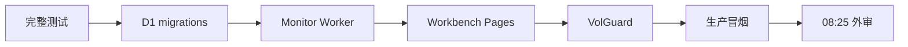

# 部署、验收与回退

更新日期：2026-07-27

代码基线：`main`。精确版本以 `git rev-parse origin/main`、Pages `/api/health` 和 Worker `/health` 三方回读为准，不在文档中维护容易失真的固定 SHA。

2026-07-27 已恢复 GitHub Actions 的 Cloudflare 自动发布；同一 token 在童装 Agent production 环境也已验证。SEC 已有 GOOGL 官方 8-K evidence，工信部旧搜索端点已退役并替换为中国政府网政策库。2026-07-28 资金流 migration、回填、关闭态发布和 daily 增量均完成真实生产验收。

## 1. 生产对象

| 对象 | 名称或地址 |
|---|---|
| Workbench Pages | `tradingagents-board` |
| Pages 生产域名 | `https://tradingagents-board.pages.dev/` |
| D1 | `tradingagents-workbench` |
| Monitor Worker | `tradingagents-monitor` |
| Worker 地址 | `https://tradingagents-monitor.gaaiyun-risk-selfcheck.workers.dev/` |
| VolGuard Pages | `https://sh50-volguard.pages.dev/` |

Workbench、Monitor Worker 和 VolGuard 有独立部署记录与回退路径。

## 2. Secret 和变量

密钥只放 Cloudflare 或 GitHub Secret。不要写入 D1、前端、日志、Issue、报告或本文。

### Pages Functions

| 名称 | 用途 |
|---|---|
| `ACCESS_CODE` | 设置、分析和问答写操作 |
| `OPENAI_COMPATIBLE_API_KEY` 或 `TRADINGAGENTS_CHAT_API_KEY` | 问答模型 |
| `TRADINGAGENTS_LLM_BACKEND_URL` | OpenAI-compatible endpoint |
| `TRADINGAGENTS_CHAT_MODEL` | 问答模型名 |
| `GITHUB_DISPATCH_TOKEN` | 网页触发 `daily-analysis.yml` |
| `VOLGUARD_LIVE_URL` | VolGuard `/api/live` |
| `VOLGUARD_SNAPSHOT_URL` | 实时接口失败时的快照 |
| `EVIDENCE_READ_TOKEN` | Evidence 读取，缺失时 fail-closed |
| `EVIDENCE_WRITE_TOKEN` | GitHub 任务发布 Packet 和 Manifest |
| `FUND_FLOW_ENABLED` | Pages 发布能力开关；代码中只接受字符串或布尔值 `true` |

### Monitor Worker

| 名称 | 用途 |
|---|---|
| `GITHUB_DISPATCH_TOKEN` | 触发深度研究 |
| `MONITOR_RUN_TOKEN` | 保护 `/run-collection` |
| `ALPHA_VANTAGE_API_KEY` | 可选美股来源 |
| `CN_HOLIDAY_DATES`、`US_HOLIDAY_DATES` | 额外休市日 |
| `SEC_CONTACT_EMAIL` | SEC fair-access 联系邮箱 |

Worker vars：

| 名称 | 用途 |
|---|---|
| `GITHUB_REPOSITORY` | 默认 `gaaiyun/TradingWorkbench` |
| `GITHUB_WORKFLOW_ID` | 默认 `daily-analysis.yml` |
| `WORKER_COMMIT_SHA` | 部署代码 SHA |
| `WORKER_DEPLOYED_AT` | UTC 部署时间 |

GitHub repository variables：

| 名称 | 用途 |
|---|---|
| `MONITOR_WORKER_URL` | Monitor 部署后 SHA 验证；缺失时发布直接失败 |
| `FUND_FLOW_COLLECTION_ENABLED` | 资金流定时采集熔断；精确设为 `false` 时跳过 schedule，手工回填和 daily 仍可运行 |

GitHub Actions 的 Python 深度研究另需 secret `TRADINGAGENTS_SEC_CONTACT_EMAIL`。它只用于构造 SEC EDGAR 的合规 User-Agent，不会写入报告、D1 或日志；缺失时 SEC 仍按失败轨迹降级到发现层。

当前 PushPlus 只运行 shadow 策略。即使环境中存在 `PUSHPLUS_TOKEN`，现有信号写入路径也不会 live 发送。

## 3. 发布前检查

```powershell
Set-Location "G:\worktrees\TradingWorkbench\report-evidence-pipeline"

git status --short
git diff --check
git rev-parse HEAD

npm run test:functions
npm run test:frontend
npm run check:workbench
npm run check:asset-version

G:\venvs\tradingworkbench-report-evidence\Scripts\python.exe -m ruff check .
G:\venvs\tradingworkbench-report-evidence\Scripts\python.exe -m pytest -q

$env:PLAYWRIGHT_BROWSERS_PATH = "G:\ClaudeData\ms-playwright"
$env:WORKBENCH_SCREENSHOT_DIR = "G:\codex-home\visualizations\2026\07\26\tradingworkbench"
G:\venvs\tradingworkbench-report-evidence\Scripts\python.exe tests\e2e_workbench.py
```

Python 全量测试和浏览器测试在 Windows 上串行执行。交接文档只记录本轮实际运行的命令和输出数字。

## 4. D1 migration

当前发布要求应用：

| Migration | 关键对象 |
|---|---|
| `0013_monitor_reliability.sql` | slot snapshot、预算、outbox/receipt、bootstrap、scheduler state、新闻健康 |
| `0014_chat_evidence_scope.sql` | Evidence 和 Manifest scope/owner |
| `0015_notification_deliveries.sql` | event provenance、通知 shadow 账本 |
| `0016_fund_flows.sql` | 资金流 long-form 表、自然键和查询索引 |
| `0017_deployment_metadata.sql` | Pages 发布身份 D1 兜底，避免同 SHA 后续部署遮盖静态 manifest 后 `deployedAt=unknown` |
| `0018_fund_flow_trade_date.sql` | 明示并索引 Asia/Shanghai 资金业务日 |
| `0019_remove_invalid_cn_intraday_bars.sql` | 精确清理 Yahoo A 股 5m 午休占位与零成交平盘端点 |

本地：

```powershell
npx --yes wrangler@4.113.0 d1 migrations apply tradingagents-workbench --local --config wrangler.monitor.toml
```

生产：

```powershell
npx --yes wrangler@4.113.0 d1 migrations apply tradingagents-workbench --remote --config wrangler.monitor.toml
```

部署后只读检查：

```powershell
npx --yes wrangler@4.113.0 d1 migrations list tradingagents-workbench --remote --config wrangler.monitor.toml

npx --yes wrangler@4.113.0 d1 execute tradingagents-workbench `
  --remote `
  --config wrangler.monitor.toml `
  --command "SELECT name FROM sqlite_schema WHERE type='table' AND name IN ('full_analysis_reservations','github_dispatch_outbox','github_dispatch_receipts','monitor_bootstrap_targets','monitor_scheduler_state','monitor_news_provider_health','notification_deliveries','fund_flows','deployment_metadata') ORDER BY name;"
```

不要改写已经发布的 migration，也不要在生产 D1 执行未进入 migration 的写 SQL。

`0019` 只删除 Yahoo A 股 5m 中午休区间记录，以及 `11:30 / 15:00` 的零成交平盘哨兵。应用前后应按来源、周期、市场和上海本地时刻核对行数，确认真实成交的收盘柱、腾讯/东方财富、美股与非 5m 数据未受影响；只通过 migration 执行，不用临时生产 DELETE 代替。

## 5. 部署顺序


```mermaid
flowchart LR
    T["完整测试"] --> M["D1 migrations"]
    M --> W["Monitor Worker"]
    W --> P["Workbench Pages"]
    P --> V["VolGuard"]
    V --> S["生产冒烟"]
    S --> E["08:25 外审"]
```

### 5.1 GitHub 自动部署 Worker

`.github/workflows/deploy-monitor.yml` 在 main 的 Worker、migration 或配置变化时运行：

1. 检查 Cloudflare 凭据和 `MONITOR_WORKER_URL`，缺少任何一项即失败。
2. 运行 monitor reliability、slot 和 Worker 测试。
3. 应用远端 migration。
4. 部署 Worker，并注入 `GITHUB_SHA` 和部署时间。
5. 每 5 秒请求 Worker `/health`，最多等待 12 次生产别名传播，要求 `deployment.commitSha === GITHUB_SHA`。

绿色 workflow 的判断标准是上述步骤都成功。只看 workflow 总结页不足以证明部署；验收人员还要打开各步骤，确认 migration、deploy 和 SHA verify 没有 skipped。2026-07-27 首次自动发布 run `30279619417` 曾因发布后立即读取旧 SHA 而误报失败，实际 Worker 已更新；`96d63da` 加入有界传播等待后，run `30280008338` 首次复验成功。

### 5.2 手工部署 Worker

手工部署也必须写入身份：

```powershell
$workerCommit = git rev-parse HEAD
$workerDeployedAt = (Get-Date).ToUniversalTime().ToString("yyyy-MM-ddTHH:mm:ssZ")

npx --yes wrangler@4.113.0 deploy `
  --config wrangler.monitor.toml `
  --var "WORKER_COMMIT_SHA:$workerCommit" `
  --var "WORKER_DEPLOYED_AT:$workerDeployedAt"
```

随后核对：

```powershell
$workerHealth = Invoke-RestMethod `
  "https://tradingagents-monitor.gaaiyun-risk-selfcheck.workers.dev/health"

if ($workerHealth.deployment.commitSha -ne $workerCommit) {
  throw "Worker SHA 不匹配"
}
if ($workerHealth.deployment.deployedAt -eq "unknown") {
  throw "Worker 部署时间未知"
}
```

顶层 `ok=true` 只说明 health handler 可响应。还要检查 `newsProviders.status` 和每个 provider 的成功、失败时间与错误码。

默认 `/health` 的 D1 provider 查询超时为 1500ms，可用 `HEALTH_QUERY_TIMEOUT_MS` 在 10–3000ms 内覆盖；冷启动超时会再试一次。`newsProviders.reason` 区分 `no_binding`、`query_timeout`、`empty_table`、`query_error`，因此“暂时不知道”不会再被误判成“所有 provider 挂了”。它仍是有界探针，不代表整个 Worker 运行时间。

资讯刷新由两层组成：

- 浏览器在页面可见时每 60 秒请求 `/api/news` 和 `/api/events`，负责显示新入库的数据；
- Monitor Worker 按每个 profile 的 `schedules.newsRefresh` 独立采集上游，默认全天每 15 分钟一次，可改为 30 或 60 分钟。

只看到浏览器请求成功，不等于上游采集成功。生产验收至少要同时核对：

1. `scheduled_slots` 出现新的 `newsCollect` 理论槽；
2. `news_items.fetched_at` 前进；
3. `/api/news` 的 `asOf` 与最新条目更新；
4. `/health.newsProviders` 保留各来源成功或失败轨迹。

`market_events` 是行情、公告和信号事件，不按固定频率伪造。周末没有新 `EVENT` 可以是正常状态，但组合资讯流应继续出现真实的 `NEWS`。

### 5.2.1 Queue（可选）

Worker 代码已经支持队列消费、幂等去重、批次重试和 DLQ，但默认部署保持 direct 模式，以免在未确认 Cloudflare Queue 计费/配额前自动创建资源。队列配置已落在 `wrangler.monitor.queue.toml`：

```powershell
npx --yes wrangler@4.113.0 queues create tradingagents-monitor-tasks
npx --yes wrangler@4.113.0 queues create tradingagents-monitor-dlq
npx --yes wrangler@4.113.0 deploy --config wrangler.monitor.queue.toml `
  --var "WORKER_COMMIT_SHA:$workerCommit" `
  --var "WORKER_DEPLOYED_AT:$workerDeployedAt"
```

只有确认账户已开通 Queue 且希望启用异步消费时才使用该配置；否则继续用 `wrangler.monitor.toml`，调度器的 direct fallback、租约和 attempt fencing 不变。

### 5.3 部署 Workbench Pages

```powershell
$pagesCommit = git rev-parse HEAD
$env:DEPLOY_SHA = $pagesCommit
$env:DEPLOY_BRANCH = "main"
node scripts/deployment-metadata.mjs

node scripts/prepare-pages-public.mjs public build/pages-public

npx --yes wrangler@4.113.0 pages deploy build/pages-public `
  --project-name tradingagents-board `
  --branch main `
  --commit-hash $pagesCommit `
  --commit-dirty=false

$pagesHealth = Invoke-RestMethod `
  "https://tradingagents-board.pages.dev/api/health?ts=$([DateTimeOffset]::UtcNow.ToUnixTimeMilliseconds())"

if ($pagesHealth.deployment.commitSha -ne $pagesCommit) {
  throw "Pages SHA 不匹配"
}
if ($pagesHealth.deployment.deployedAt -eq "unknown") {
  throw "Pages 部署时间未知或 deployment manifest 与运行时 SHA 不一致"
}
```

`deploy-workbench` 缺 Cloudflare 凭据时直接失败，不再跳过。发布前用同一个 `DEPLOYED_AT` 生成静态 manifest，再生成策略过滤后的 `build/pages-public`；禁止直接部署 `public`。verified 报告完整发布，未验证报告只保留 Manifest、EvidencePacket 和 fail-closed `complete_report.md`，角色分卷不得进入 artifact。`pages deploy` 成功后，workflow 先直接读取 `/data/deployment.json` 验证静态 manifest，再参数化 UPSERT 到 D1 `deployment_metadata`，最后从 `/api/health` 回读目标 SHA 和合法 `deployedAt`。失败的发布不会覆盖当前线上身份。Health 只有在静态 manifest 缺失、被 SPA fallback 替换或 SHA 不一致时才有界查询 D1，且仍要求记录 SHA 等于 `CF_PAGES_COMMIT_SHA`。超时或不一致都视为发布失败。`CF_PAGES_URL` 保留不可变 deployment URL，便于核对生产 alias 的传播。

发布前必须抽查至少一份未验证报告：`build/pages-public` 中不得存在 `1_analysts` 至 `5_portfolio`；发布后直接 GET 相同 Pages raw 路径应不可读取，`/api/report` 无 selector 与带 selector 的 raw 请求都必须 fail-closed。不能用“网页没有显示标签页”替代静态文件和 API 两条路径的检查。

每日分析的报告提交由 Actions 自带 `GITHUB_TOKEN` 完成。机器人 push 可能因 GitHub 递归保护不触发其它 `on: push` workflow，所以 `daily-analysis.yml` 在 `Persist reports to main` 成功后显式运行 `gh workflow run deploy-workbench.yml --ref main`。该 job 只增加 `actions: write`，继续使用 `github.token`，不需要新建 PAT；报告持久化失败时不会触发部署。真实验收必须同时记录 daily run、其生成的数据 commit、随后独立的 deploy-workbench run，并确认生产 `/api/health` 的完整 SHA 等于该数据 commit 或其后的最新 `main`。

Workbench `/api/health` 检查与 `/api/volguard` 一致的 live→snapshot 降级链，
预算为 5 秒 live + 3 秒 snapshot；detail 明示 `mode` 与 fallback 原因。snapshot
成功时产品仍可用但不冒充 live；两端都失败才使 health degraded。验收仍要直接请求
`/api/volguard` 核对合约覆盖和 slow snapshot，不能把上游尾延迟误判为 deployment
manifest 故障。

2026-07-28 现场用 Wrangler 回读 `tradingagents-board` 的 Git Provider 为 `No`，因此项目不存在 Cloudflare Git integration 竞争发布。曾出现的同 SHA 重复部署来自 GitHub workflow 之外的 Wrangler/ad-hoc 发布；这类发布若没有同步生成静态 manifest 和持久化 D1 identity，会被 `/api/health` 正确标成 `deployment_manifest=invalid_metadata`。禁止把无身份的手工发布当成最终交付；若紧急排障确需手工发布，必须按下段补齐 manifest 与 D1 identity，并立即再跑一次权威 `deploy-workbench` 收口。

手工 Pages 发布若要保留同等可观测性，必须先应用 migration 0017，并用与 manifest 相同的 SHA/UTC 时间更新 `deployment_metadata`；否则只允许作为临时排障，不能作为最终交付路径。权威生产发布仍是 GitHub `deploy-workbench`。

Hermes 每天 08:30 的任务只读取生产行情、资金、新闻、图形口径与已通过门禁的报告，输出盘前投资简报；它不执行 migration、代码审查、浏览器矩阵或根因判定。完整工程审计必须人工触发，并继续遵守默认只读边界；修复和发布需要用户另行授权。两种任务不得共用名称、模板或完成标准。

### 5.4 VolGuard

VolGuard 从独立仓库部署。工作台只通过 `/api/volguard` 代理其 `/api/live`，失败时降级到 snapshot。不要把 Workbench 的部署状态推断为 VolGuard 状态。

## 6. 设置和 profile 冒烟

生产写测试使用一个 disabled 临时 profile，并在 `finally` 中删除。不要修改正在调度的真实 profile。

验收项：

- `GET /api/settings` 返回 D1 `storage.source` 和 revision；
- 创建、复制、PATCH、启停和删除都返回新 revision；
- 缺 revision 返回 428；
- 使用旧 revision 返回 409，并附远端最新设置；
- 最后一组不能删除；
- profile 上限为 8，每组 target 上限为 14；
- 刷新页面后选择仍恢复；
- 切换 profile 后，旧行情、新闻、任务、档案、报告和聊天响应不能串入新组；
- 临时研究和 VolGuard 状态保持不变。

## 7. 运行身份冒烟

| 场景 | 预期 identity |
|---|---|
| 当前 profile 手工运行 | `profile/manual + profileId` |
| Worker 定时运行 | `profile/monitor + profileId + slotId + scheduledFor` |
| 临时研究 | `adhoc/adhoc + requestId` |
| 旧入口 | `legacy/legacy` |

检查 GitHub run title、`/api/runs`、history、Manifest、Evidence 和报告选择器。profile 与 requestId 不能同时出现；monitor 三字段缺一时 workflow 必须失败。

## 8. Chat 和 Evidence 冒烟

### Chat

使用真实访问码验证：

- 问“今天 512480 为什么涨跌”，检查行情时间、证据编号和无法归因行为；
- 同一 `requestId` 重放，确认 `replayed=true`；
- SSE 依次包含 `meta`、`delta`、`done`；
- 刷新页面后恢复同 profile 会话；
- 把同一 `sessionId` 用于另一 profile，确认返回 409；
- 选择 adhoc 报告时传 `reportRequestId`，不同时传 `profileId`；
- 指定失效或 identity 不匹配的报告时，服务端不读取正文。

### Evidence

新数据必须显式带 scope：

```powershell
Invoke-RestMethod `
  "https://tradingagents-board.pages.dev/api/v1/evidence?symbol=512480.SS&profile=cn-semi-comms&depth=summary" `
  -Headers @{ Authorization = "Bearer <EVIDENCE_READ_TOKEN>" }
```

临时研究使用 `requestId`，全局材料使用 `scope=global`。无 selector 只查 legacy。selector 混用返回 400。

POST 时检查：

- Packet 和 Manifest identity 完全一致；
- symbol、trade date、asOf、content hash 和报告路径一致；
- 正文不超过 1 MiB；
- 未授权为 JSON 401，缺写 token 为 503；
- `data_validation_failed` Packet 可以保存，但不能生成正式评级。

## 9. 行情与 history adjustment 验收

```powershell
Invoke-RestMethod `
  "https://tradingagents-board.pages.dev/api/market?profile=cn-semi-comms&symbol=512480.SS&timeframe=1d&limit=1260"
```

检查：

- A 股工作台日线主路径为 `qfq`；
- Yahoo `auto_adjust=True` 写为 `split-and-dividend-adjusted`；
- 报告 Market history 披露 source、adjustment、起止日期和样本数；
- 混合口径显示 `mixed`，缺失显示 `unknown`，不能猜成 qfq；
- `512480.SS` 在 2026-07-03 附近没有约 50% 假跌幅；
- 同一交易日按来源和采集时间去重；
- 五年历史不足时显示真实上市日期或降级原因；
- 页面、Packet、指标和报告使用相同截止时间与口径。

## 10. 提醒 shadow 验收

当前 signal writer 固定使用 shadow：

- Web 满足阈值后记录 `sent / WEB_EVENT_PERSISTED`，表示网页可见；
- PushPlus 记录 `skipped / SHADOW_MODE`；
- 页面显示 `PushPlus · SHADOW`；
- `notification_deliveries` 保持 `event_id + channel` 唯一；
- policy snapshot 记录 profile、时区、阈值、静默时段、event 和评估结果；
- token、请求正文和上游响应不能进入 D1 或 API。

不要执行 live PushPlus canary，除非用户另行授权，并且已经准备回退、去重和结果不确定处理。

## 11. Worker 手工补跑

入口使用 Bearer token：

```powershell
Invoke-RestMethod `
  -Method Post `
  -Uri "https://tradingagents-monitor.gaaiyun-risk-selfcheck.workers.dev/run-collection?task=newsCollect" `
  -Headers @{ Authorization = "Bearer <MONITOR_RUN_TOKEN>" }
```

支持 `usCloseSnapshot`、`usIntradayCollect`、`intradayCollect`、`cnDailySnapshot` 和 `newsCollect`。`usIntradayCollect` 只会选择 profile 中 role=driver 的 `SOXX / NVDA`，不会顺手扩到全部美股标的。响应包含 cursor、backlog、工作量预算和来源结果。调用方按 cursor 继续，不要用一个请求要求无限补跑。

补跑成功要检查写入数、唯一交易日、来源轨迹和错误码。HTTP 200 本身不是成功证据。

资金交易日验收不要截 `ts`。发布后的权威检查为：

```powershell
node scripts/verify-fund-flow-production.mjs

npx --yes wrangler@4.113.0 d1 execute tradingagents-workbench `
  --remote --config wrangler.monitor.toml `
  --command "SELECT symbol, flow_type, COUNT(*) AS rows, MIN(trade_date), MAX(trade_date), SUM(CASE WHEN CAST(strftime('%w', trade_date) AS INTEGER) IN (0,6) THEN 1 ELSE 0 END) AS weekend_rows FROM fund_flows WHERE flow_type='margin_net_buy' GROUP BY symbol, flow_type"
```

验收脚本按三个标的逐一要求：`trade_date` 全部存在、周末为 0、周五非 0，并在同标的日线覆盖区间内验证 `fund_flows.trade_date ⊆ market_bars`。`/api/flows?limit=2000` 的 limit 是返回总行数而不是“交易日数”；同时请求多种 flow type 时不能据此判断回填深度。

## 12. 2026-07-27 周一 08:25 外审协议

时区：`Asia/Shanghai`。理论计划时间为 `2026-07-27T08:25:00+08:00`，即 `2026-07-27T00:25:00Z`。

### 12.1 08:20 前

1. 记录待验 main SHA。
2. 确认 migrations 0013、0014、0015 已应用。
3. 打开 `deploy-monitor` run，确认 credentials、migration、deploy、SHA verify 四个关键步骤成功且没有 skipped。
4. 请求 Worker `/health`，记录：
   - `deployment.commitSha` 等于待验 SHA；
   - `deployment.deployedAt` 不是 `unknown`；
   - `newsProviders.status` 和各 provider 当前状态。
5. 读取 enabled profile 的 revision、时区和 08:25 计划；不改生产配置。

任一 SHA 不符、步骤 skipped 或 deployment identity 为 unknown，外审直接判失败。

### 12.2 08:25–08:30

观察每个 enabled profile 的两个 slot：

- `newsCollect`
- `premarketBrief`

D1 只读核对：

- `scheduled_for = 2026-07-27T00:25:00.000Z`；
- `profile_revision` 与 08:20 记录一致；
- `payload_json`、`payload_hash`、`local_date` 非空；
- 同一 profile、任务和理论槽只有一个 slot；
- payload 在运行前后不变。

### 12.3 08:30–08:35

slot 应进入 completed、degraded 或带明确原因的 deferred/failed。检查：

- attempt 不超过 3；
- 没有超时 claimed；
- `capped`、`backlog` 和工作量预算有值；
- 第二次 Cron 没有创建重复 slot；
- 08:25 不应产生完整分析 dispatch；若出现 outbox/receipt，核对任务类型和来源。

### 12.4 SEC 具体检查

对 `ORCL` 和 `GOOGL` 分别检查：

- source trail 包含 `sec-edgar-submissions`；
- SEC 请求使用已配置组织和联系邮箱，响应或日志不暴露邮箱；
- 只接收 `8-K/8-K/A`；
- 原文链接位于 `https://www.sec.gov/Archives/edgar/data/...`；
- `publishedAt` 不晚于采集截止时间；
- 每条官方结果标记 `sourceTier=evidence`；
- SEC 403、malformed envelope 或 response limit 产生稳定失败码；
- discovery 即使成功，也不能把 SEC 失败改成 ok。

若当日没有新 8-K，合法结果可以为零条，但 source trail 必须证明 SEC 查询成功并通过结构校验。

### 12.5 中国政府网与上交所具体检查

对 A 股通信和芯片主题分别检查：

- Worker source trail 包含 `gov-policy-library`；上交所不在 Worker source trail 中，单独检查 `official-news` workflow；
- 政策查询固定 `t=zhengcelibrary`、`timetype=timeqb`、`sort=pubtime`、`searchfield=title`、`p=1`、`n=20`；
- 查询词分别为“通信”和“集成电路”；
- 响应仍由客户端按上海日历执行 30 天窗口，拒绝未来和窗口外结果；
- 每个查询最多保留 8 条；
- 部门文件、国务院公文、公报为 evidence，政策解读为 discovery；
- 政策原文只接受 `www.gov.cn/zhengce/` 或 `/gongbao/`；
- 手工或定时运行 `.github/workflows/official-news.yml`，确认凭据检查、上交所请求和 D1 写入三步均成功；
- 网络错误、HTTP 429/5xx 或临时无效响应会按 1 秒、3 秒间隔最多重试两次；其它 4xx 不重试，耗尽后必须以 `SSE_NETWORK_ERROR_<code>`、`SSE_HTTP_<status>_<code>` 或 `SSE_RESPONSE_INVALID_<code>` 失败；
- 上交所只接受与代码精确相等且位于 `www.sse.com.cn/disclosure/fund/announcement/` 的 PDF 公告；
- `512480` 与 `515880` 的季度报告、拆分公告等官方结果标记 `sourceTier=evidence`；
- 东方财富或 Google 结果保持 `discovery`；
- 抽查 A 股 discovery 标题：通信与半导体主题必须在标题中直接命中对应行业词；若政策主题只在摘要命中行业词，标题还必须同时含明确政策机关与政策动作。投资日历、宽基 ETF、海外个案或仅在风险提示中顺带出现行业词的文章不得入库，也不得由 `/api/news` 返回；
- Monitor 内计划官方源失败时，即使东方财富成功，本次采集仍为 degraded；上交所失败则对应 `official-news` run 为 failure，不污染 Worker 健康状态。

生产核对必须使用 `profile=cn-semi-comms&limit=200`，否则 `512480.SS` 的高频 discovery 可能把较早的拆分公告挤出较小的时间窗口。2026-07-28 首轮生产 run `30290500176` 写入 7 行：`515880.SS=4`、`512480.SS=3`。

### 12.6 API 和页面检查

```powershell
Invoke-RestMethod `
  "https://tradingagents-board.pages.dev/api/news?profile=cn-semi-comms&limit=200"

Invoke-RestMethod `
  "https://tradingagents-board.pages.dev/api/monitor-status?profile=cn-semi-comms"

Invoke-RestMethod `
  "https://tradingagents-board.pages.dev/api/monitor-status?profile=cn-semi-comms&capacity=1"
```

`capacity=1` 是手工运维探针，不在页面轮询中执行。其默认查询预算为 3000ms，
`D1_CAPACITY_TIMEOUT_MS` 最低 25ms、硬上限 5000ms；超时返回
`capacity.reason=query_timeout`，同时保留 health/notifications，不自动重试已经开始的
D1 扫描。上线后至少连续请求 10 次，要求全部 `capacity.status=ok`；若数据增长后再次
触顶，应改为缓存或写入时维护计数，不继续抬高超时。

确认：

- 本轮 `fetchedAt` 已更新；
- 新闻有发布者、发布时间、原文链接、层级和标的；
- Worker `/health.newsProviders` 的成功/失败时间已推进；
- 页面显示 degraded 和来源错误，不把部分成功写成全部正常；
- 提醒仍为 Web 可见 + PushPlus shadow。

### 12.7 复权只读检查

08:25 不产生当日收盘线，但外审仍检查现有 1d 历史：

- A 股主路径为 qfq；
- `512480.SS` 拆分连续；
- Yahoo fallback 显示 `split-and-dividend-adjusted`；
- 不出现 mixed history 被标成 qfq。

### 12.8 外审证据

保存脱敏材料：

- main SHA；
- workflow URL 和关键步骤 conclusion；
- Worker health JSON；
- migrations list；
- slot 行和 payload hash；
- SEC、中国政府网和上交所 source trail；
- `/api/news`、`/api/monitor-status`、`/api/market` 样本；
- 页面截图。

外审不记录 access code、token、Cookie、SEC 联系邮箱或完整上游响应。

### 12.9 ETF 资金流采集与回滚

`.github/workflows/fund-flow.yml` 的 daily 任务在工作日 UTC 12:17（北京时间 20:17）运行。它是独立故障域，不占 Monitor Worker 的 32 次外部请求预算，也不与行情或新闻共用熔断状态。成分股篮子每只 ETF 必须解析出 10 个不同代码，跨篮子先去重再串行访问；daily 每股只取最新 50 条，backfill 每股最多 6 页，上交所规模最多 64 页，单请求 15 秒、单轮最多 360 个上游请求且采集阶段最多 12 分钟，整个 job 仍受 15 分钟硬超时约束。单日可用覆盖低于 80% 时不写聚合；8/10 或 9/10 可以作为 partial 写入，但不能覆盖同一交易日已有的 10/10 完整聚合。日志以 `eastmoney-constituent-margin` 的稳定错误码降级。全历史回填只手工触发：

```powershell
gh workflow run fund-flow.yml --repo gaaiyun/TradingWorkbench --ref main -f mode=backfill
gh workflow run fund-flow.yml --repo gaaiyun/TradingWorkbench --ref main -f mode=daily
```

生产验收至少检查：

```powershell
npx wrangler d1 execute DB --remote --command `
  "SELECT symbol, flow_type, COUNT(*) AS row_count, MIN(ts), MAX(ts) FROM fund_flows GROUP BY symbol, flow_type ORDER BY symbol, flow_type" --json

npx wrangler d1 execute DB --remote --command `
  "SELECT COUNT(*) AS total_rows, COUNT(DISTINCT profile_id || '|' || symbol || '|' || flow_type || '|' || period || '|' || ts || '|' || source || '|' || adjustment) AS unique_keys FROM fund_flows" --json
```

`total_rows` 必须等于 `unique_keys`。回填或 daily 的日志只允许稳定来源错误码，不得出现 token 或上游正文。API 至少验收 `margin_net_buy`、`constituent_margin_net_buy` 和 `constituent_margin_balance`；后两者的 `method` 必须含披露日与 `coverage=N/N`，`quality` 必须明确为当前前 N 大近似。统一信封仍为 `status/asOf/data/sources/capabilities`，其中 `capabilities.constituentMarginDaily=true`；`/api/monitor-status?capacity=1` 应包含 `fund_flows`。

日期验收必须把 `ts` 转为 `Asia/Shanghai` 后再统计星期：上海周六/周日必须为 0，且流程日期应落在相同标的日线行情交易日集合内。不要直接用 `ts.slice(0, 10)`；上海交易日 2026-07-27 的规范 UTC 表示是 `2026-07-26T16:00:00Z`。东方财富两融 backfill 完成后，三个 ETF 的 `margin_balance / margin_net_buy` 条数应与上游 count 同量级（当前约 1600 / 1500 条），不能把页面最近 60 点展示误当成回填上限。

回滚顺序：先把 repository variable `FUND_FLOW_COLLECTION_ENABLED=false`，确认下一次 schedule 被跳过；再把 `FUND_FLOW_ENABLED` 和页面 `data-fund-flow-enabled` 关为 `false`，最后回退 UI/API/collector。手工 `workflow_dispatch` 不受采集熔断变量限制，仍可用于受控排障。保留 migration 0016 和数据表，不执行破坏性 down migration。回滚后重新验证 Evidence、Manifest、期权、行情、新闻和设置 revision 均未变化。

资金叙事层只读取既有 `/api/flows`、日线 `/api/market`、`/api/events` 与 evidence 新闻；关闭页面 `data-fund-flow-enabled` 会同时隐藏三卡、ETF vs 成分股分位对照和确定性一句话，不影响采集、主图、期权或 Evidence。事件锚只作同期标记。`/api/flows` 历史查询按每条逻辑序列的最新行判断状态，并按当前时间重算 4 天 freshness；不能让窗口内旧行污染最新状态，也不能让较新的一个 flow type 遮住另一个滞后类型。卡片 P 值要区分“水平/单日/单日变化”，叙事 P 值是近 5 个可用交易日累计。若两端交易日不一致，页面必须写明日期并暂不比较。若仅叙事层有问题，优先关闭页面开关，不删除 `fund_flows` 数据，也不回退 migration。

## 13. 故障定位

### Worker workflow 绿色但生产未更新

1. 检查 migration、deploy、verify step 是否执行。
2. 请求 Worker `/health`。
3. 比较 `deployment.commitSha` 与目标 SHA。
4. 比较 `deployedAt` 与 workflow 时间。

SHA 不符时按未部署处理。

### Agent 没有运行

1. 核对 identity 类型。
2. 对 monitor 运行检查 slot、预算 reservation、outbox 和 receipt。
3. `fullAnalysesPerDay=0` 会阻止 dispatch。
4. `PROFILE_REVISED/DISABLED/DELETED` 表示旧 slot 已取消。
5. outbox 为 unknown 时先 reconcile，不能直接重复 POST。

### Chat 或报告串组

1. 核对 session 的 `profile_id`。
2. 核对 API selector 是 profile 还是 requestId。
3. 核对相邻 Manifest identity。
4. 检查请求是否同时传了 profile 和 adhoc 范围。

### Evidence unavailable

1. 使用正确 scope selector。
2. 检查读写 token。
3. 核对 Packet 与 Manifest identity、hash、symbol、asOf 和 report path。
4. 检查报告运行中的 `evidence_publish` 状态。
5. 不为旧报告补造 Packet。

### 提醒没有到手机

当前 PushPlus 是 shadow，手机不会收到消息。检查网页事件和 `notification_deliveries` 中的 `SHADOW_MODE`。不要把 shadow 当作故障，也不要在排障时私自开启 live。

## 14. 回退

- Pages：选择前一个已验证 Cloudflare deployment。
- Worker：部署前一个已验证 commit，并注入该 commit SHA 和新的部署时间。
- D1：保留 migrations 0013–0015 的表和列，代码按向后兼容方式回退。
- Git：使用普通 revert 或已验证 tag，不 force push。
- 设置：D1 是真值，仓库 JSON 不能覆盖已有在线设置。

回退后重新检查 Worker SHA、profile 隔离、行情、新闻、Evidence、问答、提醒 shadow 和 VolGuard。

## 15. 免费 Worker CPU 与积压处理

生产 direct 配置固定：

```toml
DIRECT_MAX_TASKS = "1"
DIRECT_TASK_REQUEST_LIMIT = "3"
DAILY_RECOVERY_ENABLED = "true"
```

这两个值是针对免费 Worker 10ms CPU 观测到的 `exceededCpu` 做的保守上限，不是吞吐承诺。每次 cron 先取消被更新 slot 替代的高频 backlog，再把三次尝试耗尽的 failed/过期 claimed slot收口为 `cancelled / RETRY_EXHAUSTED`，最后只执行一个有界任务。发布后必须用 Worker tail 和 D1 同时验证：

- cron 不再持续 `exceededCpu`；
- 最新行情、新闻或分析 slot 真正从 pending 走到 completed/degraded；
- backlog 最老时间持续前移；
- `claimed` 中没有过期租约；
- 取消只发生于 superseded 或 retry-exhausted，不影响一次性日线或完整分析。
- 当天收盘任务因 Cron 失败未曾入库时，后续 tick 会在 36 小时内补建
  `cnDailySnapshot / closeFullAnalysis / usCloseSnapshot`；检查 D1 中必须存在对应
  `local_date`，不能只看 Worker 本次返回 completed。

`DAILY_RECOVERY_ENABLED` 只控制关键日任务的重新发现，不会补跑盘中、信号或新闻。
同一 profile 的 retry backlog 必须先完成同一业务日行情任务的全部分片，再运行
`closeFullAnalysis`；实现顺序是 `local_date → task_priority → scheduled_for → id`，
避免次日新行情饿死前一日分析。验收时不能只看分析 workflow 已触发，还要先证明
同一业务日的 `cnDailySnapshot` 分片均已完成。
紧急关闭后，既有 slot 仍按原租约规则处理；恢复时重新设为 `true` 并部署 Worker。

如果仍超 CPU，不得继续提高 direct 上限。下一步是评估并由用户确认 Cloudflare Queue 的费用和配额后启用 `wrangler.monitor.queue.toml`；未获授权不得创建付费资源。

## 16. 报告质量事故处理

发现已发布报告把拆分、复权或其他公司行动误判为涨跌时：

1. 先把精确 `ticker/trade_date/path` 加入 `scripts/report-audit.mjs` 的 invalidated 集合并重新生成 `public/data/report-audit.json`；
2. 验证无 selector 及带 `profile` / `requestId` 的最新观点都不再返回该报告，并验证问答不能读取；
3. 修复 Evidence `asOf`、公司行动和单一市场数值真源；
4. 不修改历史正文伪造“当时正确”；历史角色分卷保留审计；
5. 新报告若 claim validation 失败，汇总正文必须只有 Evidence Snapshot、`Not Rated` 和失败码，不得继续显示交易指令；
6. claim-failed 报告在网页和带身份的 `/api/report` 中只能读取
   `complete_report.md`；Market/News/Fundamentals 等原始角色分卷只留在 GitHub 做开发审计；
7. 只有新版本 Manifest、Evidence packet、packet file hash 和 claim validation 全部匹配，才可重新成为 verified 候选。

新报告的验收必须以用户可见边界为准：

1. 确认 LangGraph 编译图运行后仍保留 `evidence_packet` 与 `analysis_status`；
2. Manifest 的 `claimValidation` 只评价最终 Portfolio Decision，Evidence Snapshot
   不能用自身引用掩盖结论缺少引用；
3. `complete_report.md` 只能包含 Evidence Snapshot 与通过门禁的最终结论；
4. `omittedUnsafeParagraphs > 0` 时，逐段确认被省略文本仍存在于 `1_analysts` 至
   `5_portfolio` 原始分卷，但不出现在公开汇总；
5. 组合与范围引用、非法引用、目标价、数字仓位、数字免责声明、Markdown link 和
   超长恶意输入的回归测试全部通过；
6. 若最终结论没有至少一个合法 Evidence ID，必须保持 `Not Rated`，不得为了制造
   `verified` 放宽门禁。
7. 人工复算至少一段涨跌幅和均线关系；派生数字不在 cited ledger、单时点指标被写成
   趋势、或均线排列与 `close/MA20/MA60` 顺序矛盾时，必须 `Not Rated`。

本轮已精确 invalidated：

- `reports/512480.SS/2026-07-28/complete_report.md`
- `reports/515880.SS/2026-07-28/complete_report.md`
- `reports/512480.SS/2026-07-29-v4/complete_report.md`
- `reports/515880.SS/2026-07-29-v4/complete_report.md`
- `reports/512480.SS/2026-07-29-v5/complete_report.md`
- `reports/515880.SS/2026-07-29-v5/complete_report.md`
- `reports/515880.SS/2026-07-30-v3/complete_report.md`（价量被越界叙述为“抛压”；错误码 `UNSUPPORTED_ACTOR_OR_FLOW_ATTRIBUTION`）

每日全局验收可直接使用 [云端 Agent 每日审查提示词](CLOUD_AGENT_DAILY_AUDIT_PROMPT.md)。

## 17. 盘中时效、slot 冲突与派生证据验收

盘中采集发布后除常规 health 外，还必须执行以下业务验收：

1. A 股午休、收盘后和周末的 5 分钟序列应停在最近合法上海会话端点，不得仅因自然时间流逝变成 stale；美股按纽约常规时段和 DST 做同样核对。
2. 在真实开盘时段制造或读取一个超过 30 分钟未更新的合法端点，仍必须是 stale。腾讯当前形成柱可以使用最多一个 5 分钟步长后的合法区间结束标签；超过该步长的未来时间、非整 5 分钟和时段外端点不得被 freshness 修正掩盖。
3. 同一标的分别请求 5m、15m 和 1h：只要最新完成端点相同且未过期，三者顶层状态必须一致为 `ok`；聚合桶内较早记录曾标为 stale 不能拖累当前周期。将最新端点改成真实延迟后，三个周期仍应共同转为 `stale`。
3. 检查 cron 摘要的 `discovered / staged / conflicted`。幂等重复不计冲突；真实唯一键冲突必须产生 `SCHEDULER_STAGE_CONFLICT`。
4. `intradayCollect / intradaySignal / newsCollect / usIntradayCollect` 超过 30 分钟仍未执行时应以 `STALE_SLOT_EXPIRED` 收口；一次性日线和完整分析不得被该规则取消。
5. 定时 5 分钟 provider 单标的最多返回 96 根给写入层；确认这只是单轮工作量限制，D1 既有 90 天历史没有被删除。

新报告验收还要读取 `evidence_packet.json` 的 `derivedEvidence`：每个 `D#` 必须包含 `method / window / inputEvidenceIds`。公开 Portfolio Decision 会逐段剔除未支持的自算比例、窗口极值/排名、面值、持续路径、因果或主体归因，并在 manifest 的 `omittedUnsafeParagraphs` 留痕；剩余文本仍须整体通过 claim gate。Markdown 标题和 Rating 尾随理由不能豁免引用；纯引用、免责声明、条件句或“下一步观察”不能单独构成 verified 结论。普通 N#/CA# 不能替无关因果背书；没有阈值、历史分位或统计检验时，也不能把数值写成“极端/极高/显著”、把单日变化称为“无信号/噪音”，或从单点波动率推导反弹与清仓风险。否定词只保护真正否定归因的局部从句，“不能忽视/无法否认主力流出”仍应被拒；“既非严格空头排列”和“卖压是否释放无法确认”则不能被误报成正向结论。旧 raw agent 分卷即使保留 Underweight/Sell 等字样，也不等于公开 verified 结论。
