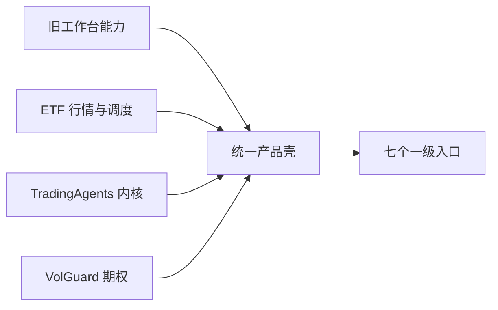
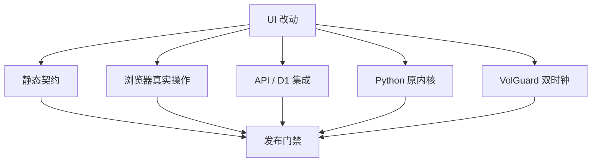

# 产品回归、迁移与防复发约束

更新日期：2026-07-24

## 1. 发生过什么

旧工作台已经有总览、研究任务、研究档案、新闻、期权和设置。ETF 主题监控开发初期把整个页面替换成单页 ETF 终端，导致：

- TradingAgents 仍在仓库里，但网页看不到完整研究流程；
- 任务和档案被压缩成按钮或局部信息；
- 期权入口指向简化快照，用户看不到原 VolGuard 的完整风险能力；
- 自动测试只验证文字、按钮或文件存在，没有验证真实导航和操作；
- 视觉样式从成熟工作台变成卡片墙，再变成调试终端，产品语言不一致。

这次回归的根因是信息架构替换，不是某个 CSS 错误，也不是原代码被删除。

## 2. 恢复策略

采用“旧产品壳 + ETF 新工作区”的方式：

没有把 TradingAgents 和 VolGuard 强行合成一个运行时。两者数据和部署隔离，导航、状态和视觉统一。

## 3. 本次恢复与增强

### 产品结构

- 恢复 Agent 研究、研究任务、研究档案、新闻/事件、期权风控和设置。
- ETF 行情作为“市场监控”工作区保留。
- 所有入口使用稳定 hash route，桌面侧栏和移动底栏共用同一路由契约。
- Agent 运行、档案、报告、任务、设置和新闻绑定现有 API，不使用空壳页面。

### 期权

- 工作台内展示 VolGuard 实时 schema v2。
- 兼容旧 snapshot，但明确标记降级。
- 合并快层报价与慢层 GARCH VaR、BSADF、HV、GEX/DEX 等结果。
- 分开显示行情时间和模型时间。
- 合约链、认购/认沽方向和缺失指标显示正确。
- 修复测试收集问题：在线手工检查不再伪装成单元测试，并增加确定性清洗测试。

### 行情

- A 股红涨绿跌，美股绿涨红跌。
- 美股日线目标覆盖五年；Yahoo 请求 5 年，备选来源接收实际 limit，不再固定 320 根。
- API 上限提高到 2000；网页支持 6m、1y、3y、5y。
- 只支持日线的美股标的会禁用盘中周期，不再重复请求不可用数据。
- 页面显示覆盖起止日期、K 线数量和降级原因。

### 生产数据完整性

第一次生产浏览器验收发现，美股自选出现数百至上千个百分点的涨幅。颜色组件没有算错，
根因是 D1 中只存在一根 2026 年行情和一根 2011 年腾讯旧种子，前端把两根不连续日线
当成相邻交易日。后续回填又发现，同一交易日可能同时存在 Yahoo 的美东收盘时间和腾讯
的本地日期时间；若只按完整时间戳去重，会重复计算一天。

修复包括：

- 日线遇到超过 45 天的异常断口时只保留最新连续段，避免误删春节等合法休市；
- 同一交易日有多个来源时，优先保留最近成功采集的一条；
- Cloudflare Worker 为 Yahoo、东方财富和腾讯发送来源所需的请求头；
- 受访问令牌保护的人工回填可以越过旧熔断状态重新探测，正常五分钟任务仍遵守熔断；
- 生产回填和页面验收必须检查唯一交易日数、最近两个交易日、覆盖起止和涨跌幅范围。

2026-07-24 的生产回填写入 10,032 根 Yahoo 日线。SOXX、SMH、NVDA、TSM、
AVGO、AMD、ASML 和 ORCL 各返回 1,254 个唯一交易日，覆盖
2021-07-26 至 2026-07-23，重复交易日为零。该数字是一次验收记录，不是写死在代码里的
成功条件；以后仍以 API 返回的来源和时间为准。

### 真实 Agent 冒烟

同日从 GitHub Actions 实际运行 `512480.SS` 深度研究：

- 安装、行情/新闻/基本面 Agent、辩论、风险决策和报告持久化全部成功；
- 模型阶段约十分钟，使用仓库保存的 OpenAI-compatible 配置；
- 生成 28,928 字符的完整报告并写入
  `reports/512480.SS/2026-07-23/complete_report.md`；
- `latest.json` 和 `history.json` 已更新，生产 `/api/latest` 与报告 URL 可读取。

第一次 run 的最终状态曾显示失败，但失败发生在报告写回之后：工作流无条件调用
`actions/configure-pages`，而新仓库没有启用 GitHub Pages。正式站点实际使用
Cloudflare Pages，因此后续把 GitHub Pages 三个步骤置于
`ENABLE_GITHUB_PAGES=true` 条件下。未启用的可选发布目标不再把成功的 Agent 研究标成
失败。

### 视觉

- 取消彩色左边卡片和卡片墙。
- 使用一个石墨灰 token 系统；语义色只用于行情和状态。
- 普通界面不使用整页等宽字体。
- 顶栏和浮层保留克制的层次，不用大面积渐变、发光和装饰动效。
- 动效控制在 160–220ms，并尊重 `prefers-reduced-motion`。

## 4. 防复发测试

以后改首页，必须同时通过：

强制契约：

- 七个一级入口各有一个可见工作区。
- 从任务页可以运行，从运行页可以进入报告，从报告可以进入问答上下文。
- 期权不是只有外链；工作台中必须有报价、风险指标、合约链和刷新状态。
- 原 `TradingAgentsGraph`、CLI、workflow 和报告接口存在且可测试。
- 页面不可用状态不得显示 fixture、旧缓存或 `0` 代替缺失指标。
- 路由、颜色、行情竞态、移动端和历史区间由浏览器测试验证。

## 5. Git 与发布收敛

- 产品主仓库迁移到 `gaaiyun/TradingWorkbench`；原 `gaaiyun/TradingAgents` 暂时只作为可回退源。
- Python 包继续叫 `tradingagents`，以兼容上游 API、CLI、测试和现有脚本；仓库名与包名不要求一致。
- `main` 是唯一日常发布主线。
- 功能分支通过测试后快进合并，合并完成再删除远程功能分支。
- 分支和仓库名称不含 `codex/`。
- 安全点使用 tag，不长期保留已合并的开发分支。
- 不 force push，不用 `--no-verify` 绕过 hooks。
- 文档和生产行为必须在同一提交系列中更新。

## 6. 尚未假装完成的内容

下面是后续增强，不应在当前页面标成已经可用：

- 交易所、巨潮、SEC、公司 IR 等官方证据层的直接采集，以及跨发布者重复簇；
- ETF 持仓、规模、跟踪误差和份额变化的统一 adapter；
- 20/60 日跨市场相关性和隔夜传导统计；
- 本地只读 MCP 工具；
- Qlib 离线因子评价和组合回测；
- 有可靠来源后的 ETF iNAV 和溢折价。

页面遇到这些字段时应显示“暂无可靠数据”，而不是构造估计值。
