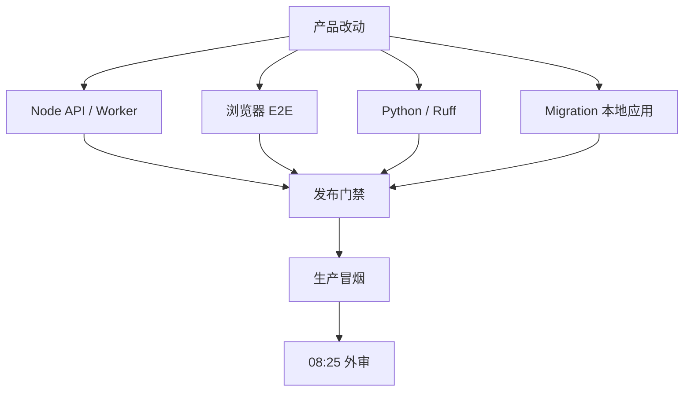

# 产品回归、迁移与防复发约束

更新日期：2026-07-26

代码基线：`main`；测试对象使用当前 `HEAD`，生产对象必须另行回读 Pages 与 Worker 的运行时 SHA。

## 1. 保留的产品边界

ETF 监控是 Trading Workbench 的一个工作区。任何首页或设置改动都要保留：

- 七个一级入口；
- TradingAgents Python、CLI、LangGraph、模型 Provider 和报告链；
- 临时研究、研究任务、13 个报告分栏和持久问答；
- VolGuard 期权链、快慢双时钟和独立故障域；
- GET-only MCP。

Cloudflare、GitHub Actions 和 VolGuard 不合并成一个运行时。Worker 只处理有界 I/O 和状态机。

## 2. 多 profile 防串线

以下契约由设置、前端和 E2E 测试保护：

- 最多 8 个 profile，每组最多 14 个 targets；
- profile ID 不可修改，至少保留一组；
- 复制出的 profile 默认停用；
- profile 写操作使用 revision CAS；
- 缺 revision 为 428，冲突为 409；
- 切换 profile 后取消旧异步请求；
- 行情、新闻、事件、任务、档案、报告和聊天只读当前 profile；
- 临时研究和 VolGuard 不跟随 profile 重置。

回归用例应覆盖两个 profile 使用同一 symbol 和同一理论时间槽。两组的行情、失败状态、slot 和报告必须分开。

## 3. Run identity

系统只接受四类身份：

| scope / kind | 字段 |
|---|---|
| `legacy / legacy` | 无 |
| `profile / manual` | `profileId` |
| `profile / monitor` | `profileId + slotId + scheduledFor` |
| `adhoc / adhoc` | `requestId` |

防复发规则：

- profile 与 adhoc 互斥；
- monitor 三字段成组出现；
- workflow title、history、Manifest、Evidence 和 API 返回同一 identity；
- profile selector 不读取 adhoc 报告；
- requestId selector 不继承浏览器当前 profile；
- 报告正文必须通过相邻 Manifest identity 校验；
- 旧无身份报告继续可读，但服务端不猜 profile。

## 4. Chat 和 Evidence owner

migration 0014 增加 scope 与 owner 后，以下行为必须保持：

- chat session 绑定 profile；
- 跨 profile session 返回 409；
- session GET/DELETE 都校验 owner；
- 报告上下文在 `profileId`、`reportRequestId`、`reportScope=global` 中只选一种；
- Evidence GET 的 profile、requestId、global、legacy 范围互斥；
- Packet、Manifest 和提交 bundle identity 完全一致；
- identity 不匹配时返回不可见或冲突，不降级到其他报告。

## 5. 调度可靠性

migration 0013 建立的约束：

- slot 保存不可变 profile revision、payload JSON、payload hash 和 local date；
- D1 trigger 拒绝修改 payload；
- profile 删除、停用或 revision 变化会取消旧 slot；
- attempt fencing 阻止旧租约覆盖新结果；
- 最多三次重试；
- bootstrap 按 profile、symbol、timeframe、schema 和 target hash；
- 完整分析预算按 profile 和本地日期原子预留；
- `fullAnalysesPerDay=0` 不 dispatch；
- profile 公平轮转，任务和外部请求有硬上限；
- outbox/receipt/reconcile 阻止重复 GitHub dispatch；
- Queue 和 direct fallback 都报告 capped 与 backlog。

测试必须注入网络超时、GitHub 已接收但客户端未知、D1 写回失败、profile revision 变化和多 profile 竞争。

## 6. 提醒 shadow

migration 0015 建立事件 provenance 和 `notification_deliveries`。

当前契约：

- `eventId + channel` 唯一；
- Web `sent / WEB_EVENT_PERSISTED` 只表示网页可见；
- PushPlus `skipped / SHADOW_MODE` 表示没有外发；
- 阈值、静默时段、critical 例外和缺 token 有确定性策略结果；
- API 不返回 token、策略秘密或上游正文；
- 页面区分 SHADOW、延期、失败、结果不确定和已发送。

live PushPlus 尚未启用。只有完成生产 canary、重复事件对账和结果不确定处理后，才能修改这一声明。

## 7. 行情与复权

曾出现的生产问题包括旧种子与新行情相隔多年、同交易日多来源重复、ETF 拆分被写成暴跌。防复发约束：

- 日线按交易日去重；
- 超过 45 天的异常旧种子断口不参与相邻涨跌；
- A 股主路径使用 qfq；
- Yahoo auto-adjust 标记 `split-and-dividend-adjusted`；
- 报告 Market history 披露 source、adjustment、起止日期和样本数；
- mixed 或 unknown 不改写成 qfq；
- `512480.SS` 2026-07-03 附近保持拆分连续；
- 页面、Packet、指标和报告使用同一截止时间与历史口径；
- 短上市历史不补造 MA200 或五年趋势。

## 8. 新闻证据

当前已实现：

- SEC EDGAR Submissions：ORCL、GOOGL 的 `8-K/8-K/A`；
- 中国政府网政策文件库：通信和集成电路政策；
- 上交所基金公告：`515880`、`512480` 的季度报告、拆分和招募说明书；
- HashKey 公司投资者关系公告；
- Federal Reserve 官方 RSS：有界宏观证据；
- Google、东方财富和 Yahoo 的 discovery 降级链。

官方失败不能由 discovery 成功掩盖。HTTP 200 但结构错误也要 degraded。

仍未完整接入：

- 深交所基金公告；
- 巨潮和基金管理人公告；
- 中证指数成分与公司行动；
- 更多公司 IR 和 HKEXnews 发行人原文。

页面对缺失字段显示“暂无可靠数据”，不构造估计值。

资讯表按 symbol 保留关联行，前端必须按 duplicate cluster 或原文 URL 聚合，不能把同一文章重复展示为多条新闻。新闻整体 freshness 只看最新文章组，不得因列表中包含旧文章就把刚完成的采集标成 stale。

identity 迁移不回填旧报告为当前 profile。无 identity 的历史批次规范为 `legacy`：`legacy_unverified` 保留只读入口和醒目警告，`invalidated` 默认隐藏，任何 legacy 报告都不得绕过 verified 门禁进入问答。

## 9. 部署门禁

`deploy-monitor` 必须：

1. 缺 Cloudflare 凭据或 `MONITOR_WORKER_URL` 时失败；
2. 运行 monitor contract tests；
3. 应用 migration；
4. 注入 commit SHA 和部署时间；
5. 部署后请求 `/health`；
6. 要求运行时 SHA 等于 GitHub SHA。

绿色 workflow 只有在 migration、deploy 和 SHA verify 都成功时才算 Worker 发布证据。Pages 也要检查 deploy step 和生产路由，不能只看 workflow 总结。

功能分支上的测试通过不代表生产已部署。交接文档要分开记录代码 SHA、main SHA、Pages deployment、Worker SHA、migration 列表和生产冒烟时间。

## 10. 回归矩阵

```mermaid
flowchart TD
    U["产品改动"] --> N["Node API / Worker"]
    U --> B["浏览器 E2E"]
    U --> P["Python / Ruff"]
    U --> M["Migration 本地应用"]
    N --> G["发布门禁"]
    B --> G
    P --> G
    M --> G
    G --> S["生产冒烟"]
    S --> A["08:25 外审"]
```

提交前至少覆盖：

- Functions、Worker、frontend Node tests；
- `node --check`；
- Python 全量 pytest 与 Ruff；
- Playwright 七入口、双 profile、报告身份和聊天恢复；
- migration 0013–0015 本地应用；
- `git diff --check` 和链接检查。

报告测试数字时必须注明命令、HEAD 和时间。不要复制旧交接中的数字。

## 11. Git 和回退

- `main` 是发布主线；
- 功能分支通过测试后使用普通 merge 或 fast-forward；
- 报告任务写入 main 时先 fetch，再处理新增版本目录；
- 不 force push，不用 `--no-verify`；
- migration 向前保留，代码回退不删除表或列；
- 文档和行为在同一提交系列中更新。

回退后重新验证 profile 隔离、Worker SHA、行情复权、新闻证据、Evidence scope、聊天 owner、提醒 shadow 和 VolGuard。
