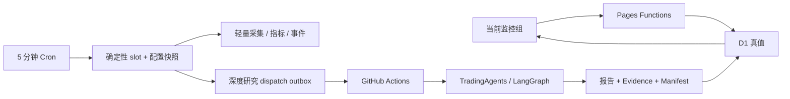

# TradingWorkbench 可用性闭环设计

## 目标

本轮不把“多监控组”当作孤立功能。它是检验整套产品是否形成闭环的压力测试：用户必须能在网页创建、复制、编辑、启停、运行和删除独立监控组，并且行情、新闻、任务、报告、问答和提醒始终属于当前明确选中的监控组。临时研究、期权风控和旧报告继续保持各自边界，不被监控组切换污染。

完成标准不是“控件出现”，而是以下链路可重复通过：

1. 设置意图能够持久化并处理并发冲突。
2. 定时 Worker 能按相同配置执行并产生可解释状态。
3. 页面只展示当前监控组的数据和任务。
4. 手工研究与定时研究有稳定身份，不互相覆盖。
5. 提醒配置会真实投递或明确说明为什么没有投递。
6. 任一来源或外部服务失败只导致局部降级。
7. 完整测试、生产冒烟、发布记录和交接文档能够复现结论。

## 已确认的现状

- `WorkbenchSettingsV2`、D1 行情键和 Monitor Worker 已具备多 profile 基础。
- 网页大量固定读取 `profiles[0]`，行情请求不携带 profile，问答、报告和任务状态可能跨组残留。
- 设置只有整份 JSON 的读写，没有网页可用的 profile 生命周期操作。
- `alerts` 目前只保存配置，没有监控事件投递实现。
- `agentBudget` 只被校验，没有实际执行。
- 定时 Worker 在单次 Cron 中顺序处理全部 profile；免费 Workers 单次 CPU 只有 10ms，不能把规模化采集、RSS 大文本解析或 TradingAgents 推进同一个调用。
- GitHub Actions 适合 Python、LangGraph 和长时间 LLM 研究；Cloudflare 适合轻量 API、D1 状态、确定性调度、幂等和通知。

## 方案比较

### 方案 A：只补前端监控组选择器

继续整份 PUT 设置，只在页面增加选择器，并把 `profiles[0]` 改为当前索引。

优点是改动少。缺点是并发覆盖、profile 级错误语义、任务身份、跨组问答和真实提醒都没有解决。它只能让第二个监控组“看得见”，不能形成可用闭环，因此不采用。

### 方案 B：保留 V2 单行存储，增加 profile 级原子操作与统一上下文

继续把 V2 JSON 作为 D1 即时真值，但服务端提供 profile 级创建、修改、复制、启停和删除操作。每次操作在最新文档上执行、重新校验并通过 revision 做 CAS。前端建立唯一 `selectedProfileId`，所有工作区和 API 都从同一上下文读取。

优点：

- 不迁移现有设置主存储，回退简单。
- 能快速修复数据串线和交互断点。
- 旧完整 PUT、legacy ticker 更新和 Monitor Worker 可以向后兼容。
- profile 上限较小时，单行 JSON 与 D1 成本都很低。

缺点是设置文档仍是一个并发单元，不能无限扩展。当前产品上限为 8 个监控组，这个权衡合理。本轮采用该方案。

### 方案 C：立即把 profiles、targets、schedules、alerts 完全拆表，并迁移到 Queues/Workflows

长期扩展性最好，但会同时改写设置、调度、部署和运维故障域。Cloudflare Queue 是至少一次投递，仍需幂等；Workflow 免费额度也只适合 I/O 编排，不能承载 Python/LLM。一次性切换风险过大。

本轮只建立可演进边界：D1 slot/outbox/notification 表使用稳定 identity，Cron 保持轻量；后续用 shadow/canary 方式把具体 slot 执行迁入 Queue/Workflow。

## 统一产品上下文

浏览器只允许一个当前监控组：

```text
selectedProfileId -> currentProfile() -> targets/schedules/alerts/timezone
                  -> market/news/events/tasks/chat/run
```

- 选择写入 `localStorage`；值不存在、已删除或无权限时选择第一个 profile。
- 停用 profile 仍可查看和编辑，但不会被 Worker 调度。
- 切换 profile 时保留当前一级路由，清空行情图、报价、新闻、事件、任务、所选报告和问答线程，再加载新组数据。
- 如果原标的不属于新组，自动选择新组第一个标的；没有标的时展示真实空状态。
- 期权风控与临时研究不属于任何监控组。切换 profile 不重建 VolGuard，不改变临时研究表单。
- 每个聊天线程绑定创建时的 profile。切换后建立新线程，服务端拒绝把同一会话静默改绑。

## 设置与 profile 生命周期

### 约束

- 最多 8 个 profile。
- ID 为不可变的 `[A-Za-z0-9_-]{1,64}`。
- 名称、目标、基准和时区有明确长度与格式限制。
- 每组最多 14 个 targets，网页与服务端使用同一限制。
- 至少保留一个 profile；删除只删除配置，不删除历史行情、报告和事件。
- 完整 PUT 对已存在设置必须携带 revision；缺失返回 `428`，不匹配返回 `409`。
- D1 不可用时 profile 写接口失败关闭，不把 GitHub 异步写入伪装成即时成功。

### API

- `GET /api/settings` 保持旧 data 结构，并增加非破坏性的 `storage` 信息和 `updatedAt`。
- `POST /api/settings/profiles` 创建空白或模板 profile。
- `PATCH /api/settings/profiles/:id` 修改该 profile 或启停。
- `DELETE /api/settings/profiles/:id` 删除非最后一个 profile。
- `POST /api/settings/profiles/:id/copy` 复制并生成新 ID。

所有写操作只接受 header 访问码，返回最新 settings 与 revision。服务端在最新文档上执行原子读改写，避免客户端上传整份旧数组覆盖其他 profile。

## 数据、任务和报告隔离



- 行情、新闻、事件、任务状态查询必须显式携带 profile。
- scheduled slot 固化 profile revision、target 快照和 payload hash。重试使用原快照；profile 被停用或删除时取消尚未执行的旧 slot。
- bootstrap readiness 按 `profile + symbol + timeframe` 判断，新建 profile 或新增标的能够回填。
- 监控组合手工运行携带 `profileId`；临时研究继续没有 profile 依赖。
- 研究记录和 Manifest 保存 `kind/requestId/profileId/slotId/scheduledFor`。相同 ticker/date 的不同 profile 不再只能依靠 `-v2` 猜测归属。
- Agent 日预算按 `profile + localDate + budgetKind` 原子 reserve；0 表示禁止，失败是否退还由稳定 error code 决定。
- GitHub dispatch 以 `slotId` 为端到端幂等键。响应不确定时进入 reconcile，不能立即重复 POST。

## 真实提醒

事件生成后按 profile 的 `pushMinSeverity`、时区、静默时段和渠道计算投递：

1. Web 渠道由持久化 `market_events` 提供。
2. PushPlus 只有在 profile 开启且 Worker secret 存在时执行。
3. 非 critical 事件在静默时段标记为 deferred；critical 可立即投递。
4. `notification_deliveries` 以 `eventId + channel` 唯一，记录 `pending/sent/deferred/failed`、attempt、时间和安全错误码。
5. Cron 重试或 Queue 重复投递不能产生第二条推送。

页面显示真实投递状态；缺 token、静默、阈值不足或来源降级都不能表现为“已提醒”。

## Cloudflare 与 GitHub Actions 分工

| 能力 | Cloudflare | GitHub Actions |
|---|---|---|
| UI、profile CRUD、查询、问答 SSE | Pages Functions + D1 | 否 |
| 时区/节假日/due slot、轻量状态 | Monitor Worker + D1 | 否 |
| 5–15 分钟行情、少量 RSS/JSON、规则信号 | Worker，必须有批量上限 | 否 |
| 提醒幂等、预算和 dispatch outbox | Worker + D1 | 否 |
| Python 依赖、TradingAgents、LLM 辩论、报告审计 | 否 | 是 |
| 完整 CI、浏览器 E2E、不可变发布物 | 读取生产状态 | 是 |

免费 Worker 的 10ms CPU 约束意味着：

- Cron 每次只处理有上限的 slot，不扫描或解析无限 RSS。
- provider 请求、D1 查询和数据条数均设置硬上限，并记录各阶段 wall time 供分析。
- 本轮不把 LangGraph、Qlib、GARCH、BSADF 或大规模历史回填迁入 Worker。
- Queue/Workflow 先作为可选扩展点，不在缺少 shadow 对账时直接替换现有路径。

## 交互与视觉

- 顶栏提供一致的 profile 选择器；设置页提供“新建、复制、启停、删除”并展示保存状态。
- 任务页直接运行当前监控组，不再先打开设置；展示 slot、排队/运行/失败/完成、最近结果、失败原因和下一执行时间。
- 新闻页提供标的、权威层级、来源、主题和重要性筛选。
- 409 冲突显示“重新载入远端配置”动作，而不是要求整页刷新。
- 设置和问答抽屉使用真正 modal 语义、focus trap 和背景 inert。
- 320px 宽度不横向溢出，触控目标不小于 44px，键盘焦点可见。
- 刷新结果逐项显示成功、降级和失败，不再无条件提示成功。

## 数据源演进

本轮先保证隔离和运行闭环，再按相同 provider contract 增加官方证据：

- SEC EDGAR Submissions JSON 覆盖美股正式申报。
- Federal Register 与 Federal Reserve RSS 提供美国政策证据。
- HKEX 官方 RSS 只标记为市场/监管证据，不冒充发行人公告。
- GDELT 仅作发现层，使用批量、缓存和 429 退避。

registry 分离 `authorityTier` 与 `transportTier`，并记录授权用途、再分发限制、额度、freshness 和复核日期。Yahoo、东方财富、腾讯继续标记为 best-effort，不包装成官方授权源。

## 迁移与回退

1. 先发布向后兼容 schema 与只读状态。
2. 在测试数据中创建两个 disabled profile，验证相同 symbol 和同一时槽隔离。
3. profile CRUD 和选择器先上线，旧完整 PUT 保留。
4. 提醒投递先 shadow 记录，不发送；对账后对一个 profile 开启 PushPlus。
5. 每次发布记录 `git SHA → Pages deployment ID → Worker version → migration list`。
6. 回退时先停止新 dispatch，再回滚 Pages 和 Worker；D1 schema 只前向保留。只有数据损坏才使用 D1 Time Travel，配置使用带 revision 的已校验快照恢复。

## 验收门槛

- 两个 profile 同 symbol、同理论时槽、不同数据和失败状态时零串线。
- 创建、复制、编辑、启停、运行、冲突恢复、删除和刷新都能在网页完成。
- 临时研究、13 个报告分栏、问答 SSE、VolGuard 双时钟无回归。
- `fullAnalysesPerDay=0` 不 dispatch；同一 slot 最多产生一次研究。
- PushPlus 成功、静默、缺 secret、重试和重复事件均有可复算状态。
- Functions、前端、Python、Ruff、浏览器 E2E 和密钥扫描全部实跑。
- 生产冒烟包含 settings CRUD 回滚、双 profile 隔离、Worker/Pages 版本、数据 freshness 和负向鉴权。
- 发布前执行一次独立“上下文漂移审计”：从最初产品功能清单、历史实现、用户反馈和本轮审计反向核对最终 diff，确认没有因长对话而遗忘 TradingAgents 核心、临时研究、报告分栏、问答、期权、新闻、监控或文档承诺，也没有把不适合 10ms CPU 的任务强行迁入 Cloudflare。
